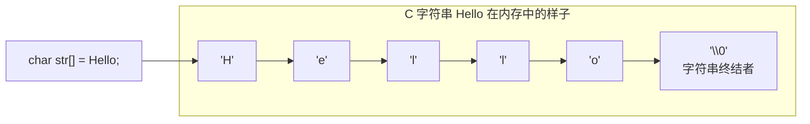

> C++ 程序员在面试时，经常会被拉着聊 `std::string` 和 C 风格字符串 (`char*`) 的爱恨情仇。  
> 再往前一步，有的面试官会问你：“那你觉得标准库的字符串设计得怎么样？”  
>
> 真正把字符串当饭吃的工程师，其实早就把视线投向了线上跑着的大型系统——比如 Redis。  
> 这篇，我们就顺着 Redis 的实现，看看它的那套看家本领——SDS（Simple Dynamic String），是怎么一步步长出来的。

## 🎯 C 语言字符串：从时代选择到“美丽的错误”

要理解 SDS，得先回到 C 语言还年轻的那个年代。

那时候的内存很贵，编译器也很“朴素”。C 字符串的设计目标非常直接：**占用少、实现简单、移植容易**。于是，有了我们今天耳熟能详的这一幕：



看懂了吗？C 字符串的设计哲学突出一个“简单粗暴”：**字符挨个排队，队尾必须站着一个看不见的 `\0` 哨兵**。在当年，这种设计极大地方便了编译器和库的实现；但随着程序和数据规模的膨胀，这个小小的哨兵也埋下了不少隐患。

我们先把这些“历史债务”列一列：

1. **长度全靠遍历**  
   想知道字符串多长？`strlen()` 只能从头数到尾，直到遇见 `\0`。字符串越长，成本越高。在线服务里，如果这种 O(N) 操作出现在热点路径上，很快就能在 CPU 图上留下痕迹。
2. **缓冲区溢出，安全事故高发地**  
   `strcpy`、`strcat` 这类函数并不知道你的目标缓冲区多大，一旦你分配得小了一点，它就老老实实把数据写出去——超不超界，它不管。早年的很多安全漏洞，都和这里有关系。
3. **对二进制数据不友好**  
   只要中间混进一个 `\0`，C 字符串就会认为“已经到头了”。这让它天生不适合拿来存放通用的二进制片段。
4. **修改等于频繁搬家**  
   在复杂系统里，字符串往往需要反复拼接、截断、替换。如果每一次修改都伴随着重新分配、全量拷贝和释放旧内存，内存分配器的压力会非常大。

在小程序、小脚本时代，这些问题还不至于成为灾难；
但对像 Redis 这样长期在线、要扛高并发的服务来说，这些“原罪”必须被正面解决。

## ✨ SDS 闪亮登场：从“char*”到“带脑子的字符串”

在这样的背景下，Redis 作者 antirez 设计了 SDS——Simple Dynamic String。

它没有离开 C 的世界：底层依然是结构体加上一块连续内存，只是多加了一点“脑子”：

- **Simple（简单）**：没有黑魔法，结构体 + `malloc` / `free`，任何 C 程序员都看得懂；
- **Dynamic（动态）**：长度可变、容量有策略地预留，可以抵抗频繁修改带来的抖动；
- **String（字符串）**：对外依然长得像“字符串”，还能和传统 C API 比较平滑地打交道。

它做的事情，用一句话概括就是：

> 在原始字符数组前面，加上一个“小脑袋”，
> 把“当前长度”和“剩余空间”这些关键信息都记在里面。

这个“小脑袋”在代码里大概是这样：

```cpp
// 伪代码：SDS 的核心结构
struct sdshdr {
    // ✅ 已用长度：记录 buf 中已占用的字节数
    unsigned int len;

    // ✅ 剩余空间：记录 buf 中还剩多少空闲字节
    unsigned int free;

    // ➡️ 真实数据：字节数组，真正存储字符串内容
    char buf[];
};
```

看明白没？`len` 和 `free` 这两个字段，就是 SDS 的“账本”。

有了它们，很多原本需要遍历才能知道的信息，现在只要抬手读一个整数就够了。

## 🚀 SDS vs C 字符串：一场很有工程味的“对照实验”

有了 `len` 和 `free` 这两个“小账本”，SDS 在几个关键问题上，对传统 C 字符串做了非常务实的改造。

### 1. 问长度？秒回！O(1) 的“钞能力”

- **C 字符串**：`strlen(s)` -> O(N) 🐢 (爬着去数)
- **SDS**：`sdslen(s)` -> 直接返回 `s->len` -> O(1) 🚀 (张口就来)

在高并发场景下，这个差距足以在 CPU 火焰图上拉开一截距离。

### 2. 杜绝缓冲区溢出？自带安全感

当你需要拼接字符串时，SDS 的 API 会先“动动脑子”，问问管家 `free` 空间还够不够。

- **空间足够**？直接放进来，一条龙服务。
- **空间不足**？管家会自动去申请更大的豪宅（扩容），然后再把新数据舒舒服服地请进来。

```cpp
// 伪代码：sdsacat 函数逻辑
SDS* sdsacat(SDS* s, const char* t) {
    size_t t_len = strlen(t);
    // 1. 问管家：嘿，free 空间还够吗？
    if (s->free < t_len) {
        // 2. 不够？管家去申请个更大的房子
        s = sdsMakeRoomFor(s, t_len);
    }
    // 3. 够了！把新数据搬进来
    memcpy(s->buf + s->len, t, t_len);
    // 4. 更新小本本
    s->len += t_len;
    s->free -= t_len;
    return s;
}
```

全程自动化，安全感拉满，妈妈再也不用担心我写出半夜被叫起来改的 Bug 了！🛡️

### 3. 二进制安全？“来者不拒”

SDS 判断字符串结束的唯一标准就是 `len` 这个小本本，它压根不关心你的数据里有没有 `\0`。这意味着 `buf` 数组里可以塞进任何妖魔鬼怪，图片、音频、压缩包...万物皆可存！

这个特性，直接让 Redis 的应用场景从“小池塘”变成了“星辰大海”。

### 4. 智能的“空间换时间”：格局打开

为了避免每次修改字符串都去“麻烦”操作系统这位大忙人，SDS 采用了两种非常鸡贼的策略：

- **空间预分配**：当你扩容时，SDS 会很有远见地多申请一些空间，以备不时之需。
  - 如果修改后 `len` < 1MB，直接给你 `2 * len` 的双倍快乐。
  - 如果修改后 `len` >= 1MB，再大方地送你 1MB 的额外空间。
- **惰性空间释放**：当你缩短字符串时，多出来的空间不会立即还给系统，而是记录在 `free` 里。SDS 心里的小九九是：“谁知道你待会还想不想加回来呢？先留着，万一要用呢。”

这种“长期主义”的内存管理策略，让 SDS 在数据密集修改的场景下，性能表现异常“丝滑”。

## 🎓 用 C++ “山寨”一个 SDS

光说不练假把式！为了让你彻底搞懂它，咱们撸起袖子，用 C++ 来“山寨”一个极简版的 SDS。别怕，我们不搞“代码劝退”，而是像搭乐高一样，一块一块地把它拼起来。

### Step 1: 搭建蓝图 - `SimpleSDS` 类的结构

首先，咱们得有个蓝图。`SimpleSDS` 类的设计很简单，就三样东西：记录信息的“小本本”、存放数据的“大仓库”，以及操作它们的“工具箱”。

```cpp
#include <iostream>
#include <string>
#include <cstring> // for memcpy, strlen

// 蓝图：一个简化版的 SDS
class SimpleSDS {
private:
    unsigned int len_;      // ✍️ 记录当前长度
    unsigned int capacity_; // 🏠 记录房子总大小 (len + free)
    char* buf_;             // 📦 存放真实数据

public:
    // 构造函数：如何“出生”
    SimpleSDS(const char* init_str = "");

    // 析构函数：如何“善后”
    ~SimpleSDS();

    // 核心功能：如何拼接字符串
    void append(const char* t);

    // 辅助功能
    size_t length() const { return len_; }
    const char* c_str() const { return buf_; }
};
```

看到这个结构，是不是心里有底了？`len_` 和 `capacity_` 就好比 SDS 里的 `len` 和 `free`（`capacity_` 在这里约等于 `len + free`），`buf_` 就是那个灵活的字符数组。接下来，我们逐一实现这些功能。

### Step 2: 实现构造与析构 - 对象的诞生与消亡

一个对象的诞生，从构造函数开始。它负责根据你给的初始字符串，为 `SimpleSDS` 对象申请一块不大不小的“宅基地”，把数据安顿好。有生就有死，析构函数就是那个“拆迁队”，负责在对象销毁时，把申请的内存还给系统，做到“片甲不留”。

```cpp
// 构造函数：初始化我们的“智能字符串”
SimpleSDS::SimpleSDS(const char* init_str) {
    len_ = strlen(init_str);
    capacity_ = len_; // 刚出生时，容量不多不少，正好等于长度
    buf_ = new char[capacity_ + 1]; // +1 是为了给末尾的 '\0' 留个位置
    memcpy(buf_, init_str, len_);
    buf_[len_] = '\0'; // 兼容 C 风格函数，让 printf 也能用
    std::cout << "✅ 构造: \"" << buf_ << "\", len: " << len_ << ", cap: " << capacity_ << std::endl;
}

// 析构函数：别忘了释放内存
SimpleSDS::~SimpleSDS() {
    delete[] buf_;
}
```

眼尖的你可能发现了，我们还是在末尾手动加了个 `\0`。这倒不是 SDS 的硬性要求（人家靠 `len` 走天下），主要是为了“向下兼容”，让 `printf`、`cout` 这些老前辈也能认识咱，方便调试。

### Step 3: 实现 `append` - 灵魂所在

来了来了，`append` 方法是 SDS 的灵魂所在，它完美诠释了什么叫“深谋远虑”（空间预分配）和“随机应变”（自动扩容）。

```cpp
// 拼接字符串：见证奇迹的时刻
void SimpleSDS::append(const char* t) {
    size_t t_len = strlen(t);

    // 1. 🧐 检查房子够不够住 (capacity - len 是剩余空间 free)
    if (capacity_ - len_ < t_len) {
        // 2. 🤯 不够？换个大别墅！(这里采用双倍扩容策略)
        //    这是 SDS 空间预分配策略的简化版
        capacity_ = (len_ + t_len) * 2;
        char* new_buf = new char[capacity_ + 1];

        // 搬家：把旧数据复制到新房子
        memcpy(new_buf, buf_, len_);
        delete[] buf_; // 别忘了拆掉旧房子
        buf_ = new_buf;

        std::cout << "🚀 扩容! 新容量: " << capacity_ << std::endl;
    }

    // 3. 🚚 把新数据放进来
    memcpy(buf_ + len_, t, t_len);
    len_ += t_len;
    buf_[len_] = '\0'; // 再次确保以 '\0' 结尾

    std::cout << "➕ 拼接后: \"" << buf_ << "\", len: " << len_ << ", cap: " << capacity_ << std::endl;
}
```

看懂了吗？这段代码的精髓就在于 `if` 里的扩容逻辑。它不是“缺多少补多少”的“小气鬼”，而是很有远见地申请了“未来总需求的两倍”。这种拿空间换时间的“钞能力”，正是 Redis 高性能的秘密武器之一。

### Step 4: 组装测试 - 见证奇迹

最后，我们把所有零件组装起来，写一个 `main` 函数来测试一下我们亲手打造的 `SimpleSDS`。

```cpp
// 为了让代码块能独立运行，我们将类的定义和实现放在一起
#include <iostream>
#include <string>
#include <cstring>

class SimpleSDS {
private:
    unsigned int len_;
    unsigned int capacity_;
    char* buf_;

public:
    SimpleSDS(const char* init_str = "") {
        len_ = strlen(init_str);
        capacity_ = len_;
        buf_ = new char[capacity_ + 1];
        memcpy(buf_, init_str, len_);
        buf_[len_] = '\0';
        std::cout << "✅ 构造: \"" << buf_ << "\", len: " << len_ << ", cap: " << capacity_ << std::endl;
    }

    ~SimpleSDS() {
        delete[] buf_;
    }

    void append(const char* t) {
        size_t t_len = strlen(t);
        if (capacity_ - len_ < t_len) {
            capacity_ = (len_ + t_len) * 2;
            char* new_buf = new char[capacity_ + 1];
            memcpy(new_buf, buf_, len_);
            delete[] buf_;
            buf_ = new_buf;
            std::cout << "🚀 扩容! 新容量: " << capacity_ << std::endl;
        }
        memcpy(buf_ + len_, t, t_len);
        len_ += t_len;
        buf_[len_] = '\0';
        std::cout << "➕ 拼接后: \"" << buf_ << "\", len: " << len_ << ", cap: " << capacity_ << std::endl;
    }

    size_t length() const { return len_; }
    const char* c_str() const { return buf_; }
};

int main() {
    SimpleSDS s("Hello");
    s.append(", World!");
    s.append(" This is a long string to trigger reallocation.");
    return 0;
}
```

### 运行结果

```
✅ 构造: "Hello", len: 5, cap: 5
🚀 扩容! 新容量: 26
➕ 拼接后: "Hello, World!", len: 13, cap: 26
🚀 扩容! 新容量: 104
➕ 拼接后: "Hello, World! This is a long string to trigger reallocation.", len: 52, cap: 104
```

看到了吗？这个简单的例子清晰地展示了 SDS 的自动扩容和拼接逻辑，是不是感觉它的设计思想也没那么复杂？

## 🎯 总结一下

好了，今天的“SDS 探秘之旅”差不多就到这了。最后，咱们来画个重点，回顾一下 SDS 是如何对 C 字符串实现“降维打击”的：

1.  **O(1) 长度获取**：快人一步的性能。
2.  **二进制安全**：海纳百川的胸怀。
3.  **杜绝缓冲区溢出**：坚如磐石的可靠性。
4.  **智能内存分配**：高瞻远瞩的效率。

虽然在日常 C++ 开发中，功能强大的 `std::string` 就够我们"浪"了（当然，`std::string` 在某些场景下也有自己的问题，比如写时拷贝策略在多线程环境下的性能开销、小对象优化的局限性等，但这些话题咱们这里就不展开了），但理解 SDS 这种在极端场景下打磨出来的设计思想，不仅能让你在面试中"秀"翻全场，更能启发你在自己的项目中，写出性能更炸、更安全的代码。

所以，下次面试再聊字符串，别只谈 `std::string` 了，把 SDS 的故事讲给他听，保准能让面试官眼前一亮！😎
