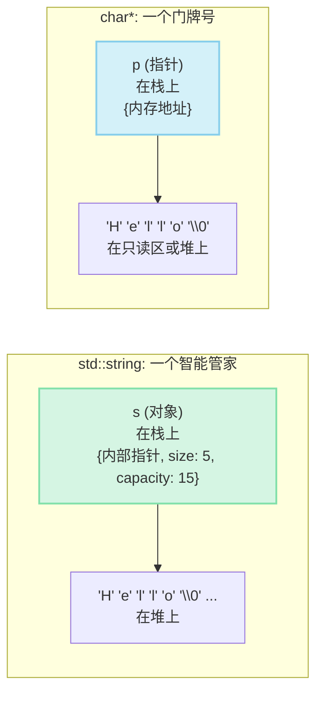
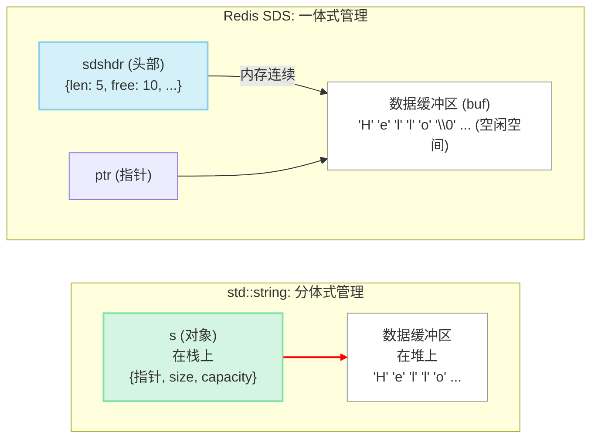
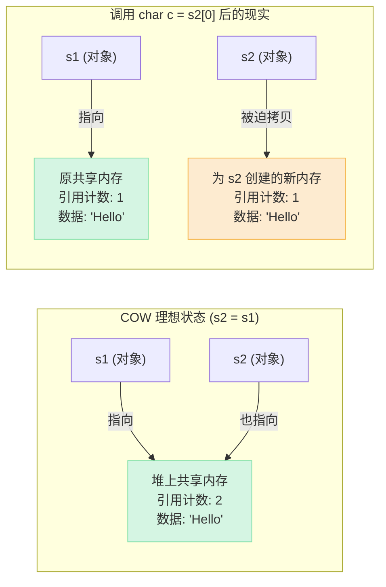

刚从 C 语言 `char*` 的“刀耕火种”时代爬出来的 C++ 新手，第一次看到 `std::string` 时，大概都会热泪盈眶，感觉像是“终于活进了文明社会” 😌。

这位“管家”实在是太能干了：自动管理内存，我们再也不用担心缓冲区溢出；轻松拼接、查找、遍历，简直是字符串处理的“瑞士军刀”。`std::string` 几乎把所有脏活累活都包揽了。

但...你有没有想过，这位“完美管家”会不会因为太能干，反而“好心办坏事”，把一些关键的性能细节给悄悄藏起来了呢？🤔

Bingo！在性能就是生命的后端开发世界里，这些被隐藏的细节，往往会成为程序里最令人头疼的性能瓶颈。

今天，咱们就来扮演一回“福尔摩斯”，揭开这位“完美管家”背后的七个秘密——也就是 `std::string` 的七大性能陷阱。

## 📖 本质区别：`std::string` (类) vs `char*` (指针)

在开始“吐槽” `std::string` 之前，我们必须先从根上理解它和 `char*` 的区别。一句话概括：

- **`char*` 是一个指针**：它只是一个指向内存中某个字符地址的“门牌号”，它本身不“拥有”数据，也不知道字符串有多长。
- **`std::string` 是一个类**：它是一个精心设计的“智能管家”对象，内部不仅管理着字符串数据，还记录着长度、容量等重要信息。



光看图可能还不够过瘾，`std::string` 这位“智能管家”和 `char*` 这个老派的“门牌号”，在脾气性格上到底有哪些不同呢？我们来仔细盘一盘：

从**本质**上说，`char*` 就像一个简简单单的“门牌号” 🏷️，它只告诉你字符串住在哪儿，但对屋里几口人（长度）、房子多大（容量）一概不知。而 `std::string` 则是一个全能的“智能管家” 📦，它不仅拿着钥匙，心里还有本账，对字符串的家底了如指掌。

这份“智能”首先体现在**内存管理**上。`char*` 这位老派的“看门大爷”，把 `new`/`delete` 这对烫手山芋交给你，稍有不慎就会导致内存泄漏 🤯。而 `std::string` 管家则信奉 RAII 原则，生命周期结束时会自动打扫战场，保证内存安全 ✅。

想知道字符串有多长？`char*` 会让你拿着尺子从头量到尾（`strlen()`），累得满头大汗（O(N) 🐢）。`std::string` 管家呢？它瞥一眼账本（内部成员变量），瞬间就能报出精确数字（`.size()`），快如闪电 🚀。

**安全感**更是天差地别。用 `char*` 搭配 `strcpy` 这样的老工具，就像在用一把没有保险的枪，极易走火导致缓冲区溢出 💣。`std::string` 管家则自带安全防护 🛡️，需要更多空间时会自动扩容，绝不会让数据“无家可归”。

更不用说**功能**上的差距了。`char*` 能做的有限，凡事都得求助于 C 库函数。而 `std::string` 自带一个工具箱 🛠️，查找、拼接、比较等十八般武艺样样精通。

最后，在处理**二进制数据**时，`char*` 有个致命弱点：它把 `\0` 当作字符串的终点，所以无法在内部存储 `\0` 字符 ❌。而 `std::string` 则毫无此限制，无论是文本还是图片，任何二进制数据都能照单全收 ✅。

## 😇 `std::string`：从“蛮荒”到“文明”的飞跃

在开始“吐槽大会”之前，我们必须先给 `std::string` 颁发一个“时代进步奖章”，因为它几乎治好了 C 字符串的所有“老毛病”。

还记得那些年被 `char*` 支配的恐惧吗？

想知道一个字符串多长？对不起，请从头到尾跑一遍 `strlen()`，CPU 风扇呼呼作响。手动 `malloc` 之后，还得天天提醒自己千万别忘了 `free`，不然内存泄漏分分钟找上门。更别提 `strcpy` 和 `strcat` 这对“定时炸弹”兄弟了，一不留神就缓冲区溢出，程序“duang”一下就崩溃给你看。而且它还特别“小气”，字符串里连个 `\0` 都容不下，处理二进制数据时简直寸步难行。
 
就在这时，`std::string` 踏着七彩祥云出现了！它用 `.size()` 在 O(1) 时间内告诉你长度；它用 RAII 机制自动管理内存，彻底告别内存泄漏和野指针；它还能自动扩容，让缓冲区溢出成为历史；甚至还能轻松处理包含 `\0` 的二进制数据。

一句话总结：**`std::string` 用一点点性能上的“不自由”，换来了安全和效率的“大解放”**。在 99% 的场景下，它都是比 C 字符串更香的选择。

但我们，是那群追求极致的 1% 工程师，对吗？😉

## 🕵️ 揭秘 `std::string` 的“隐藏款”特性

好了，赞歌唱罢，让我们戴上性能分析的眼镜。但在开始“抓虫”之前，我们必须先了解现代 `std::string` 实现的两个基本盘，因为它们是理解很多性能问题的“题眼”：

1.  **短字符串优化 (SSO) 是标配**：为了避免短字符串也产生堆分配，绝大多数现代 `std::string` 实现都会采用 SSO。这极大地提升了处理短字符串的效率，但也带来了一些值得玩味的新问题。
2.  **写时复制 (COW) 已成历史**：C++11 标准明令禁止了 COW 实现，因为它在多线程环境下会带来严重的性能问题。如果你还在维护远古时期的代码，可能会遇到它，但新代码中可以忽略。

搞清楚这两个“时代背景”后，我们再来看 `std::string` 在日常使用中，还有哪些让人“意想不到”的坑。

### 陷阱一：内存分配的“黑盒” 📦

这是 `std::string` 便利性背后的最大代价。当你开心地向一个字符串追加内容时，虽然表面风平浪静，但它内部可能正在经历一场“惊心动魄”的搬家（内存重分配）。

```cpp
#include <iostream>
#include <string>

int main() {
    std::string s;
    std::cout << "初始容量: " << s.capacity() << std::endl;
    for (int i = 0; i < 10; ++i) {
        s.push_back('a' + i);
        std::cout << "长度: " << s.length()
                  << ", 容量: " << s.capacity() << std::endl;
    }
    return 0;
}
```

**运行结果 (GCC/Clang 可能如下):**

```
初始容量: 0
长度: 1, 容量: 1
长度: 2, 容量: 2
长度: 3, 容量: 4
长度: 4, 容量: 4
长度: 5, 容量: 8
...
```

看到没？每次 `capacity` 变化，都意味着一场“伤筋动骨”的大手术：

1.  **找新家**：先申请一块更大的新内存。
2.  **搬东西**：然后吭哧吭哧地把旧内存里的数据一个不落地拷贝到新内存。
3.  **拆旧房**：最后还得把旧的内存给释放掉。

这个过程在高频字符串操作（比如日志拼接）中，会带来巨大的性能开销。虽然 `s.reserve()` 可以提前“打招呼”预留空间，但问题是，你并非总能未卜先知，准确知道需要多大空间。这种不确定性，让 `std::string` 的性能变得像“开盲盒”一样，难以预测。

### 💡 隔壁家的“尖子生”：Redis 的 SDS 是如何解决的？

`std::string` 的“搬家”问题这么烦人，有没有更聪明的解决方案呢？当然有！隔壁家高性能数据库 Redis 就因为它受不了 C 字符串和 `std::string` 的这种不确定性，干脆自己撸了一个轮子——**SDS (Simple Dynamic String)**。

SDS 的设计哲学突出一个“实用至上”，它用一种非常巧妙的方式解决了频繁内存分配的痛点。它的核心秘密在于**将元数据和数据本体打包存在一起**。



看到了吗？`std::string` 是一个栈上的“遥控器”去控制堆上的“电视机”。而 SDS 则是把“遥控器”直接粘在了“电视机”上，组成一个整体。一个指向 SDS 字符串的指针，实际上指向的是 `buf` 的起始地址，但只要将指针向前移动一点点，就能访问到记录着长度 `len` 和空闲空间 `free` 的头部。

#### “一体式”设计的动机：为什么这样更快？ 🧠

你可能会问，不就是把元数据和数据放一起吗？有那么神奇？问得好！这背后是对计算机硬件工作方式的深刻洞察，主要有三大好处：

1.  **极致的缓存亲和性 (Cache Friendliness)**：CPU 读取内存时，不是一个字节一个字节地读，而是一块一块地（称为 Cache Line，通常是 64 字节）“批发”到自己的高速缓存里。`std::string` 的元数据（在栈上）和数据（在堆上）内存地址通常“天各一方”，访问元数据，CPU 拉取一块缓存；再访问数据，CPU 很可能又要去主内存里重新拉取另一块缓存，这个过程很慢。而 SDS 的“一体式”结构，让元数据和数据本体紧紧相邻，CPU 在读取元数据（比如 `len`）时，极有可能“顺手”就把字符串的开头部分一起加载到了高速缓存里。当你紧接着要操作字符串内容时，数据已经在“手边”了，速度快如闪电！⚡
2.  **减少一次内存访问**：访问 `std::string` 的数据，需要先在栈上找到 `string` 对象，读取里面的指针，再根据指针地址去访问堆内存，这是两次内存跳转。而访问 SDS，指针直接指向数据区，访问元数据也只是一个简单的指针偏移运算，内存访问更直接。
3.  **内存分配更简单**：一次 `malloc` 同时搞定元数据和数据空间，一次 `free` 全部释放。管理起来干净利落，减少了内存碎片化的可能性。

正是这种对硬件“脾气”的精准把握，让 SDS 在性能上赢在了起跑线上。

这种设计带来了两大“神技”：

1.  **空间预分配 (Space Pre-allocation)**：当 SDS 需要扩容时，它会很有远见地申请比当前所需更多的空间。比如，如果修改后字符串长度小于 1MB，它会直接分配两倍大小的内存；如果超过 1MB，则会额外多分配 1MB。这种“用空间换时间”的策略，大大减少了后续操作触发内存重分配的次数。
2.  **惰性空间释放 (Lazy Freeing)**：当你缩短一个 SDS 字符串时，程序并不会立即归还多出来的内存，而是把这部分空间标记为“空闲”，记录在 `free` 字段里。万一你马上又要追加内容呢？这些预留的“库存”就能立刻派上用场，避免了一次“先裁员再招人”的折腾。

虽然 SDS 是用 C 语言实现的，但它的设计思想——尤其是对内存分配的精细化控制——对于我们 C++ 程序员来说，极具参考价值。它告诉我们，在性能敏感的场景下，一个“自适应”且“有远见”的内存管理策略，比一个“一刀切”的通用策略要高效得多。

### 陷阱二：短字符串优化 (SSO) 的“双刃剑” ⚔️

> SSO 是现代 `std::string` 实现中最常见的性能优化，但它也是一把双刃剑：极大地提升了短字符串的性能，也引入了行为不确定性。

为了缓解“陷阱一”带来的频繁搬家问题，标准库的实现者们普遍采用了一个“骚操作”——“短字符串优化”（Short String Optimization, SSO）。

- **核心思想**：对于那些“个头小”的字符串（比如小于16或24字节），`std::string` 压根儿就不去堆上“大动干戈”申请内存，而是直接把内容塞进自己对象内部预留的一小块“私房钱”（栈上空间）里。

这在大多数情况下都是一个天才设计，它避免了堆内存分配的开销，处理短字符串时快如闪电。但也正因为它并非 C++ 标准的一部分，而是编译器的“自行发挥”，导致了它的“副作用”：

1.  **行为不一致**：SSO 的阈值、具体行为在不同编译器（GCC, Clang, MSVC）、不同平台、不同版本之间都可能**完全不同**！这让依赖 SSO 的性能调优变得非常脆弱。
2.  **潜在的“性能悬崖”**。你的代码可能在一个平台上因为享受了 SSO 的红利而跑得飞快，换个平台，可能就因为字符串长了那么1个字节，没够上 SSO 的“包邮门槛”，性能瞬间“拉了胯”，出现断崖式下跌。
3.  **`sizeof(std::string)` 的迷惑性**。你可能会被 `sizeof(std::string)` 那 24 或 32 字节的大小吓一跳，心想“存个指针和长度而已，怎么这么胖？”——这正是为了给 SSO 预留“私房钱”空间。

**核心观点**：我们应该享受 SSO 带来的性能红利，但不能编写依赖其特定行为的代码。要始终把它当作一个“锦上添花”的免费优化，而不是一个可以依赖的稳定特性。

### 陷阱三：临时对象的“隐形成本” 👻

这是 C++ 新手最容易踩的坑，没有之一。快看看下面这行“平平无奇”的代码：

```cpp
std::string a = "hello";
std::string b = "world";
std::string c = "!";
// 看似简单的一行，在编译器眼里却是场灾难
std::string result = a + ", " + b + c;
```

你以为只是一次简单的拼接？不，在编译器眼中，这行代码触发了一场不易察觉的“连锁反应”。它会先将 `a` 和 `", "` 相加，悄悄在内存中生成一个临时的 `std::string` 对象来存放结果 "hello, "。紧接着，这个刚诞生的临时对象又马不停蹄地和 `b` 结合，创造出第二个临时对象，内容是 "hello, world"。故事还没结束，第二个临时对象继续与 `c` 合并，这才得到我们想要的最终结果 "hello, world!"，并把它存放在第三个临时对象里。最后，`result` 才从这第三个“短命”的临时工手里接过最终的数据（通过拷贝或移动构造）。

就这么一次拼接，背后是三次（可能）的内存分配和若干次数据拷贝。正确的姿势是什么？

```cpp
// 方式一：原地拼接，只在必要时“搬一次家”
std::string result = a;
result.reserve(a.length() + b.length() + c.length() + 2); // Pro 级操作：提前算好总大小
result += ", ";
result += b;
result += c;

// 方式二 (C++20)：交给专业人士 `fmt` 库，它会预计算总长度，一次搞定
#include <format>
std::string result = std::format("{}, {}{}", a, b, c);
```

**血泪教训**：**别再像“土豪”一样用 `+` 疯狂拼接字符串了！**

### 陷阱四：`substr()` 的“昂贵代价” 💸

想从一个长字符串里抠一段子串出来？`substr()` 似乎是天经地义的选择。

```cpp
std::string log = "ERROR: User 'root' failed to login.";
// 我只想拿到 "ERROR" 这个类型
std::string log_type = log.substr(0, 5);
```

在 C++11 之前，`substr` 可能还会玩点“写时复制”（后面会讲）的小聪明来共享内存。但在 C++11 及以后，标准大笔一挥，规定 `substr` **必须返回一个全新的 `std::string` 对象**，童叟无欺。这意味着什么？

1.  一次全新的**堆内存分配**。
2.  一次**数据拷贝**，把子串内容从 `log` 一个个搬到 `log_type` 的新家。

如果你只是想“看一眼”或者把子串传给某个函数，却为此付出了一整套“买房+装修”（内存分配+拷贝）的代价，这无疑是巨大的浪费。

**现代 C++ 的答案**：用 `std::string_view` (C++17) 啊！

```cpp
#include <string_view>

// string_view 像一张“租房合同”，它只“指向”原始字符串的一部分，不拥有数据
std::string_view log_type_view(log.c_str(), 5);

// 几乎零成本！没有内存分配，没有拷贝，轻装上阵
void process_log(std::string_view sv);
process_log(log_type_view);
```

`std::string_view` 的出现，就是为了在这些“只读”场景下，一举干掉 `substr` 带来的性能痛点。

### 陷阱五：与 C-Style API 交互的“来回奔波” 🏃‍♂️

在实际工程中，我们总免不了要和一些只认 `const char*` 的“老古董” C API 打交道（比如文件操作、网络库等）。`std::string` 提供了 `.c_str()` 方法来搭起沟通的桥梁。

```cpp
std::string filename = "config.json";
// fopen 这位“老先生”只认识 const char*
FILE* fp = fopen(filename.c_str(), "r");
```

这看起来很简单，但背后有两点值得说道说道：

1.  **`.c_str()` 的开销**：在 C++11 之后，标准要求 `std::string` 内部存储必须是连续的，且末尾必须有 `\0`。所以**大多数时候**，`.c_str()` 只是轻巧地把内部指针给你，几乎零成本。但注意，我说的是“大多数时候”，在某些极端或旧的实现中，它也可能触发一次内部缓冲区的整理。
2.  **反向的开销**：真正的开销大头是从 C-Style API 返回 `char*`，再把它塞进 `std::string` 里。

```cpp
// get_username() 返回一个需要我们手动 free 的 char*
char* c_username = get_username();
// 就在这一步：1. 为 std::string 分配新家 2. 把 c_username 的内容全都搬进来
std::string cpp_username = c_username;
free(c_username); // 千万别忘了给“老先生”擦屁股
```

每一次这样的转换，都是一次内存分配和一次全量拷贝。在高性能服务中，需要仔细设计接口，尽量避免这种在 `std::string` 和 `char*` 之间的“反复横跳”。

### 历史回顾：写时复制 (COW) 的“被禁”往事 📜

> **前方考古注意**：这个特性在 C++11 标准中已被“扫进历史的垃圾堆”，现代主流编译器（近十年内的）都已不再使用。但了解它，有助于我们理解 `std::string` 的演进，以及维护那些“祖传”老代码。

在遥远的 C++11 之前，很多标准库（比如老掉牙的 GCC）为了“节约闹革命”，采用了一种叫“写时复制”（Copy-on-Write, COW）的策略。

- **工作方式**：当你拷贝一个 `std::string` 时（`std::string s2 = s1;`），`s2` 不会立即复制 `s1` 的数据，而是鸡贼地和 `s1` 共享同一块内存，并把一个“引用计数”加 1。只有当 `s1` 或 `s2` **忍不住要修改**数据时，“嘭”的一声，才会真正触发拷贝，为修改方创建一个新副本。

**优点**：对于“复制一万次，修改没几次”的场景，能节省大量内存和时间。

**致命缺点**：

- **多线程噩梦**：为了维护那个共享的“引用计数”，所有操作都必须是原子操作，这在多线程环境下会引入大量的锁竞争，性能直接拉胯到姥姥家。这是它在 C++11 时代被“处决”的首要罪状。

- **性能“薛定谔”与 `operator[]` 的“无心之过”**：这可能是压垮 COW 的最后一根稻草。`std::string` 提供了一个极其常用的操作符 `operator[]` 来访问单个字符。问题在于，它返回的是一个 `char&`（引用），这意味着外部代码拿到它之后，既可以读取也可以写入。

  > `char c = s[0];` // 意图：读取
  > `s[0] = 'h';` // 意图：写入

  `operator[]` 函数本身无法“未卜先知”，它根本不知道你接下来要干什么。因此，它被迫做出最悲观、最安全的假设：**只要你调用了非 `const` 版本的 `operator[]`，我就当你可能要写入！**

  这就导致了一个灾难性的后果：

  ```cpp
  std::string s1 = "Hello";
  std::string s2 = s1; // COW 启动，共享内存

  // 仅仅是想读取 s2 的第一个字符
  // 但灾难就在这里触发了！
  char c = s2[0];
  ```

  就在你执行 `s2[0]` 的那一刻，`operator[]` 函数为了防止你可能的写入污染 `s1` 的数据，被迫**立即触发了一次完整的数据拷贝**（即“分离”），哪怕你的本意只是想读一下。



一个本该是 O(1) 的超快读取操作，瞬间变成了一个 O(N) 的内存分配和拷贝操作。这种常用操作上的巨大性能不确定性，是开发者无法接受的。

正是因为 COW 在多线程和 `operator[]` 这两大核心问题上栽了跟头，C++11 标准才“痛下杀手”，规定字符串操作不能再共享数据，天下太平。

### 陷阱六：`find` 和搜索的“朴素”算法 🔍

当你需要在一个长字符串里查找一个子串时，`std::string::find` 是最顺手的工具。

```cpp
std::string text = "a very long long long text...";
size_t pos = text.find("long text");
```

但是，C++ 标准这位“大家长”只管规定 `find` 该干啥（接口和行为），却**压根儿没说它该怎么干**（具体用哪种算法）。

这意味着，库的实现者完全可以“偷懒”，用最简单、最“朴素”的暴力匹配算法（Brute-Force），其时间复杂度是 O(N\*M)。

对于绝大多数日常场景，这都够用了。但在需要极致性能的文本处理、搜索引擎等领域，这种不确定的“随缘”算法可能会成为瓶颈。到那时，你就得考虑请出 KMP、Boyer-Moore 这些“专业杀手”了。

## ⚖️ 总结：戴着镣铐的舞者

经过这次“探案之旅”，我们不难发现，`std::string` 并非一个可以无脑使用的“傻白甜”类。它更像一位戴着“性能镣铐”的优雅舞者，舞姿虽美，但你得懂它的限制。

我们揭开了它**内存分配**的“黑盒” 📦，知道了它那频繁“搬家”可能带来的性能抖动，也学会了用 `reserve()` 提前为它订个大房子。我们审视了 **SSO 优化** ⚔️ 这把“双刃剑”，学会了享受其便利，同时警惕其行为的不确定性。

我们也曾为 `+` 拼接字符串时背后那场**临时对象** 👻 的“狂欢派对”而震惊，现在则更青睐于使用 `+=` 或 `std::format` 来避免这场灾难。面对 `substr()` 随手一截就是一次“深拷贝”的**昂贵代价** 💸，我们找到了 C++17 的“神器” `std::string_view` 作为“降本增效”的利器。

此外，我们还懂得了在 `std::string` 与**老旧 C-Style API** 🏃‍♂️ 之间交互时，要尽量避免“反复横跳”式的数据拷贝。最后，我们也清楚了 `find` 算法 🔍 可能很“朴素”，在性能热点上需要呼叫更专业的算法来救场。通过“考古”写时复制 (COW) 的历史，我们更庆幸活在现代 C++ 的多线程安全时代。

**最终建议**：

- **大胆用 `std::string`**：它的安全性和便利性，依然让它成为现代 C++ 的基石，别因噎废食又回到 `char*` 的蛮荒时代。
- **在性能热点处保持警惕**：当性能分析器（Profiler）告诉你的瓶颈在字符串操作上时，回来看看这“六宗罪”，检查一下是不是踩了哪个坑。
- **拥抱 `std::string_view`**：对于只读的字符串参数，别犹豫，大胆地用 `std::string_view`，它能帮你消除大量的无谓拷贝，让代码又快又好。

`std::string` 为我们铺好了 99% 的康庄大道，而理解它的这些“陷阱”，正是我们成为那 1% 顶尖 C++ 工程师所需要走完的最后 1% 的路。🚀
