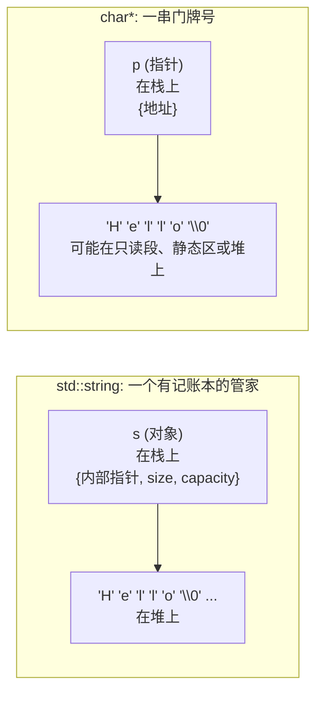

要是你随手逮一个混了十几二十年 C 的老程序员，  
在茶水间角落问一句：

> “你这辈子见得最多的线上事故，大概都跟啥有关？”

他多半会先笑一声，再叹口气，接着开始报菜名：

- `char*`
- 一排看起来很乖的 `strcpy` / `strcat` / `strlen`
- 再加几个“图方便就写上去”的 `sprintf`

上世纪末到本世纪初，这几位几乎包圆了一半的安全公告。

- 缓冲区少开了 8 个字节，测试环境一点事没有，上线一夜，几千台机器轮流 core dump；
- 某人为了“提高性能”把边界检查注释掉，被第一波外部流量直接打穿；
- 某个 `sprintf` 少写了一个长度限制，给几代安全研究员稳定“续命”。

那会儿的世界和现在完全不是一个量级：

- 内存小到抠门，几十 MB 能扛一堆服务；
- 调试器原始，很多人还在串口追日志；
- 标准库的 KPI 很朴素：**快、简单、能在各种奇怪平台上编得过**。

所以 C 语言在“字符串”这件事上，走了一条最省心也最硬核的路：

> 一串 `char`，遇到第一个 `'\0'` 就算完事。  
> 长度你自己记，边界你自己担。

换句话说：

> 语言把绳子递给你，要不要把自己吊起来，看你职业操守。

---

### C++ 上场：帮你少还一点“记忆债”

时间轴往前拨，画面从一堆 `char*` 和 `strcpy` 拉远，  
拉到上世纪八十年代的贝尔实验室。

一群工程师白天写电信系统、数据库、操作系统，  
晚上还得回公司救火。  
Bjarne Stroustrup 就在这种环境里琢磨 C++。

他的日常，大概是这种体验：

- 这边 `malloc`，那边 `free`；
- 这里 `fopen`，那里 `fclose`；
- 上锁 `lock`，解锁 `unlock`；
- 稍微一走神，就漏还、多还、乱还。

人脑得记一张巨大的“资源账本”。  
代码一多，账就很难对齐。  
一忙起来，人就是 bug 的放大器。

Bjarne 心里冒出一个当时挺激进的想法：

> “这些成对出现的操作，能不能别全靠人记？  
>  能不能把‘拿了资源就必须还’写进语言规则里？”

于是你后来在书上看到的这些东西就陆续登场了：

- 构造函数 / 析构函数；
- RAII（Resource Acquisition Is Initialization）；
- “对象一挂，资源自动还”。

先在文件句柄、锁、内存块这种地方试水，  
发现这路子确实好用。  
逻辑顺着往下拐，自然就拐到了**字符串**身上。

---

在 C 的时代，字符串就是：一串 `char` 加一个 `"\0"`。  
语言不管是谁分配的，不记长度，也不管该不该还。

到了 C++，脑回路完全变了：

> “既然大家天天用字符串，  
>  不如给它办个正式户口，做成一个像样的对象。”

于是 `std::string` 出场：

- 帮你记长度，`size()` O(1) 直接读成员；
- 帮你管内存，构造时申请，析构时归还，中间自动扩容；
- 常用操作直接包成成员：拼接、查找、子串、比较，一条龙。

很多人第一次从 `char*` 世界爬出来，写下：

```cpp
std::string s = "hello";
s += " world";
```

心里一般会微微一愣：

> “这也太省事了吧？  
> 缓冲区多大不用我算，`\0` 写没写对也不用我操心，  
> 拼接直接 `+` 一把梭？”

对比一下“远古写法”：

```c
char buf[16];
strncpy(buf, "hello", sizeof(buf) - 1);
buf[sizeof(buf) - 1] = '\0';
strncat(buf, " world", sizeof(buf) - strlen(buf) - 1);
```

一个是“上山挑水，每次先掂量桶够不够大”；  
一个是“家里早就装好自来水，拧开就有”。  
谁更舒服，一眼就懂。

在这个比喻里，`std::string` 就是那个**上心的房管家**：

- 自己记着房子多大（`size`）；
- 心里清楚还能不能再扩一间（`capacity`）；
- 你只管说“再搬点字符进来”，  
  什么时候换大房、什么时候退租，它自己安排。

这层抽象，把 C 年代一大票经典事故挡在门外：  
野指针、越界写、双重释放、忘记释放……  
很多以前要在日志里熬一整晚才查出来的 bug，  
现在连露脸机会都少了很多。

---

### 技术债转移：从你脑袋转到标准库

现实世界没有纯爽。

在 C 字符串那一代，语言把麻烦事都甩给你：

- 长度你自己维护；
- 边界你自己盯；
- 内存多大、从哪来、该不该还，全看你有多自律。

说白了：

> “绳子给你了，系哪儿你自己决定。”

到了 `std::string` 这一代，账本位置变了：

- 语言和标准库开始接这口“锅”；
- 你不用手动记账，但账本还在，只是塞进了类里；
- 你用得越爽，它在背后干的活就越多。

从技术史的视角看，这是一次“时代转账”：

- 早年为了在几十 KB、几百 KB 的机器上活下去，  
  C 选了最省内存、最好移植的做法；
- 这些“小聪明”在今天变成技术债，  
  C++ 只能用更复杂的抽象，一点点帮你还。

`std::string` 是这场还债行动里的主力选手之一。  
它把字符串用起来变得像脚本语言一样丝滑，  
也在性能、内存布局、临时对象这些地方，  
埋下几道不太显眼、但真能出事的坑。

后面的“六宗罪”，说的就是这些坑。

这篇文章想做几件事：

- **把 C 到 `std::string` 这条演化线拉直**：  
  让你知道它不是凭空冒出来的，而是时代一点点拱出来的。
- **把 `std::string` 里那些“暗中干的活”翻译成人话**：  
  哪些看起来无害的一行代码，背后可能触发分配、复制、移动。
- **挑几个实战里最常见的场景，讲清楚它在性能上的“六宗罪”**：  
  哪些是设计本身的 trade-off，哪些纯粹是用法太随意。
- **最后给你一套“直觉上的标尺”**：  
  什么时候可以心安理得地用 `std::string`，  
  什么时候该掂量一下，换工具或者换写法。

如果你是刚入行不久的 C++ 新手，希望你读完以后：

- 能明白 `std::string` 为啥长成今天这个形状，而不是别的奇怪东西；
- 碰到性能问题，不再习惯性地骂“标准库慢”，  
  而是会先问一句：“是库的问题，还是我自己在给库添堵？”

如果你已经在 C/C++ 里混了很多年，希望你能在下面看到：

- 几段你亲眼经历过的技术史回放；
- 几个“标准为什么这样定，而不是那样定”的影子；
- 那些你踩过的坑，现在有机会提前帮新人绕过去。

---

### `std::string` 和 `char*`：一个钥匙串，一个房管家

先把最底层的差别说清楚，不然后面那几个“罪名”都不好聊。

一句话概括：

- `char*` 是**钥匙串**：只知道“这有个门牌号”，  
  房子多大、住几口人、有没有违建，它都不知道。
- `std::string` 是**房管家**：  
  手里有钥匙，还揣着一本账：当前住了几个字符、最多能塞多少、还有没有空房。

可以脑补一张小图：



关键不在“谁在栈上、谁在堆上”，而是：

- `char*` 那一小块栈空间，只装了一个**地址**；
- `std::string` 那一小块栈空间，里头是**地址 + 长度 + 容量**。

这点差别，落到日常开发会变成几个非常现实的问题。

#### 1. 内存到底谁说了算？

在 `char*` 的世界：

- 这块内存是 `malloc` 出来的，还是别人传进来的？
- 这段字符串是静态常量，还是从堆里 new 出来的？
- 该不该 `free`？会不会多 `free` 一次？

全靠你在脑子里画图。  
一旦画错：

- 少 `free`：泄漏；
- 多 `free`：双重释放，堆直接打穿。

`std::string` 的态度是：

> “这块地是我名下的。  
>  什么时候买、什么时候卖，记在我自己的账本上，你别操心。”

构造函数负责占地，析构函数负责还地，  
RAII 帮你把“收尾动作”绑死在生命周期上。

#### 2. 长度怎么算？

`strlen(p)` 的工作方式很憨：

- 从头开始扫；
- 一直扫到第一个 `'\0'`；
- 中间啥都不记。

字符串越长，每次求长度越贵。

`std::string` 直接把长度记在对象里，`s.size()` 本质就是：

- 读一个整数成员；
- 理论上 O(1) 完事。

#### 3. 会不会写出界？

回到最经典的一问：**会不会写过头？**

`char*` 配 `strcpy` / `strcat` 那代的画风是：

- 函数根本不知道“目标缓冲区有多大”；
- 源字符串稍微长一点，就有机会把后面那片内存统统抹掉。

很常见的一幕：

- 某人写了个命令行工具，缓冲区开了 128 字节；
- 某天同事加了个长长长的参数；
- 工具照样编译过，运行时直接一脚把栈踹裂了。

`std::string` 至少多了点“自知之明”：它知道自己的 `capacity`。

- 容量够，就接着往里塞；
- 不够，就去分配器要一块更大的地，把原来的内容搬过去。

实在扩不了，要么抛异常，要么让你明显感觉“内存绷不住了”，  
比默默越界写还是文明太多。

它当然不能证明你业务逻辑绝对安全，  
但比“闭着眼睛往后写”好看不少。

#### 4. 能不能放“脏东西”？

C 风格字符串有个硬伤：  
**遇到 `'\0'` 就认定“结束了”。**

普通文本没事，但放二进制数据就很难受——  
你永远分不清第一个 `'\0'` 是“内容的一部分”，还是“结束标记”。

`std::string` 更佛系：

- 它只认长度；
- 内容长什么样，它不管。

所以很多项目里，其实是拿 `std::string` 当“字节容器”用。

历史原因也不复杂：  
C 设计那会儿，机器穷、工具弱：

- 多存一个长度字段都要犹豫；
- 能省一点就省一点，至于以后会不会出大事，先不想那么远。

等机器越来越快、内存越来越便宜，当年的“小聪明”就变成今天的技术债。  
C++、Java、C# 这些后来的语言，只能一点点替你把这债还掉。

---

### 从“野路子”到“正规军”：`std::string` 出道记

在翻“六宗罪”之前，得先把该发的锦旗发完。

把时间拨回到八九十年代，那会儿的 C 世界很像“江湖”：

- 有团队用固定大小数组做缓冲区；
- 有团队自己封一层“安全字符串库”；
- 有人直接开一堆宏。

每个团队都有一套自己的“字符串武功心法”。  
好不好用，全看口碑。  
一旦原作者离职，后来人接手就是满屏 `char*` 和约定俗成。

你刚才已经见过类似代码：

```c
char buf[16];
strcpy(buf, input);   /* 只要 input 稍微长一点，世界就会炸一次 */
printf("len = %zu\n", strlen(buf));
```

那几年，安全报告、技术博客讲的几乎是同一类故事：

- 命令行工具参数一长，缓冲区直接顶穿栈帧；
- 某个网络服务忘了校验报文长度，被塞了一截 shellcode；
- 某库接口文档里随手一句：
  “调用方需要保证传入的字符串可写且足够大”。

等到各种蠕虫在公网乱跑、缓冲区溢出成了安全圈的热词，  
大家才意识到：

> 当年图省事留的洞，这么多年一直在滚利息。

C 标准库后来开始往字符串 API 上贴创可贴：

- `strncpy` / `snprintf` 这种“带安全带版本”；
- 各个平台自带的 `_s` 结尾兄弟们。

但这些都只是**库层面的补丁**：

- 语言层面没有“资源对象”这个抽象；
- 没有构造/析构兜底；
- 谁也管不住大家老老实实用“安全版”。

到了 C++ 标准化的节骨眼上，委员会面前摆着一个现实问题：

> “要不要继续让每个项目自己发明一套字符串？  
>  还是干脆在标准库里给它一个正式编制？”

实际上，在 C++98 之前，各大厂、各大库早就有自己的 `basic_string`。  
只是名字、细节、行为都对不上。

C++98 把 `std::string` 正式收进标准，可以看成一次态度非常明确的“收编”：

- **从这以后，主流 C++ 代码里不再鼓励你用裸 `char*` 写完整业务逻辑**；
- 字符串从江湖野路子，升级成有规范、有语义保证的“正规军装备”；
- 生态里的库和框架终于有了共同语言：大家都用 `std::string` 交接。

从语言史角度看，这是从“裸指针时代”迈向“带一点抽象层”的关键一步：

- 字符串有了清晰的值语义和生命周期；
- 错误边界从“每一个 `strcpy` 调用点”，变成“几个核心类的实现”；
- 在**绝大多数业务代码**里，线上事故的来源因此少了整整一个量级。

如果用一句稍微粗一点但好记的话总结：

> `std::string` 用**一部分性能上的不确定性**，  
> 换来了**安全性和可维护性的大幅提升**。  
> 对大部分业务来说，它更像是一份“买保险”。

但对老一辈 C 程序员来说，心里总剩下一点疙瘩：

- 当你写的是高频、低延迟、对内存布局极其敏感的系统；
- 当你在意每一次堆分配、每一次 cache miss；

`std::string` 里那些对你“不可见”的小动作——扩容策略、临时对象、实现细节，  
就会一笔一笔写进你的性能账单。

下面这“六宗罪”，本质就在回答一个问题：

> **当一个原本透明的“野生工具”，被做成标准库抽象之后，  
>  那些被藏起来的细节，会在哪些地方重新以“代价”的形式出现？**

---

### 幕后设定两件事：SSO 和 COW

理解后面六宗罪，有两件幕后设定必须有点印象。

#### 短字符串优化 SSO：几乎人人都在偷开小灶

现代主流标准库基本都给 `std::string` 开了个“小灶”：

> 既然短字符串特别多，那干脆在对象内部留一小块空间。  
> 能塞下的全塞里面，尽量别往堆上跑。

结果就是，很多实现里的 `std::string` 对象长得有点“肿”：

- 除了指针、长度、容量；
- 还悄悄嵌了一小段“内联缓冲区”。

只要字符串足够短，就完全在这小块内存里打转：  
构造、拷贝、销毁，都是在栈上搬几字节，速度飞快。

#### 写时复制 COW：辉煌过一阵，最后退了场

早年的一些实现（比如旧版 libstdc++）玩过一个小聪明：

- 多个 `std::string` 可以共享同一块底层缓冲区；
- 真有人要写的时候，再复制一份。

这就是写时复制（Copy-On-Write, COW）。

在单线程小项目里看起来非常优雅：

- 赋值几乎不要成本；
- 真正会改内容的地方不多；
- 拷贝次数大幅下降。

但随着多线程、异常安全这些话题变得严肃，问题出现了：

- 谁负责加锁？
- 引用计数什么时候 +1 / -1？
- 异常一飞，会不会把计数搞坏？

C++11 把语义收紧后，相当于间接告诉大家：COW 这条路有点难走。  
现代主流实现基本都不再玩这套。

你只要记住两个关键词：

- **SSO**：为了短字符串性能，在对象里塞了一块“私房钱”；
- **COW**：曾经很风光，但因为多线程和语义问题，基本退场。

后面的几宗罪，很多都跟这俩有千丝万缕的关系。

---

### 第一宗罪：看不见的内存分配戏法

先看一段看起来“毫无问题”的代码：

```cpp
#include <iostream>
#include <string>

int main() {
    std::string s;
    std::cout << "初始容量: " << s.capacity() << '\n';
    for (int i = 0; i < 10; ++i) {
        s.push_back('a' + i);
        std::cout << "长度: " << s.length()
                  << ", 容量: " << s.capacity() << '\n';
    }
    return 0;
}
```

在很多实现里，你会看到类似输出：

```text
初始容量: 0
长度: 1, 容量: 1
长度: 2, 容量: 2
长度: 3, 容量: 4
长度: 4, 容量: 4
长度: 5, 容量: 8
……
```

表面上，你就是在一遍遍 `push_back`。  
背地里，一旦容量变大，典型流程是：

1. 向分配器要一块更大的地；
2. 把旧内容一字不落搬过去；
3. 把旧地还回去。

算法课会安慰你：

> “别慌，摊还复杂度是 O(1)。”

理论上没毛病。  
但你要是把类似写法塞进高 QPS 的日志系统，再打开火焰图，  
经常会看到一整条很红的 `std::string::append`。

问题不在于 `std::string` 用堆分配，  
而在于：**你根本不知道它会分多少次。**

现实中的字符串长度，经常是“随缘”的：

- 日志字段爱加不加；
- URL 长度看用户心情；
- 配置写多写少，看同事那天是不是加班。

你可以提前用 `reserve(N)` 跟它打个招呼：

```cpp
s.reserve(1024); // 大概需要 1KB 左右，先预留一下
```

这会好很多。  
但很多时候，你心里真没谱要预留多少。

我见过一次线上小事故：

- 某服务每个请求都会往一个 `std::string` 里拼 debug 信息；
- 一开始字段少，谁都没在意；
- 随着业务迭代，log line 平均长度翻倍；
- 一段时间后，CPU 曲线慢慢拱起来，  
  火焰图一看，大量时间烧在那段“看起来很朴素”的拼接上。

**一点使用经验：**

- 热点路径可以用 `std::string`，但别完全当黑盒；
- 它背后真的有一台“分配器状态机”在跑；
- 真要抠性能，要么自己管 buffer，要么用更可控的抽象（比如 SDS 那挂）。

---

### 第二宗罪：SSO 带来的性能悬崖

短字符串优化 SSO（Small String Optimization）  
本来是 `std::string` 里最接地气的一笔改良：

- 大部分字符串不长；
- 干脆在对象里挖一小块内联空间；
- 能塞的就原地放，别老跑堆。

于是像 `"OK"`、`"GET"`、`"id=12345"` 这种日常小字符串，  
在很多实现下压根不会碰堆分配：

- 构造只是栈上搬几字节；
- 拷贝就是把那一小坨 buffer 整块挪一挪；
- 析构几乎是空操作。

对大多数业务来说，这是纯福利：

- 日志级别、HTTP 方法、状态码这种被疯狂创建 / 销毁的小字符串，
- 都被 SSO 收进“对象私房钱”里，省了不少堆分配开销。

**真正危险的，不是 SSO 本身，而是它背后那条“阈值线”。**

你可以想象实现者在做一道算术题：

> “给你一个固定大小的 `std::string` 对象，  
>  里头要放指针、长度、容量，还能挤出多少字节留给短字符串？”

结果可能是：

- 有的实现：15 个字节以内内联；
- 有的觉得自己能塞 22 个；
- 还有别的奇怪数字，和 ABI、对齐、实现哲学都有关系。

标准一句没管这些细节，全靠各家 STL 自己拿捏。

故事就从这条“阈值线”开始变得好笑。

一个非常典型的实战：

- 某游戏项目里，角色结构体上有一个 `std::string name`；
- 内测阶段，大家名字都很短："Bob"、"Alice"、"猫咪"；
- 列表界面刷起来很丝滑。

某天策划说：

> “名字前面加个区服前缀吧，比如 `[S666]Alice`，更有 MMO 味。”

代码改完上线，没人动循环，没人改算法。  
只是多了几个字符，然后：

- 某些列表场景帧率开始抖；
- profiler 一看，一大坨时间花在构造/拷贝 `std::string` 上；
- 大家来回查逻辑 bug，愣是找不出哪行写错了。

顺着对象布局一点点抠，才发现真相：

- 老版本里，名字长度刚好落在 SSO 阈值以内，  
  都乖乖待在 `std::string` 对象内部；
- 加了 `[S666]` 之后，名字长度刚好跨过那条线，  
  字符串被赶去堆上安家；
- 构造、拷贝、析构一下从“栈上挪几字节”，  
  变成“频繁分配 / 释放堆内存”。

更魔幻的是：

- 他们在另一台机器上、换另一个编译器重现问题时，
- 怎么测都测不出同样的抖动——
- 因为那家的 SSO 阈值不一样，刚好没被跨过去。

这就是所谓的“性能悬崖”：

- 你眼里只是“多打了几个字符”；
- 实现眼里却是“从全程 SSO 一脚跌回堆分配时代”。

关于 SSO，有几个很现实的忠告：

- 别在设计里写“长度不超过 X 就一定很快”这种和 SSO 绑死的说法，  
  你依赖的不是标准，而是某个 STL 的性格；
- 一旦看到“字符串长度稍微一变，性能曲线就一脚踩空”，  
  先问一句：**“这里是不是踩在 SSO 阈值上了？”**

把 SSO 当福利，你会觉得它很香；  
把它当保证，你早晚会在某个奇怪的线上曲线拐点上翻车。

---

### 第三宗罪：连环临时对象——你以为在算字符串，其实在搬家

看一段大家都写过类似的代码：

```cpp
std::string a = "hello";
std::string b = "world";
std::string c = "!";

std::string result = a + ", " + b + c;
```

写起来很顺。  
肉眼看过去，好像就是“拼了一下字符串”。

编译器脑子里的画面完全不是这样，大概是：

1. 算 `a + ", "`，生成一个临时 `"hello, "`；
2. 再拿这个临时跟 `b` 拼，生成 `"hello, world"`；
3. 再跟 `c` 拼，生成 `"hello, world!"`；
4. 用最后这个临时构造 `result`，前面那仨依次析构。

如果这些字符串都很短，SSO 顶着，这种接力还行。  
但一旦字符串本身就挺大，每一棒基本是：

- 在堆上申请一块新内存；
- 把前面那一长串全抄一遍；
- 旧的还回去。

很多人第一次打开火焰图，看到一整片  
`std::string::operator+` / `append` 的红墙，  
心态是崩的：

> “我就写了几行很优雅的拼接，  
>  主角怎么变成了这俩函数？”

在这种场景下，更“土”的写法反而更靠谱：

```cpp
std::string result;
result.reserve(a.size() + 2 + b.size() + c.size());
result += a;
result += ", ";
result += b;
result += c;
```

或者在有 `std::format` 的环境里，  
干脆丢给专门干排版的库：

```cpp
std::string result = std::format("{}, {}{}", a, b, c);
```

不是说以后不能写 `a + b + c`，  
而是希望你在脑子里常驻一个小弹窗：

- 偶尔拼一两次，小字符串，`+` 很香；
- 高频、大字符串，还一条链 `a + b + c + d + e` 那种，  
  很容易变成“临时对象接力赛”。

写多了你会形成一个肌肉记忆：

> 一看到一长串 `a + b + c + d`，  
> 脑子里会自动弹出一句：  
> “这里要不要改成预分配 + 多次 `append`？”

---

### 第四宗罪：`substr()` ——“我只是想抠一口，你给我整了一盆”

再看一段经典代码：

```cpp
std::string log = "ERROR: User 'root' failed to login.";
std::string level = log.substr(0, 5); // 想要 "ERROR"
```

读起来一点问题没有。  
但在现代 `std::string` 语义下，这一行的含义是：

- 再分配一块堆内存；
- 把 `"ERROR"` 这 5 个字符抄一份出来。

在 COW 还流行的年代，有些实现会比较“鸡贼”：

- 表面上看是拷贝；
- 实际上底下跟原字符串共享缓冲区，只记起止索引。

C++11 基本把 COW 送走之后，这条路就封死了：

> 既然你说要一个“新的 `std::string` 对象”，  
> 那就给你一份真货，内存单独分。

小工具里偶尔来一两发 `substr`，当然没啥。  
但如果你在一个高频日志解析逻辑里这么用：

- 每行 log `substr` 几段；
- 每一段又塞进容器；
- 一秒几十万行日志飞过来；

内存分配器会非常真诚地告诉你：

> “你现在不是在解析日志，你是在办字符串分拣中心。”

C++17 往标准里塞了一个新工具：`std::string_view`。  
名字里有 `string`，但完全**不管**内存所有权：

```cpp
#include <string_view>

std::string log = "ERROR: User 'root' failed to login.";
std::string_view level{log.data(), 5};

void process_level(std::string_view sv);
process_level(level);
```

- 不分配堆内存；
- 不拷贝数据；
- 就是拿一个指针 + 长度，对着原字符串说：“看，从这到这就是 level。”

唯一前提：

> **原始字符串得活得比 `string_view` 久。**

实战里，我一般这么记：

> 只是想尝一口汤，就别每次都端走整锅。  
> 能借的，就别抄一份。

`substr` 不是什么原罪，很多地方依然很好用；  
`string_view` 只是送你一个“更懒一点”的选项。

---

### 第五宗罪：在 C 和 C++ 世界之间来回办签证

现实世界的 C++ 项目，很少是“纯血统”。  
只要代码活得够久，仓库里多多少少会躺着几箱“考古文物”：

- `libcurl` 一类的网络库；
- `zlib`、`libpng` 这类压缩 / 图像库；
- OpenSSL 那挂安全库；
- 各种只提供 C 接口的系统 API。

它们有个共同点：**只讲 C 话，只认 `const char*`。**

而你的新代码到处都是 `std::string`。  
于是两边世界之间，自然就有一道“边境线”。

`std::string` 往 C 世界走，其实还挺友好：

```cpp
std::string filename = "config.json";
FILE* fp = fopen(filename.c_str(), "r");
```

- `c_str()` 就是把内部缓冲的地址递出去；
- 只要 `filename` 还活着，`fp` 用它那会儿就安全；
- 基本不多分配，也不多拷贝。

真正费劲的是**从 C 世界回来那一趟**：

```cpp
char* raw = legacy_get_name(); // 需要调用者 free
std::string name = raw;        // 为 name 申请新家，再抄一遍
free(raw);
```

每一次这样的“入境”，都隐含着：

- 一次堆分配；
- 一次全量拷贝；
- 一次“别忘了 free / 别 double free”的心理压力。

偶尔办一次签证没事。  
问题是很多系统的长相是这样的：

- 最底下是一圈 C 风格接口；
- 上面包一层“稍微现代一点”的 C++ 封装；
- 再上面是“业务友好”的 C++ API；
- 每一层都坚持：**“我这层只收 `std::string`，不用 `char*`。”**

结果：

- 请求从外到里要过好几道“海关”；
- 每一层都要把上一层传来的 `const char*` 再包一层 `std::string`；
- 同一个名字、同一个 URL，在一次请求里被拷来拷去好几轮。

你在火焰图上看到一堵 `std::string` 构造 / 析构的红墙，  
追进去一看，大量时间都死在这几次“跨国办签证”的路上。

怎么缓解这种来回折腾？  
我的做法一般是：

- 把“和 C 打交道”的代码，严格关在边界层；
- 边界层里，老老实实写 `char*`、`const char*`、`size_t`；
- 一旦跨过边界，尽量只在少数几个地方，把它们变成 C++ 世界的类型。

实战里，通常会加几条小约定：

- **读不改的字符串参数，优先用 `std::string_view` 收**：  
  既能无损接 `std::string`，也能无损接 C 字符串，不多拷一份；
- **真要接管内存的地方，就坦率地收 `std::string`**：  
  清清楚楚告诉调用者：“到我这里，后面我帮你管”；
- **C 接口的转换尽量集中处理**：  
  不要在业务代码里到处“顺手包一层 `std::string`”。

当你把“海关”压缩在一圈清晰的边界代码里：

- 业务逻辑几乎看不到 `char*`；
- 整个系统只在少数地方发生“办签证”的堆分配和拷贝；
- 出了性能问题，你也知道该往哪一圈代码里翻日志、拉火焰图。

那种“到处都有 `std::string` 在 new，谁先动的手也说不清”的局面，  
会好很多。

---

### 第六宗罪：`find` ——你以为在随口一问，它其实在全表扫描

这一宗，很多人是被 profiler 当头一棒打醒的。

我们都写过类似代码：

```cpp
std::string text = "a very long long long text...";
auto pos = text.find("long text");
```

API 设计得很顺眼：

- 语义清晰：“帮我在这段文本里找一下这个模式”；
- 返回值也好理解。

但标准在这里给实现留了很大自由度：

> 只规定**要找到**，  
> 没规定**要多聪明地找到**。

于是现实可能是：

- 有的实现用最朴素的暴力匹配：从头到尾逐个尝试，复杂度 O(N×M)；
- 有的实现会在模式足够长时启用 Boyer–Moore 之类的算法，  
  但**什么时候启、什么时候退化**，全是实现细节。

对绝大多数业务来说，这一点都不致命：

- 配置文件就那么几十行，顶多几百行；
- 偶尔在日志里 `find` 一两次，根本挂不上火焰图。

但我见过这样的“翻车现场”：

- 某日志解析服务，每行日志都要 `find` 几个关键字段；
- 每秒上万行，解析逻辑写得还挺优雅；
- profiler 一开，CPU 曲线告诉你：**主要时间烧在 `std::string::find` 里。**

代码大概是这个味道：

```cpp
for (std::string_view line : lines) {
    auto p1 = line.find("user=");
    auto p2 = line.find("ip=");
    auto p3 = line.find("session=");
    // ... 后面还有一串 find
}
```

逻辑没错，语义也对。  
但算法上，本质是**对每一行做了多次线性扫描**。

如果实现采用的是最简单的逐字符比较：

- 每个 `find` 至少扫一遍行内大半字符；
- 几个 `find` 连着写，相当于把每行反复扫了好几遍；
- 行数一多，整体就变成一个慢速“全表扫描服务”。

在类似场景里，更健康的思路是：

- 写一个**专门的解析器**，顺序扫描一遍，把需要的字段一口气抠出来；
- 或用 `string_view` 切片，把每段只看一遍；
- 再高级一点，上成熟的模式匹配算法或库（KMP、Boyer–Moore、Aho–Corasick、正则引擎等）。

这并不是在给 `std::string::find` 定罪，它本质上是一个**很好用的通用工具**：

- 写 demo、小工具、偶尔跑一下的脚本逻辑，用它完全 OK；
- 甚至很多线上代码也能放心用，只要你知道文本规模和调用频率在哪个量级。

但当你在做“高吞吐文本分析”“复杂协议解析”这种活时，  
继续一股脑往上堆 `find`，就有点委屈它了。

一句话总结这宗罪的经验：

> 把 `find` 当成瑞士军刀上的小锯子，  
> 而不是木工厂里唯一的电锯。

它值得信赖，但也不该一个人扛起全文检索的锅。

---

### 尾声：别和 `std::string` 敌对，学会跟它和平相处

六宗罪翻完，你大概对 `std::string` 会有种复杂的感觉：

- 一方面，它确实帮我们躲开了 C 字符串时代一整片深坑；
- 另一方面，它身上的历史包袱和实现细节，  
  又确确实实会在性能敏感场景里留下痕迹。

如果只盯着“罪名”看，很容易冲动：

> “这玩意有问题，我要造一套自己的字符串类。”

从工程角度看，这种冲动可以理解，也挺危险：

- 你要为自己的字符串类负责 ABI、异常安全、多线程语义；
- 要给它写文档、写测试、修 bug；
- 还要说服后来接盘的人：  
  “相信我，这轮子比标准库更稳、更快、更靠谱。”

而 `std::string` 这位老哥，虽然不完美，但有几张别人很难复刻的底牌：

- 它是标准库的一部分，跨平台、跨编译器有共同语义；
- 它被无数大型项目在各种诡异场景里反复打磨；
- 很多你今天觉得“理所当然”的行为，  
  背后其实是几代人踩坑后的折中。

我更愿意这么看它：

> `std::string` 不是轻盈的独舞者，  
> 它脚上拴着标准、ABI、历史兼容性的锁链，  
> 却依然能在大多数舞台上跳得有模有样。

你要做的，不是把它当敌人，  
也不是在所有地方无脑迷信它，而是学会跟它搭档：

- 在普通业务代码里，把它当**默认选项**，换来安全和更低心智负担；
- 在热点路径上，帮它垫好台阶：预分配、少造临时对象、避免不必要的拷贝；
- 在极致性能场景，敢于自己接管底层，用更专门的工具代替它。

等到有一天，你在 code review 里：

- 一眼能看出“这里会不会生成一堆临时字符串接力赛”；
- 一看到长串拼接就会想“这里要不要先 `reserve` 一下”；
- 一看接口边界就会问“这里该传 `string` 还是 `string_view`，谁来管内存”；

那时候，你和 `std::string` 的关系，  
就不再是“被它坑了就骂一句标准库不行”，  
而是：

> 知道它的好，明白它的坏，  
> 该用的时候放心用，该兜底的时候提前兜。

走到这一步，你不仅是把 `std::string` 玩明白了，  
也比很多把所有问题都怪在库头上的程序员，  
在工程思维上，往前走了一大步。