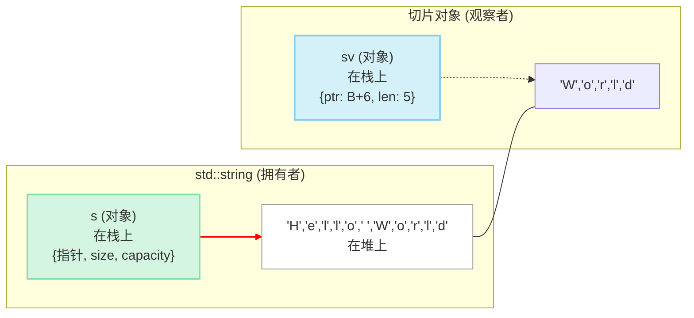

C++17 空降了一位“武林盟主”——`std::string_view`，一统字符串视图的江湖。它用几乎零成本的“内力”，化解了函数间传递字符串时的昂贵拷贝，让无数 C++ 程序员如释重负，感觉“泰裤辣”！

但你有没有想过，在这位盟主登场前，那些身经百战的“武林高手”——Google、LevelDB、Qt 这些顶级门派——又是如何各显神通，应对这个棘手难题的呢？🤔

好玩的是，他们居然不约而同地“悟”出了同一套心法。来，泡杯茶，咱们今天就当一回“说书人”，穿越回那个 `string_view` 还没出生的年代，扒一扒各大门派的独门绝技，看看 C++ 标准的进化史，背后是怎样一场“英雄所见略同”的浪漫剧本。

## 📜 一切的起点：那个“两难”的字符串参数

故事要从一个我们每天都会写的函数说起：

```cpp
// 我只是想打印一个字符串，仅此而已
void print_string(const std::string& s) {
    std::cout << s << std::endl;
}

int main() {
    const char* c_str = "hello from C-style string";
    std::string cpp_str = "hello from std::string";

    // 问题一：从 C 字符串转换，有一次内存分配和拷贝
    print_string(c_str);

    // 问题二：即便传入 std::string，也可能涉及 SSO 失效等隐形成本
    print_string(cpp_str);

    // 问题三：想打印子串？代价更高了
    print_string(cpp_str.substr(0, 5)); // substr 创建了一个全新的 string 对象！
}
```

瞧，我们明明只是想“看一眼”字符串，却被 `std::string` 强行塞了一份“房产证”，被迫承担了不必要的拷贝开销。换成 `const char*` 呢？这位老兄虽然轻便，却是个“马大哈”，既不记长度，也容不下 `\0` 字符，想用它表示 `std::string` 的一小部分？门儿都没有！

这个进退两难的尴尬处境，正是所有故事的开端。各大门派为了打破这个“次元壁”，纷纷闭关修炼，最终都炼成了一套相似的“神功”。

## 💡 共同的“心法”：(指针, 长度) 双人组

所谓大道至简，各路神功的“心法”竟然出奇地一致，就四个字：**不持有，只引用**。

他们没去另起炉灶，搞个什么新的字符串类型，而是聪明地设计了一个超轻量级的“观察者”对象。这家伙自己不存任何数据，像个“狗仔队”，只悄悄记下两件最重要的事：一个是目标的**起始地址（一个指针 `const char*`）**，另一个是目标的**身形大小（一个长度 `size_t`）**。



这个 `(指针, 长度)` 的双人组，就像一张“租房合同”，它清晰地描述了我们“租”了哪一段内存（从哪里开始，有多长），但房子本身（原始字符串）并不属于我们。

这套操作下来，好处简直不要太明显。首先，它**极致轻量** 🤏，复制一个只含指针和长度的小家伙，那开销小得就像呼吸一样自然。其次，它实现了真正的**零拷贝** 💨，所有操作都像是在原数据上隔空比划，压根儿就没有内存分配和数据复制的烦恼。最关键的是，它**极度灵活** 🤸，无论是 `std::string`、C 风格字符串，还是随便哪块内存，都能轻松“切”下一片来，简直是庖丁解牛，游刃有余。

现在，让我们看看各大门派是如何将这套“心法”炼成自家的“独门绝技”的。

## ⚔️ 各大门派的“独门绝技”

### 1. Google `StringPiece`：江湖“教父”，`std::string_view` 的直系祖师爷

如果说这个江湖有“教父”，那非 Google 的 `StringPiece` 莫属。它几乎是后续所有实现的“精神领袖”，`std::string_view` 身上满是它的影子。

`StringPiece` 的设计哲学非常明确：**函数参数用 `StringPiece`，想修改？转成 `std::string`**。

```cpp
// Google C++ Style Guide 推荐的写法
void ProcessData(const StringPiece& piece) {
    if (piece.starts_with("ERROR")) {
        // ...
    }
    // 如果需要修改或持有数据，再转换为 std::string
    std::string owned_data = piece.as_string();
}
```

它本质上就是 `(指针, 长度)` 这套心法的经典封装，但 Google 赋予了它极其丰富的“武功招式”，像 `starts_with`、`ends_with` 这些 API 用起来顺滑无比。更重要的是，它和 `std::string` 之间可以轻松“变身”，无缝衔接。正是 `StringPiece` 在 Google 内部大放异彩，才最终催生了官方标准 `std::string_view` 的诞生。

### 2. LevelDB `Slice`：大道至简，为性能“断舍离”

LevelDB 作为一个高性能键值数据库，对性能的追求近乎偏执。它的核心武器 `Slice` (切片)，就是这种“断舍离”哲学的终极体现。

在 LevelDB 的世界里，不管是键(key)还是值(value)，在内部流转时，几乎都以 `Slice` 的形态存在。

```cpp
// LevelDB 源码中的 Slice 定义 (简化后)
class Slice {
public:
    Slice() : data_(""), size_(0) { }
    Slice(const char* d, size_t n) : data_(d), size_(n) { }
    Slice(const std::string& s) : data_(s.data()), size_(s.size()) { }

    const char* data() const { return data_; }
    size_t size() const { return size_; }
    // ... 其他辅助函数
private:
    const char* data_;
    size_t size_;
};
```

它的代码实现极其精简，没有任何花里胡哨的功能，只保留了获取指针和长度等最核心的操作。`Slice` 就像一把锋利的匕首，朴实无华，却招招致命。它贯穿了 LevelDB 的整个生命线，是其高性能的基石，也向我们证明了：在性能的战场上，最简单的，就是最有效的。

### 3. Qt `QStringRef`：优雅的“圈地自萌”，服务于专属生态

Qt 是一个画风完全不同的门派。它的核心是基于 UTF-16 的 `QString`。为了在自家地盘里实现零拷贝，`QStringRef` 便应运而生。

```cpp
QString main_string = "Hello, beautiful world!";
// 从 main_string 中“借”了一段，没有发生任何拷贝
QStringRef sub_string(&main_string, 7, 9); // "beautiful"
```

它虽然也遵循 `(指针, 长度)` 的心法，但它的指针是 `const QChar*`，操作的是16位字符，和 `std::string` 的世界完全不同。`QStringRef` 的一辈子都和 `QString` 深度绑定，像个“跟屁虫”，所有操作都依赖于原始的 `QString` 对象。这也引出了所有视图类共同的“天性”——生命周期警示。一旦“大哥” `QString` 不在了，`QStringRef` 这个“小弟”立马就会变成一个危险的悬空指针，分分钟让你程序崩溃。

### 4. Folly `StringPiece`：师出同门，技艺更精的“卷王”

你以为只有 Google 在用 `StringPiece`？不，隔壁的 Facebook (现在的 Meta) 早就把它学了过去，还搞出了一个“加强版”——`folly::StringPiece`。

Folly 是 Facebook 开源的高性能 C++ 基础库，里面的 `StringPiece` 和 Google 的那位几乎是“双胞胎”，但作为“后浪”，它在性能优化上往往更激进、更“卷”。它同样是 `(指针, 长度)` 的设计，但在哈希计算、字符串查找等细节上，Folly 团队用尽了各种黑科技进行打磨，力求在 Facebook 海量服务的严苛环境下，榨干最后一滴性能。可以说，`folly::StringPiece` 是站在巨人肩膀上，把这套心法修炼得更为精纯的“卷王”。

### 5. LLVM `StringRef`：编译器“心脏”里的高效“手术刀”

在另一个平行宇宙——编译器的世界里，LLVM 这位“开山鼻祖”也锻造出了自己的神兵利器 `StringRef`。

对于编译器来说，每天都要处理成千上万行的代码文本，对字符串的解析、切分、比较操作多如牛毛，性能是绝对的生命线。`LLVM::StringRef` 就是为此而生的。它同样是 `(指针, 长度)` 的经典结构，被广泛用于编译器前端的词法分析、语法分析等各个角落，用来表示源码中的标识符、关键字、字符串字面量等。它就像一把锋利而精准的“手术刀”，在源码这个“病人”身上飞速地切分、探查，却从不产生多余的拷贝，保证了 Clang 这类现代编译器风驰电掣般的编译速度。

## ⚖️ 思想的碰撞：当五大高手“华山论剑”

把这五位“高手”放在一起过过招，你会发现他们真是“和而不同”，气质迥异。

- **Google 的 `StringPiece` 像一位融会贯通的“武学宗师”** 👨‍🏫。它的核心是 `(const char*, int)`，追求通用性和功能全面性，API 极其丰富，目标就是让函数参数传递这件事变得丝滑流畅。

- **LevelDB 的 `Slice` 则像一位追求极致的“剑客”** ⚔️。它的世界里只有 `(const char*, size_t)`，信奉“大道至简，性能至上”。它不在乎编码，视一切为二进制安全的字节流，招式极简，但招招致命。

- **Qt 的 `QStringRef` 更像一位优雅的“贵族”** 👑，只在自家的 `QString` (UTF-16) 领地里活动。它的内核是 `(const QChar*, int)`，是一种高度生态内聚的“圈地自萌”设计。

- **Folly 的 `StringPiece` 是一位青出于蓝的“卷王”** 🚀。它师从 Google，却在性能优化的道路上走得更远，用各种“黑魔法”将 `(指针, 长度)` 这套心法的威力压榨到极致，是高并发服务器领域的“特种兵”。

- **LLVM 的 `StringRef` 则是一把精准高效的“手术刀”** 🩺。它心无旁骛，专心服务于编译器这个特殊场景，将零拷贝的优势发挥在词法分析等核心环节，是工具链领域的“幕后英雄”。

尽管招式各异，内核不同，但他们都悟到了同一条“大道”：**将数据的所有权和使用权彻底分离**。这种“解耦”思想，正是现代 C++ 设计（比如智能指针、视图）的灵魂所在。

## 👑 “盟主”登基：`std::string_view` 的大一统时代

各大门派“占山为王”固然爽，但也造成了江湖的割裂：`StringPiece` 和 `Slice` 互相不认识，没法直接“对话”，代码的组合性大打折扣。

这时，C++ 标准委员会这位“武林大会主办方”终于出手了。它看遍了各家武学，吸取其精华，去其糟粕，最终推出了真正的“武林盟主”——`std::string_view`。

它集各家之所长：既有 `StringPiece` 丰富的 API，又有 `Slice` 极致的性能，还像 `QStringRef` 一样明确了自己作为“视图”的生命周期法则。

最关键的是，它成了**官方标准**！从此，江湖实现了“书同文，车同轨”，不同门派之间传递字符串，终于有了一套统一、高效、安全的“普通话”。

## 结语：从“百家争鸣”到“天下归一”，品品 C++ 的演进智慧

回顾 `string_view` 这段精彩的“前传”，我们看到的不仅是一段技术进化史，更能品味出 C++ 这门语言的独特智慧。它总是鼓励社区在标准之外进行天马行空的探索（各大库的实践），一旦某个模式被证明是“版本答案”，委员会就会将其吸收、标准化，让所有开发者都能享受到这份红利。

从 `StringPiece`、`Slice` 的“百家争鸣”，到 `std::string_view` 的“天下归一”，这正是 C++ 在追求极致性能与现代编程范式之间，不断自我进化、走向成熟的最佳剧本。🚀
