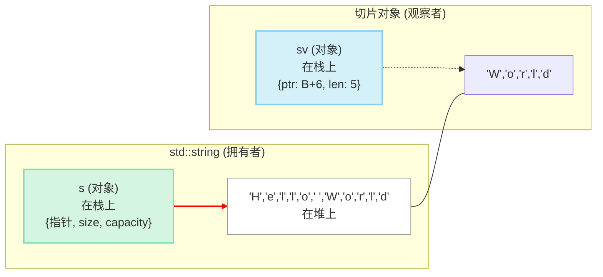

C++17 空降了一位“武林盟主”—— `std::string_view`，一统字符串视图的江湖。它用几乎零成本的“内力”，化解了函数间传递字符串时的昂贵拷贝，让无数 C++ 程序员如释重负，感觉“泰裤辣”。

但有个有点八卦、又很有意思的问题是：  
**这么重要、看起来又“简单得有点过分”的东西，是怎么一步步被发明、打磨，最后写进标准的？**

在 `string_view` 还没登基之前，江湖上早就有几位打拼多年的“地方诸侯”：Google、LevelDB、Qt、LLVM、Folly……他们在各自的战场上，被真实的性能压力和内存瓶颈逼着，**不约而同地走向了同一条路。**

这篇文章，就当一次“说书”：  
我们从一个小小的函数讲起，一路看这些门派如何各自悟出同一门心法，最后再看它们怎样汇入 C++17 这条大河。

---

## 📜 一切的起点：那个“两难”的字符串参数

先看一个每天都在写的小函数：

```cpp
// 我只是想打印一个字符串，仅此而已
void print_string(const std::string& s) {
    std::cout << s << std::endl;
}

int main() {
    const char* c_str = "hello from C-style string";
    std::string cpp_str = "hello from std::string";

    // 问题一：从 C 字符串转换，有一次内存分配和拷贝
    print_string(c_str);

    // 问题二：即便传入 std::string，也可能涉及 SSO 失效等隐形成本
    print_string(cpp_str);

    // 问题三：想打印子串？代价更高了
    print_string(cpp_str.substr(0, 5)); // substr 创建了一个全新的 string 对象！
}
```

表面上，这代码没什么毛病；可一放到大工程里，就开始显形：

- 日志里每打一次字符串，多一份拷贝；
- RPC 框架里每传一次参数，多一次分配；
- 想只“看一眼”子串，却被迫新开一块内存。

**一次无所谓，十亿次就要命。**

更尴尬的是，两个常用方案各有硬伤：

- `std::string`：统一、好用，但可能带来隐形分配和拷贝；
- `const char*`：轻巧，但不记长度，怕 `\0`，更难精准表示“某一小段”。

就是这么一个再平常不过的小函数，让一代又一代 C++ 工程师皱眉：

> “我只是想借看一下，不是想买房啊。”

也正是从这样的抱怨开始，后面那一整条“零拷贝”进化史才慢慢铺开。

---

## 💡 共同的“心法”：(指针, 长度) 双人组

先剧透一下结局：不管是 Google、LevelDB，还是 Qt、LLVM、Folly，最后都**悟到了同一门心法**，用八个字概括就是：

> **不持有，只引用。**

他们没有去造一个“新的大号字符串类型”来接管世界，而是造了一个**超轻量级的“观察者”对象**。  
这个小家伙自己不持有数据，只干两件事：

- 记住：**从哪儿开始看** —— 一个指针（比如 `const char*`、`const QChar*`）；
- 记住：**往后看多长** —— 一个长度（`size_t` 或 `int`）。

用一张图形容，就是这样：



这个 `(指针, 长度)` 组合，本质上就是一张“租房合同”：  
- 它清楚写着**租的是哪一段内存**（从哪里开始，有多长）；  
- 但**房子本身不归它所有**（所有权还在原始字符串那里）。

这样设计带来的好处非常“工程”：

- **极轻量** 🤏：拷贝一个“指针+长度”的小对象，成本几乎可以忽略不计；
- **真·零拷贝** 💨：逻辑都在原数据上“隔空操作”，不新增分配和拷贝；
- **极灵活** 🤸：上游可以是 `std::string`、C 字符串、内存映射文件，甚至是一段协议 buffer，只要你能给出“起点+长度”，它就能帮你“切一片”出来用。

接下来，我们就按大致的时间顺序，看看这套心法在各大门派身上，是怎么一点点长成今天这个样子的。

## ⚔️ 各大门派的“独门绝技”

接下来这几位“高手”，出身各不相同，但都在自己的战场上，把 `(指针, 长度)` 这门心法打磨到了极致。

### 1. Google `StringPiece`：互联网时代的“教父”

时间往前拉一点，大规模互联网服务刚刚起飞的那几年，Google 内部用 C++ 写了海量基础设施：搜索、广告、日志处理、RPC 框架……**字符串在这里是“空气级”的存在”。**

到处都是这样的函数签名：

```cpp
void Process(const std::string& s);
```

问题和我们开头那个小例子一模一样，只是量级被放大了好几个数量级：

- 参数到处传，隐形拷贝跟着到处跑；
- 想只“看一眼”一段数据，却总在 `std::string` 和 `const char*` 之间来回切换。

在这样的背景下，`StringPiece` 出场了。它干了两件事：

- 把函数参数统一成一个**轻量的只读视图类型**；
- 立下一条帮派规矩：**“只读就用 `StringPiece`，真要修改/持有再转回 `std::string`。”**

代码大概长这样：

```cpp
// Google C++ Style Guide 推荐的写法
void ProcessData(const StringPiece& piece) {
    if (piece.starts_with("ERROR")) {
        // ...
    }
    // 如果需要修改或持有数据，再转换为 std::string
    std::string owned_data = piece.as_string();
}
```

随着时间推移，Google 内部不少旧 API 的签名，**悄悄从 `const std::string&` 变成了 `StringPiece`**。对调用方来说，几乎不用改代码；对整个工程来说，字符串参数传递突然变得又省又灵活。

今天回头看，`StringPiece` 几乎可以算是 `std::string_view` 的**直系祖师爷**：

- `(指针, 长度)` 的内部结构；
- 针对参数传递设计的一整套 API；
- 和 `std::string` 的无缝互转……

都在后来标准化的过程中留下了清晰的影子。

### 2. LLVM `StringRef`：编译器前端的“手术刀”

换一个世界：编译器。

编译器前端每天的日常就是：**扫源码 → 切 token → 拼语法树**。早期很多实现里，词法分析器会给每一个标识符、关键字、字面量分配一个新的 `std::string`，几十行代码还好，上百万行源码就扛不住了。

LLVM/Clang 的目标是“现代化、高性能、还能当 IDE 后端”，于是他们也走上了 `(指针, 长度)` 这条路，造出了 `llvm::StringRef`。

- 它同样是 `(const char*, size_t)` 的组合；
- 但它被直接塞进了编译器的**心脏**：词法分析、语法分析、诊断信息、源码映射……到处都是 `StringRef` 的身影。

有了它，编译器可以：

- 在**整块源码 buffer 上直接切片**，而不是到处复制子串；
- 安全处理包含 `\0` 的字符串；
- 高频比较、哈希、查找，而不额外分配。

如果说 Google 的 `StringPiece` 是让服务端 API 变得顺滑的“武学宗师”，那 LLVM 的 `StringRef` 更像一把**专为源码设计的手术刀**：下刀极深，却几乎不带额外伤口。

### 3. LevelDB `Slice`：存储引擎里的“极简派”

再把镜头切到一个更底层的战场：**磁盘上的键值数据库**。

LevelDB 的任务很朴素——用最简单的结构，把海量键值对高效地存下去、再快快地拿出来。在这个世界里，“字符串”只是**二进制 key/value 的一种表象**，底层本质全都是字节流。

LevelDB 的作者很干脆，直接造了一个叫 `Slice` 的类型：

```cpp
// LevelDB 源码中的 Slice 定义 (简化后)
class Slice {
public:
    Slice() : data_(""), size_(0) { }
    Slice(const char* d, size_t n) : data_(d), size_(n) { }
    Slice(const std::string& s) : data_(s.data()), size_(s.size()) { }

    const char* data() const { return data_; }
    size_t size() const { return size_; }
    // ... 其他辅助函数
private:
    const char* data_;
    size_t size_;
};
```

几句代码，基本就把这门派的性格写死了：

- **视一切为二进制**：不关心编码，不假设 UTF-8，它的世界观是“字节流优先”；
- **招式极简**：不堆砌花哨 API，核心就是“拿指针”“拿长度”；
- **全局贯穿**：在内部几乎所有地方，key 和 value 都以 `Slice` 流转。

结果就是，`Slice` 成了 LevelDB 性能的基石之一。很多做存储的人第一次读 LevelDB 源码，会有一种恍然大悟的感觉：

> “原来，把一切都看成 slice，而不是 `std::string`，世界会简单很多。”

### 4. Qt `QStringRef`：UTF-16 世界里的“优雅贵族”

上面几个门派，基本都活在“UTF-8 / 字节流优先”的后端世界。**Qt 则是另一个宇宙。**

Qt 的核心字符串类型是 `QString`，内部用的是 UTF-16 的 `QChar` 数组。这在做 GUI、本地化、多语言 UI 时非常顺手，但代价是：**它和 `std::string` 那套 ASCII/UTF-8 世界，几乎是两套平行宇宙。**

在这个宇宙里，如果你也用 `std::string_view` 那种 `(const char*, size_t)` 直怼字节的思路，反而不自然。于是，Qt 造了一个**只在自家领地里活动**的视图类型：`QStringRef`。

```cpp
QString main_string = "Hello, beautiful world!";
// 从 main_string 中“借”了一段，没有发生任何拷贝
QStringRef sub_string(&main_string, 7, 9); // "beautiful"
```

它的底层心法其实也很熟悉：

- 一个 `const QChar*` 指针；
- 一个长度（通常是 `int`）。

但它又带着浓浓的 Qt 气质：

- **深度绑定 `QString` 生态**：一辈子离不开 `QString`，构造基本都要提供原始 `QString` 的指针；
- **强调 Unicode 语义**：操作的是 16 位字符，而不是裸字节；
- **生命周期风险很显性**：一旦原始 `QString` 被销毁，`QStringRef` 就立刻变成危险的悬空视图。

这也把一个关键点摆在了台面上：**所有视图类，天性上都是“借用者”而非“主人”。**  
这点后来也深刻影响了 `std::string_view` 在标准里的自我定位。

### 5. Folly `StringPiece`：站在巨人肩膀上的“卷王”

时间再往后一点，Facebook（现在的 Meta）开始大规模开源自己的 C++ 基础库：Folly。它服务的战场和当年的 Google 很像：海量服务、高并发、低延迟，一切都得省。

Folly 里也有一个 `StringPiece`，名字都懒得改，直接致敬 Google。但作为“后浪”，它天然占了几个便宜：

- 出场更晚，可以直接吸收前人经验；
- 一上来就面对**高并发、大流量、复杂协议**的场景；
- 焦点很明确：**在工程尺度上，把 `(指针, 长度)` 榨到极致。**

所以你会看到：

- 它和哈希、容器、字符串算法库的整合更加紧密；
- 细节上做了很多针对现代 CPU 的微优化；
- 在服务端代码里大规模使用，成为“默认视图类型”之一。

如果说 Google 的 `StringPiece` 是“把这套心法发明出来并用热”，那 Folly 的 `StringPiece` 更像是站在前人肩膀上，**把这门武学修炼成竞赛级别的“卷王版本”**。

## ⚖️ 思想的碰撞：当五大高手“华山论剑”

把这五位“高手”拉到一张桌子上过过招，你会发现他们真是“和而不同”：

- **Google 的 `StringPiece`**：互联网服务里的“武学宗师” 👨‍🏫  
  - 内核是 `(const char*, int)`；  
  - 目标是让函数参数传递变得丝滑顺手；  
  - API 丰富，方便查找、切分、比较。

- **LLVM 的 `StringRef`**：编译器前端的“外科医生” 🩺  
  - 把源码当成一整块大 buffer，在上面用 `StringRef` 做精细切片；  
  - 对性能和内存局部性的要求近乎苛刻。

- **LevelDB 的 `Slice`**：存储系统中的“极简剑客” ⚔️  
  - 只认字节流，不谈编码；  
  - 内核是 `(const char*, size_t)`，招式少但每一招都指向性能。

- **Qt 的 `QStringRef`**：UI/本地化世界的“贵族” 👑  
  - 活在 `QString`+UTF-16 的专属领地；  
  - 更强调字符语义和生态内聚。

- **Folly 的 `StringPiece`**：大规模分布式服务里的“特种兵” 🚀  
  - 师出同门，偏执地优化在高并发环境下的效率；  
  - 和自家其他高性能组件紧密耦合。

乍一看，他们差异很大：有的关心 Unicode，有的只认字节；有的 API 巨丰富，有的就两三个函数。但把这些“皮相”剥掉，你会发现他们其实都在实践两条同样的思想：

1. **将所有权和使用权解耦**：  
   谁分配/释放内存，谁持有所有权；视图只负责“安全地看”“方便地用”。
2. **把“零拷贝”变成默认选项**：  
   参数尽量传视图，而不是“新拷贝一个完整对象”；真正需要修改、持有，再显式构造新字符串。

这，正是现代 C++ 很多设计（智能指针、各种 `view`、`span` 等）的共同底色。

## 👑 “盟主”登基：`std::string_view` 的大一统时代

故事讲到这里，C++ 标准委员会这位“武林大会主办方”终于坐不住了。

一方面，**社区早就用得飞起**：

- Google/LLVM/Folly 等大厂都在用自己的字符串视图；
- 每个生态都有一套“约定俗成”的零拷贝用法。

另一方面，**生态也因此变得割裂**：

- A 库用 `StringPiece`，B 库用 `Slice`，C 库用 `StringRef`；  
- 你要在它们之间传字符串视图，就得写一堆“胶水代码”。

委员会看到的是这样一幅画面：

> 社区已经帮你把“哪种设计更好用”这道题，写了无数份答卷。  
> 你要做的，不是从零设计，而是**把大家收敛过的经验，提炼成一个统一的标准接口**。

于是，在经历了提案、实验（比如 `std::experimental::string_view`）、反复讨论之后，`std::string_view` 作为 C++17 的正式成员登场了。

它的身上，你几乎能看到前面所有这些库的影子：

- 和 `StringPiece` 一样，是 `(指针, 长度)` 的只读视图，API 接近“现代字符串”；
- 学到了 `Slice` 那种极简、二进制安全的态度：不会偷偷假设以 `\0` 结尾；
- 和 `QStringRef`、`StringRef` 一样，非常强调**生命周期**：你只能看，不能决定存活多久。

更重要的是，它有一个别人都没有的身份——它是**官方普通话**。

一旦有了这个统一的“字符串视图普通话”，社区的组合性就回来了：

- 标准库函数可以接受 `string_view` 参数；
- 自己的库也可以以 `string_view` 作为首选接口类型；
- 各种第三方库之间，终于有了一个天然的“公共视图格式”。

## 结语：从“百家争鸣”到“天下归一”

回过头来看 `string_view` 的前传，我们会发现：

- 这不是某个天才拍脑袋的瞬间灵感；
- 而是一群工程师在各自战场上，被真实问题一步步逼出来的共同答案。

Google 在和日志、RPC 打仗；LLVM 在和源码、诊断打仗；LevelDB 在和磁盘、IO 打仗；Qt 在和 Unicode、本地化打仗；Folly 在和高并发、海量服务打仗。

他们在不同的时间、不同的语境里，**不约而同地拧向了 `(指针, 长度)` 这条路。**

等到这些实践被验证、打磨到足够成熟，C++ 标准委员会再把它们收进标准库，我们就多了一位看似平平无奇、实则改变了无数代码形状的“武林盟主”——`std::string_view`。

从 `StringPiece`、`Slice`、`StringRef` 这些“百家争鸣”，到 C++17 时代的“天下归一”，这就是 C++ 一贯的节奏：

> **先放手让江湖试错，再把真正有用的武功刻进武林秘籍。** 🚀

