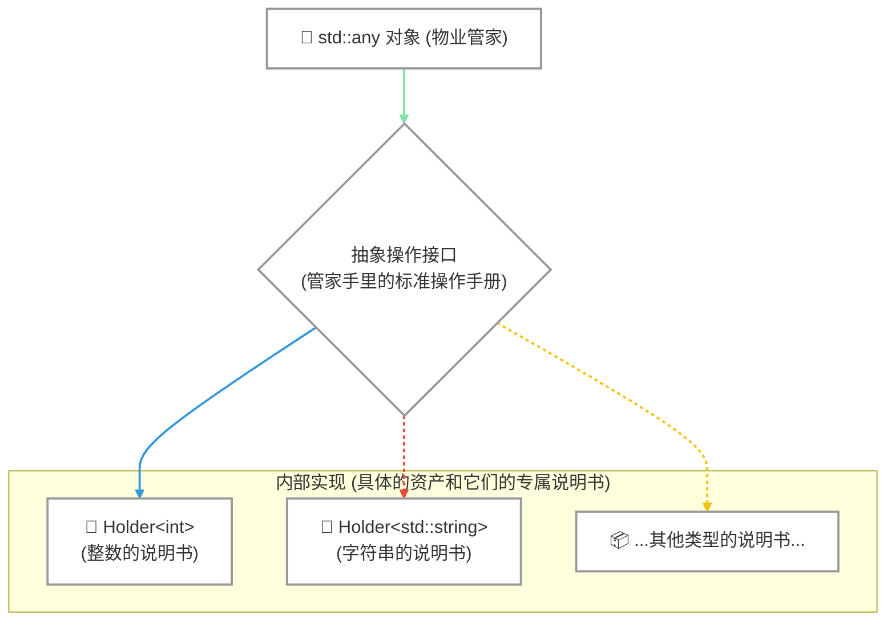
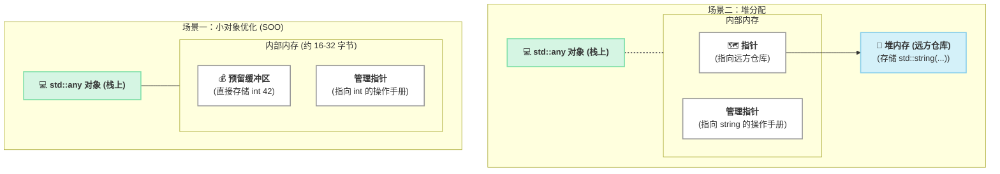

写代码时，咱们最喜欢的就是“一个萝卜一个坑”，一个 `int` 配一个 `int`，一个 `string` 配一个 `string`，清清楚楚，编译器看了都说好。但总有那么些时候，生活会给你点“惊喜” 😵。

比如你正在写一个函数，它可能需要接收一个用户ID（一个整数），也可能接收一个昵称（一个字符串），偶尔还得处理一下用户的在线状态（一个布尔值）。用模板？`template<typename T>` 确实厉害，但它要求在编译的时候就把类型定下来。可咱们这个需求是“运行时才知道是啥”，这就好比你妈让你去买菜，却不告诉你买啥，到了菜市场你才接到电话，这就叫动态类型。

这时候，C++17 摸了摸你的头，从背后掏出了一个神奇的口袋——`std::any`，并对你说：“甭管是啥，往里装就对了！” 👜

### “别的路子”为啥不灵光：盘点那些年我们走过的弯路 🤕

在 `std::any` 问世之前，老前辈们为了解决这个问题，可谓是八仙过海，各显神通，但也常常会“翻车”。

最野的路子莫过于 `void*`，江湖人称“万能指针”。它就像一张空白支票，可以指向任何地址。自由是真自由，但风险也是真要命。你只知道那是个地址，但那地址背后到底是个啥，全靠你自己记着。

```cpp
#include <iostream>

int main() {
  long user_id = 9527;
  void* pocket = &user_id; // 装进口袋，但标签没了

  // 你以为里面是 long，结果你同事把它当 double* 用了...
  // 这就是传说中的“未定义行为”（Undefined Behavior），程序可能崩溃，也可能算出个外星数字
  std::cout << "你猜这是啥: " << *static_cast<double*>(pocket) << "\n";
}
```

上面这段代码就像是你把家门钥匙（`&user_id`）给了朋友（`void* pocket`），结果他拿着你的钥匙去开邻居家的门（`static_cast<double*>`），后果不堪设想。类型信息一旦丢失，安全就无从谈起。

后来，大家学聪明了，搞出了 `enum + union` 的“DIY套餐”。`union` 是个大盒子，能装下好几种东西，但同一时间只能装一个。`enum` 就像你贴在盒子外面的标签，告诉你现在里面装的是“可乐”还是“豆浆”。

```cpp
// 伪代码，感受下精神
enum class ContentType { IS_INT, IS_STRING };
union Stuff {
    int i;
    std::string s; // 抱歉，union里不能直接放非POD类型，这里只是示意
};

struct MyPocket {
    ContentType tag;
    Stuff stuff;
};
```

这个方案看着不错，但所有管理工作都得自己来。你得保证贴的标签永远是正确的，万一手一抖，标签写着“整数”，你却跑去按“字符串”的方式读，那程序就“Duang”地一下给你个惊喜 💥。

`std::variant` 是 C++17 提供的另一个“正规军”，它像一份“固定套餐菜单”📜。你可以规定一个 `variant` 只能装 `int`、`string` 或者 `bool`。它类型安全，性能又好，但缺点是“不够灵活”。如果你的程序发布后，想新加一个 `double` 类型，对不起，你得修改 `variant` 的定义，然后把整个程序重新编译一遍。

```cpp
#include <variant>
#include <string>

int main() {
  // 菜单上只有 int 和 string 两道菜
  std::variant<int, std::string> v = "你好";
  // v = 3.14; // 对不起，菜单上没有 double 这道菜，编译直接报错！
}
```

所以你看，`void*` 太野，`union` 太累，`variant` 太死板。我们需要一个既安全又灵活的“百宝袋”，`std::any` 闪亮登场！

### std::any 闪亮登场：像个万能储物柜，存取都简单 🧳

`std::any` 的用法非常直观，就像使用一个临时的储物柜。你把东西放进去，它给你保管好。需要的时候，你报上“暗号”（类型），把它取出来。

我们先看最简单的“放”和“取”操作。

```cpp
#include <any>
#include <iostream>
#include <string>

int main() {
  std::any pocket; // 创建一个空空如也的百宝袋

  pocket = 42; // 往里塞一个整数
  pocket = std::string("Hello World"); // 哎，我又变主意了，换成字符串
  // pocket = true; // 随时可以换成别的类型
}
```

瞧，`pocket` 就像个脾气超好的跟班，你给啥它就存啥，旧的东西它会帮你自动处理掉，绝不啰嗦。

那么，怎么把东西拿出来呢？这就需要用到“开箱咒语”—— `std::any_cast`。但开箱也有两种姿势：一种是“温柔试探”，另一种是“霸气硬取”。

**温柔试探（指针版）**：你不太确定里面是啥，就用指针版 `std::any_cast<T*>()` 去问问。如果类型对了，它就返回一个指向内容的指针；如果类型不对，它就给你一个空指针（`nullptr`），场面一度非常和谐。

```cpp
#include <any>
#include <iostream>
#include <string>

int main() {
    std::any pocket = std::string("芝麻开门");

    // 温柔地问：“请问，这里面是字符串吗？”
    if (auto* str_ptr = std::any_cast<std::string>(&pocket)) {
        std::cout << "暗号对上了！内容是: " << *str_ptr << std::endl;
    } else {
        std::cout << "里面不是字符串哦。" << std::endl;
    }

    // 再试试别的类型：“那... 是整数吗？”
    if (auto* int_ptr = std::any_cast<int>(&pocket)) {
        // 这段代码不会执行，因为里面是字符串
        std::cout << "居然是整数: " << *int_ptr << std::endl;
    } else {
        std::cout << "看来也不是整数。" << std::endl;
    }
}
```

**霸气硬取（引用版）**：你非常自信，百分百确定里面就是你要的类型。那就用引用版 `std::any_cast<T>()`。如果猜对了，皆大欢喜，直接拿到东西。如果猜错了……对不起，程序会立刻抛出一个 `std::bad_any_cast` 异常，告诉你“开箱失败，后果自负！”。

```cpp
#include <any>
#include <iostream>
#include <string>

int main() {
    std::any pocket = 1024; // 这次我们放个整数

    try {
        // 我很自信：“把里面的整数给我！”
        int value = std::any_cast<int>(pocket);
        std::cout << "成功取出整数: " << value << std::endl;

        // 我今天就是要搞事情：“把里面的字符串给我！”
        std::string str = std::any_cast<std::string>(pocket); // 这行会抛出异常
        std::cout << "这段话你是看不到了..." << std::endl;

    } catch (const std::bad_any_cast& e) {
        std::cout << "捕获到异常了! 错误信息: " << e.what() << std::endl;
    }
}
```

### 它的底层心法：类型擦除的魔法与小对象优化 🧠

`std::any` 是怎么做到“海纳百川”的呢？它的核心魔法叫做 **类型擦除 (Type Erasure)**。

别被这个听起来高大上的名词吓到，咱们用一个具体的场景来把它“扒个精光”。

想象一下，`std::any` 对象本身就像一个专业的“物业管家”。你存进去的数据（比如一个 `int` 或者一个 `std::string` 对象）就是它要管理的“资产”。这个管家很厉害，他能管理任何类型的资产，无论是小家电（`int`）还是大家具（`std::string`）。

他是怎么做到的呢？当你要他管理一个新资产时，比如 `pocket = 42;`，他并不会傻乎乎地只记下“这里有个东西”。他会做两件事：

1.  **存放资产**：他会找个地方把 `42` 这个 `int` 存起来。
2.  **绑定专属“操作手册”**：他会拿出一个专门针对 `int` 类型的“操作手册”（也就是图中的 `Holder<int>`），并把它和 `42` 绑定。这本手册非常详细，里面清楚地写着：
    - 如何“复制”一个 `int`。
    - 如何“销毁”一个 `int`。
    - 这个资产的“类型名”是 `int`（通过 `typeid`）。

现在，`std::any` 这位管家手上就有了两样东西：一个指向 `42` 存放位置的通用指针，和一个指向《int 操作手册》的指针。这个“手册指针”就对应着图中的“抽象操作接口”。

接下来，如果你执行 `pocket = std::string("Hello");`，管家会：

1.  拿出之前绑定的《int 操作手册》，按照手册里的“销毁”流程，把旧的 `42` 给清理掉。
2.  找个新地方把 `std::string("Hello")` 这个大家具存起来。
3.  扔掉旧手册，换上一本全新的《`std::string` 操作手册》（也就是图中的 `Holder<std::string>`），并和这个新字符串绑定。这本手册里写的自然是如何复制、销毁 `std::string` 的方法。

看明白了吗？**`std::any` 对象本身始终是“无知”的，它不知道自己具体管的是什么。** 它只认“操作手册”。当需要复制、销毁资产时，它不关心资产是啥，只是盲目地翻开手上的手册，执行对应的操作。

这种“我不知道你是什么，但我知道怎么操作你”的机制，就是 **类型擦除**。`std::any` 将具体类型 (`int`, `std::string`) 的信息从自身“擦除”了，转而通过一个通用的“手册”接口（在 C++ 里通常是用虚函数实现的）来间接与具体类型打交道。



更妙的是，大多数 `std::any` 的实现都带有一个“杀手锏”——**小对象优化 (Small Object Optimization, SOO)** 🚀。`std::any` 对象自己内部预留了一小块内存（比如16或32字节），像个随身口袋。如果你要存的东西很小（比如 `int`, `char`, `float`，或者小结构体），就直接放在这块预留内存里，根本不需要去堆上申请内存，速度飞快！只有当你要存的东西太大，口袋里放不下了，它才会去堆上找个大仓库（动态分配内存）来存放。

#### 内存布局探秘：`std::any` 的“随身口袋”与“远方仓库”

为了把“小对象优化”说得更清楚，我们来画一张 `std::any` 的内存布局图。一个 `std::any` 对象本身通常不大，占用的是**栈内存**，大小可能相当于两到三个指针。它内部的乾坤，决定了它是快是慢。

**情况一：当存入的是小对象时（SOO 激活）**

如果你存入一个 `int`、`double`、`bool` 或者一个足够小的结构体，`std::any` 会把它直接塞进自己内部预留的“随身口袋”（一块缓冲区）里。

- **优点**：没有动态内存分配（没有 `new`），速度极快，而且数据和 `std::any` 对象离得近（内存局部性好），CPU 访问起来也更快。
- **内存示意**：`std::any` 对象在栈上，它要存储的数据也和它一起在栈上。

**情况二：当存入的是大对象时（使用堆内存）**

如果你试图存入一个 `std::string`（通常比预留空间大）、`std::vector` 或者一个很大的自定义类，`std::any` 的“随身口袋”装不下了。这时，它会去**堆内存**申请一个“远方仓库”，把这个大对象存进去，然后在自己内部只保留一张指向仓库的“地图”（一个指针）。

- **优点**：能存储任意大小的对象，再大的“家具”也能放下。
- **缺点**：涉及一次堆内存分配，相比 SOO 会有性能开销。
- **内存示意**：`std::any` 对象在栈上，但它通过一个指针指向远在堆上的数据。

下面这张图清晰地展示了这两种情况的区别：



理解了这一点，你就能更好地预判 `std::any` 在不同场景下的性能表现了。它在设计上已经尽力在灵活性和性能之间做到了最好的平衡。

### 把原理落到实处：一口气看几个经典场景 🍿

理论听着有点晕？没关系，我们直接上场景，看看 `std::any` 在真实世界里是如何大放异彩的。

**场景一：万能配置单**

我们经常需要从文件（如 JSON、INI）加载配置。配置项的值可能是字符串、整数、布尔值……用 `std::any` 来存储简直是天作之合。

```cpp
#include <any>
#include <iostream>
#include <string>
#include <map>

int main() {
  std::map<std::string, std::any> config;

  // 从某个地方加载配置...
  config["title"] = std::string("My Awesome App");
  config["port"] = 8080;
  config["fullscreen"] = true;

  // 使用配置
  std::cout << "应用标题: " << std::any_cast<std::string>(config["title"]) << std::endl;

  if (std::any_cast<bool>(config["fullscreen"])) {
    std::cout << "将以全屏模式启动在端口: " << std::any_cast<int>(config["port"]) << std::endl;
  }
}
```

这样，你的配置系统就变得极具扩展性，未来想加什么新类型的配置项，完全不用修改数据结构。

**场景二：实现一个简单的插件系统**

假设你在做一个媒体播放器，希望支持各种插件来处理不同的功能，比如“歌词显示”或“音效均衡器”。主程序和插件之间需要传递数据，但数据的类型五花八门。

```cpp
#include <any>
#include <string>
#include <vector>
#include <iostream>

// 插件的通用接口
struct IPlugin {
    virtual void onEvent(const std::string& eventName, const std::any& eventData) = 0;
    virtual ~IPlugin() = default;
};

// 一个歌词插件
struct LyricPlugin : IPlugin {
    void onEvent(const std::string& eventName, const std::any& eventData) override {
        if (eventName == "SONG_CHANGED") {
            // 期待歌曲路径是个字符串
            if (auto* path = std::any_cast<std::string>(&eventData)) {
                std::cout << "歌词插件：收到换歌事件，路径: " << *path << std::endl;
            }
        } else if (eventName == "PLAYBACK_TIME") {
            // 期待播放时间是个double
            if (auto* time = std::any_cast<double>(&eventData)) {
                // std::cout << "当前时间: " << *time << std::endl; // 刷屏太快，注释掉
            }
        }
    }
};

int main() {
    LyricPlugin lyric_plugin;

    // 主程序：用户切歌了
    lyric_plugin.onEvent("SONG_CHANGED", std::string("/music/jay_chou.mp3"));

    // 主程序：播放进度更新
    lyric_plugin.onEvent("PLAYBACK_TIME", 12.5); // 播放到 12.5 秒

    // 主程序：用户按了暂停键（这次数据是空的，或者说没有数据）
    lyric_plugin.onEvent("PAUSE_CLICKED", {}); // 传递一个空的 any
}
```

通过 `std::any`，你的事件系统可以传递任意类型的数据，插件开发者可以根据事件名和自己的需要来安全地解析数据，完美解耦！

### 正确“开箱”的姿势：多一手准备，总没错 🔍

除了用 `any_cast` 的两种姿势外，你还可以先用 `.type()` 方法来“侦查”一下里面的类型，它返回一个 `std::type_info` 对象。

```cpp
#include <any>
#include <iostream>
#include <typeinfo> // 要用 typeid 就得包含这个头文件

int main() {
  std::any pocket = 3.14;

  if (pocket.type() == typeid(double)) {
    std::cout << "侦查完毕：里面确实是 double！" << std::endl;
    // 现在可以放心地用霸气硬取模式了
    std::cout << "值为: " << std::any_cast<double>(pocket) << std::endl;
  }

  // 注意：千万不要把 pocket.type().name() 的结果存下来或者用于网络传输
  // 因为这个名字字符串具体是啥，完全由编译器决定，换个编译器可能就变了！
}
```

这个 `type()` 方法就像是给储物柜装了个透明小窗，让你在开锁前能先瞄一眼里面大概是个啥。

### 哪些边界别越：性能、持久化与指针安全 🚧

`std::any` 虽然好用，但不是万能神药，请务必记住它的“友情提醒”：

1.  **性能敏感区慎用**：在需要极致性能的热点代码（比如游戏引擎的渲染循环、高频交易的计算核心）里，请尽量避免使用 `std::any`。因为 `any_cast` 的类型检查和潜在的虚函数调用（类型擦除的实现方式）都有运行时开销。它更适合用在程序的“关节”处，而不是“肌肉”里。

2.  **别拿它搞序列化**：如上所述，`type().name()` 的结果是编译器相关的，不能作为持久化存储或网络通信的依据。`std::any` 设计之初就不是为了解决序列化问题的。

3.  **裸指针是大忌**：千万别往 `std::any` 里塞裸指针！`std::any` 只负责管理它“直接持有”的那个东西的生命周期。你塞一个指针进去，它就只会复制、销毁这个指针本身，而完全不管该指针指向的内存。这极易导致内存泄漏或悬垂指针。如果你真的需要共享所有权，请使用 `std::shared_ptr<T>`。

### 总结：灵活与稳妥，我全都要！👏

`std::any` 并非要推翻 C++ 的静态类型系统，恰恰相反，它是对静态类型系统的一个完美补充。它就像是你架构中的“万能接口”或“临时中转站”，专门处理那些在编译期无法确定的动态数据。

它的最佳实践是：在系统的边界（如UI、配置文件、脚本交互、插件系统）使用 `std::any` 来灵活地接收和传递数据。一旦数据进入了你的核心逻辑，就应该尽快地通过 `any_cast` 将其转换为强类型（如 `int`, `std::string`）或一个 `std::variant`，让后续的处理重新回到编译期类型检查的保护伞下。

如此一来，你既享受了动态语言般的灵活性，又没有丢掉 C++ 赖以成名的安全与稳健。这，就是 `std::any` 的大智慧。

### 从掌握特性到驾驭系统：你的下一个硬核项目

`std::any` 很好地解决了 C++ 在动态类型场景下的表达力问题，但它只是现代 C++ 工具箱中的一件利器。一个真正工业级的后台项目，考验的是开发者综合运用各种技术，在性能、健壮性和可维护性之间做出正确取舍的能力。

例如，在 `mini-redis` 这样的项目中，虽然我们可能不会在核心路径上用到 `std::any`，但我们会面临更硬核的挑战：

- 如何用 `epoll` 实现高效的 I/O 多路复用，榨干服务器性能？
- 如何用 `std::string_view` 对网络协议进行零拷贝的解析？
- 如何设计 AOF (Append-Only File) 来保证数据的持久化？

这些，都是在“学生管理系统”这类玩具项目中无法体验到的真实挑战。是时候给你的简历来点硬核的了！

别再让理论和实践脱节，也别再让你的 C++ 项目停留在“玩具”阶段。

我们为你准备了 **《用现代 C++ 从零实现 mini-Redis》** 实战指南。这不仅仅是一个项目，更是你通往后台开发高手之路的“金钥匙”。

在这趟旅程中，你将：

- 🚀 **亲手缔造性能奇迹：** 将一个“单线程玩具”改造成能从容应对万级并发的高性能引擎。
- ⚙️ **掌握真正工业级技能：** `epoll`、AOF 持久化、RESP 协议... 全程不依赖第三方库，只用最纯粹的 C++ 和系统 API。
- 🌱 **打造你的现代 C++ 试验田：** 不再停留在理论学习，你将亲手在项目中应用 C++23 的 `Modules`、`std::span` 等特性，把新语法变成真正的工程能力。
- 🗣️ **在面试中自信言之有物：** 当你能在白板上画出自己亲手写的架构时，任何关于 Redis 的问题都是送分题。

想进一步了解 Mini-Redis 项目的实现细节？可以点击阅读<a href="https://mp.weixin.qq.com/s/qujRzKcllccSHxQvJG-vOA" target="_blank" rel="noopener noreferrer">这篇详细的文章</a>。

**👇 扫码添加微信（备注“redis”），立即开启你的高手进阶之旅！**


