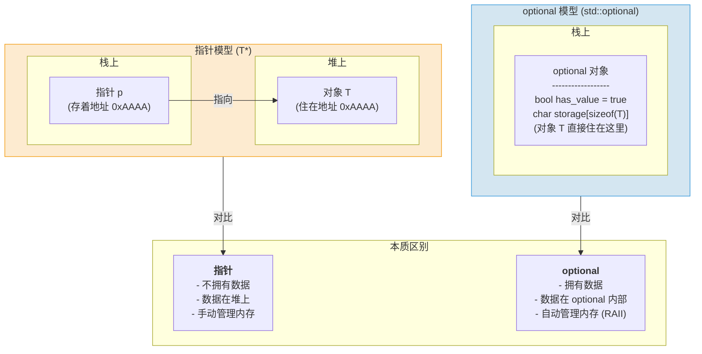

你的 C++ 代码里，是否也藏着这样的“定时炸弹”？💣

一个返回指针的函数，你敢保证每次都检查了 `nullptr` 吗？一个查找函数，失败时返回 `-1`，你敢说它永远不会和真实的业务数据 `-1` 混淆吗？

这些因“值可能不存在”而诞生的“黑话”（`nullptr`, `-1`, `false`），是 C++ 程序中最经典的 bug 来源之一。我们依赖着脆弱的约定和程序员的自觉，在代码的雷区里小心翼翼。

**但如果，有一种方法，能让编译器亲自下场，帮你拆掉这些地雷呢？**

这，就是 C++17 带来的 `std::optional` 的使命。它究竟是如何用一种优雅的、几乎零成本的方式，将这种“靠自觉”的危险约定，升级为“靠编译器”的绝对安全的？

准备好了吗？让我们一起揭开它的神秘面纱！👇

### 那些年，我们一起踩过的坑

在 C++ 的古老传说中，有两位“大神”常被用来传递“可能有，也可能没有”的信息：一位是神秘的**空指针 (`nullptr`)**，另一位是笨拙的**输出参数 (out-param)**。

#### “空指针”的诅咒：开发者永恒的噩梦

返回指针，用 `nullptr` 代表“没找到”，这似乎是 C 语言时代的标准操作。

```cpp
#include <cstdlib> // 为了 getenv
#include <iostream>

// 😫 老土的 C 风格查询
const char* get_env_c_style(const char* name) {
    // getenv 就是个典型：找到了返回一个指针，找不到返回 nullptr
    return std::getenv(name);
}

int main() {
    const char* path = get_env_c_style("PATH");
    if (path) { // 每次都得检查是不是 nullptr！
        std::cout << "Path is: " << path << std::endl;
    }
}
```

这看起来还行，但它有两大“原罪”：

1.  **它强迫你在堆上分配内存**：如果你的函数需要返回一个自己计算出的、而非像 `getenv` 那样指向静态数据的 `string` 或复杂对象，你就得在堆上 `new` 一个，然后把“烂摊子”（`delete` 的责任）甩给调用者。这简直是万恶之源，极易导致内存泄漏。
2.  **它对基础类型无能为力**：想写一个函数，把字符串 `"123"` 转成数字 `123`？如果传进来的是 `"hello"`，转换失败，你能返回一个 `int*` 类型的 `nullptr` 吗？不能，因为没人会为了一个 `int` 去堆上分配内存。于是，程序员们只能被迫发明“魔法数字” (`-1`, `9999`) 这种既不直观又极易出错的“黑话”。

#### “输出参数”的笨拙：让代码变得又臭又长

为了解决指针和魔法数字的问题，一些“更高级”的程序员发明了“输出参数”模式：

```cpp
#include <string>
#include <vector>

// 😫 另一个啰嗦的办法：输出参数
bool find_even_number(const std::vector<int>& vec, int& first_even) {
    for (int num : vec) {
        if (num % 2 == 0) {
            first_even = num; // 把结果塞进引用里
            return true;      // 返回 true 表示成功！
        }
    }
    return false; // 返回 false 表示失败
}
```

天啊，这简直是精神污染！每次调用前都得先定义一个变量，调用后还得跟上一个 `if` 判断，代码可读性极差，写起来也极其痛苦。

为了解决这些令人头疼的问题，整个编程世界都开始了漫长的探索。`std::optional` 的诞生并非一蹴而就，它的背后，是一场跨越数十年、涉及多种编程语言的伟大进化。

### 寻根溯源：一场关于“存在”的语言级进化

`std::optional` 并非横空出世，它的诞生，是 C++ 社区乃至整个编程语言领域，为了解决“值的可选性”这一古老难题，历经数十年探索与演进的智慧结晶。要真正理解它为何如此设计，我们需要戴上历史的眼镜，从它的精神源头开始，一路追踪到它被正式载入 C++ 标准史册的光辉时刻。

#### 思想的源头：函数式编程的智慧

早在 C++ 社区开始认真思考这个问题之前，函数式编程语言早已给出了优雅的答案。在 Haskell 中，它叫 `Maybe`；在 OCaml、F#、Rust 和 Swift 中，它叫 `Option`。它们的名字不同，但核心思想完全一致：

> **将“一个值可能不存在”这个概念，从一种需要程序员靠自觉去处理的“约定”，提升为由类型系统来强制保证的“契约”。**

以 Rust 的 `Option<T>` 为例，它是一个枚举类型：

```rust
enum Option<T> {
    None,    // 代表“没有值”
    Some(T), // 代表“有一个 T 类型的值”
}
```

当你有一个 `Option<String>` 类型的变量时，你**必须**处理 `None` 和 `Some` 这两种情况，否则代码根本无法通过编译。编译器会像一个严格的教官，强迫你思考：“如果值不存在，你打算怎么办？”

这种设计哲学，将“值是否存在”的检查，从运行时的一个“可能被遗忘的 if 语句”，提前到了编译期的一个“不可绕过的语法要求”。这正是 `std::optional` 所借鉴的最核心、最宝贵的思想。

#### C++ 世界的先行者：Boost.Optional

在 `std::optional` 被标准化之前，C++ 社区的开发者们如果想在项目中使用这种安全的、显式的可选值类型，几乎只有一个选择——`boost::optional<T>`。

`Boost` 是 C++ 的“准标准库”和“试验田”，无数后来被纳入官方标准的特性（如 `shared_ptr`, `variant`, `function`），都曾在这里经历过千锤百炼。`boost::optional` 正是其中之一。

```cpp
#include <boost/optional.hpp>
#include <iostream>

boost::optional<int> get_first_even(const std::vector<int>& vec) {
    for (int i : vec) {
        if (i % 2 == 0) {
            return i; // 返回一个包含值的 boost::optional
        }
    }
    return boost::none; // 返回一个空的 boost::optional
}

int main() {
    std::vector<int> numbers = {1, 3, 5, 6, 7};
    if (boost::optional<int> result = get_first_even(numbers)) {
        // 使用 * 来解引用获取值
        std::cout << "Found an even number: " << *result << std::endl;
    }
}
```

可以看到，`boost::optional` 的用法和 API 设计，与后来的 `std::optional` 简直如出一辙。它在长达十多年的时间里，为无数 C++ 项目提供了可靠的可选值解决方案，也为 `std::optional` 的最终标准化，积累了宝贵的社区实践经验和用户反馈。

#### 标准化之路：从 N3793 到 C++17

当 C++11/14 标准的制定工作尘埃落定后，将 `optional` 纳入官方标准库的呼声越来越高。社区已经受够了用指针、魔法值和输出参数来处理可选返回值的日子了。

这场标准化运动的里程碑，是 **Andrzej Krzemieński** 和 **Fernando Cacciola** 等几位大佬提交的一系列提案，其中 **N3793** 是早期非常重要的一份。他们在提案中明确指出了标准库提供 `optional` 的核心动机：

1.  **统一语义 (Unified Semantics)**：为“可选值”这一通用概念，提供一个全国统一的、标准的“词汇”。当所有人都用 `std::optional` 时，代码的意图会变得无比清晰，大大降低了沟通成本。
2.  **值语义 (Value Semantics)**：与指针不同，`optional` 是一个值类型。它直接持有对象，自动管理其生命周期，从根本上杜绝了因所有权混乱导致的内存泄漏。
3.  **避免异常 (Exception Avoidance)**：在很多场景下，“没找到”或“无结果”是一种完全正常、可预期的业务流程，而非程序错误。为一个可预期的结果抛出异常，不仅性能开销大，也违背了异常设计的初衷（处理真正的、意外的错误）。`optional` 为这类场景提供了完美的、零开销的替代方案。
4.  **提升性能 (Performance)**：避免了为了返回一个可选值而被迫在堆上分配内存的开销。

经过委员会的反复讨论和修改（提案号也一路演进到 P0220R1），`std::optional` 终于在 C++17 中正式“C位出道”，成为了标准库中不可或缺的一员。

#### 正名：Optional 不是什么？

最后，同样重要的是要明白 `optional` **不是**什么。它不是一个万能的错误处理机制。

- 当一个函数可能失败，且失败的原因有很多种，你需要向调用者传达**“为什么会失败”**的详细信息时，`std::optional` 就力不从心了。因为它只能告诉你“有”或“没有”，无法告诉你“为什么没有”。

在这种情况下，`std::expected` (C++23) 或传统的异常处理，才是更合适的工具。

`std::optional` 的最佳舞台，永远是那些**“没有值”本身就是一种正常、合法且单一的状态**的场景。

好了，考古结束！带着对历史的敬畏，我们终于可以正式揭开 C++17 官方答案的面纱了。

### `std::optional`：一个能装下“万一”的魔法盒

所以，`std::optional<T>` 究竟是个什么神仙玩意儿？

你可以把它想象成一个透明的魔法盒子 🎁。这个盒子里，**要么**装着一个你指定类型的宝贝（比如一个 `int` 或者 `std::string`），**要么**就是空空如也。它自己就包含了“有没有东西”的状态信息，我们再也不需要用那些奇奇怪怪的返回值来猜了！

快来看看怎么变出这个魔法盒吧！

```cpp
#include <optional> // 别忘了，要请神仙，先包含头文件
#include <string>

// 创建一个空的魔法盒，里面啥也没有
std::optional<int> empty_box;

// 也可以明确地告诉大家：这个盒子是空的！
// std::nullopt 是一个特殊标记，专门表示“空”
std::optional<double> also_empty_box = std::nullopt;

// 一个装有宝贝 “42” 的盒子！
std::optional<int> box_with_treasure(42);

// 也可以用一种更酷、更自然的方式
std::optional<std::string> box_with_message = "Hello, C++17!";
```

是不是很简单？`std::optional` 的设计就是这么直观，让你的代码自己会说话。

#### 深入 `optional` 的内存布局：它和指针的本质区别

你可能会想：这不就跟返回一个指针差不多吗？都能代表“有”或“没有”。

不，它们之间有天壤之别！`std::optional` 和指针的核心区别在于**“所有权”和“内存位置”**。

- **指针**：它自己只是一个地址，一个“门牌号”。它指向的数据（“房子”）通常住在别处，最常见的就是在遥远的“堆内存”上，需要你手动去申请 (`new`) 和归还 (`delete`)。
- **`std::optional`**：它是一个“自带房产”的容器。它的内部，除了有一个小旗子 (`bool has_value`) 告诉你里面是否“有人”外，还预留了一块足够大的空间，用来**直接存放**那个 `T` 类型的对象。



这种设计的巨大优势在于：

1.  **没有动态内存分配**：创建一个有值的 `optional`，只是在栈上的一次对象构造，和 `int a = 10;` 一样快，完全避免了 `new` 和 `delete` 的性能开销和内存泄漏风险。
2.  **更好的数据局部性**：数据和 `optional` 对象本身靠在一起，CPU 缓存更容易命中，程序跑得更快。
3.  **自动的生命周期管理**：当 `optional` 变量离开作用域时，如果它内部有值，它会自动调用那个对象的析构函数。这，就是 C++ RAII 精神的完美体现。

### 实战演练：打造一个绝对安全的“环境变量读取器”

光说不练假把式！咱们这就用 `std::optional` 来升级一下前面那个读取环境变量的例子。

```cpp
#include <cstdlib>
#include <iostream>
#include <optional>
#include <string>

// 这就是我们的超级英雄函数！
std::optional<std::string> get_env(const std::string& name) {
    const char* value = std::getenv(name.c_str());
    if (value) {
        // 找到了！把 C 风格字符串包装成 std::string 放进盒子里返回
        // 注意：这里 optional 内部会构造一个 string，但这是合理的开销
        return std::string(value);
    }
    // 没找到？那就返回一个空盒子
    return std::nullopt;
}
```

看到了吗？函数的返回类型 `std::optional<std::string>` 简直就像一份说明书，清清楚楚地告诉所有人：“**我这个函数会尽力帮你找一个字符串，但结果可能是空的哦！**” 意图清晰，绝不含糊！

### 开箱验货！如何优雅地打开魔法盒？

现在我们拿到了这个可能装着宝贝的盒子，该怎么打开它呢？别担心，开箱的姿势有很多种，每一种都又安全又优雅。

#### 方法一：先礼貌地敲敲门：“有人在吗？” (if 检查)

这是最常用，也是最推荐的方式。`std::optional` 对象天生就很“懂事”，可以直接放在 `if` 语句里判断它是不是空的。

```cpp
// 咱们来试试找一个几乎所有系统都有的环境变量
auto path_env = get_env("PATH");

if (path_env) { // 就这么简单！就像在问：“盒子里有东西吗？”
    // 如果有，path_env 的布尔判断就是 true
    std::cout << "找到了 PATH 变量！" << std::endl;
    // 你可以用 * 号或者 -> 像指针一样取出里面的宝贝
    std::cout << "它的长度是：" << path_env->length() << std::endl;
} else {
    std::cout << "奇怪，竟然没有找到 PATH 变量！" << std::endl;
}
```

现在，我们故意找一个不存在的变量试试水。

```cpp
auto fake_env = get_env("THIS_VAR_DOES_NOT_EXIST_I_SWEAR");

if (fake_env) {
    // 盒子是空的，这里的代码永远不会被执行，绝对安全！
    std::cout << "这是不可能的！" << *fake_env << std::endl;
} else {
    // fake_env 的布尔判断是 false
    std::cout << "很好，没有找到那个不存在的变量！程序很稳定！👍" << std::endl;
}
```

`if (path_env)` 这一步会自动检查盒子里有没有值。如果有，就放心大胆地用 `*` 或者 `->` 来操作；如果没有，就优雅地跳过，完美避免了访问空指针那样的程序崩溃！是不是既安全又帅气？😎

#### 方法二：Plan B 永远在线！(`value_or`)

有时候，你可能想得很开：“如果盒子里有宝贝，就用它；要是没有，那我就用一个默认的凑合一下。” 这种时候，`value_or()` 就是你的贴心小棉袄！

```cpp
// 尝试获取程序主题，如果环境变量没设置，就默认使用 "light"
std::string theme = get_env("MY_APP_THEME").value_or("light");

std::cout << "当前使用的主题是: " << theme << "!" << std::endl;
```

如果 `MY_APP_THEME` 存在并且值为 `"dark"`，上面就会输出 `当前使用的主题是: dark!`。如果它不存在，`value_or("light")` 就会华丽登场，提供那个默认值，最终输出 `当前使用的主题是: light!`。

一行代码，就包含了备用计划，给你满满的安全感！🛡️

#### 方法三：我命由我不由天！（危险的 `value()`)

当然，总有一些艺高人胆大的勇士，他们会说：“我很确定这里面一定有值，直接给我！要是没有，程序就崩掉，我乐意！” 那么，`value()` 方法就是为这些勇士准备的。

```cpp
auto definitely_exists_env = get_env("PATH");
// 在这一刻，你百分百确定它有值（比如你前面已经用 if 检查过了）
std::cout << "勇士取出的值: " << definitely_exists_env.value() << std::endl;

try {
    auto maybe_empty_env = get_env("THIS_SHOULD_BE_EMPTY");
    // 💥 BOOM! 如果盒子是空的，调用 value() 会立刻抛出一个异常
    std::cout << maybe_empty_env.value() << std::endl;
} catch (const std::bad_optional_access& e) {
    std::cout << "哎呀，盒子是空的，程序爆炸了！😱 " << e.what() << std::endl;
}
```

`value()` 是一把双刃剑。它最直接，但在访问一个空盒子时会毫不留情地抛出 `std::bad_optional_access` 异常。所以，它就像一个“军令状”，只有在你**百分之百确定**里面有值时才去用它。否则，还是老老实实地拥抱 `if` 检查或者 `value_or()` 吧！

### 总结：什么时候该召唤 `optional` 神龙？

聊了这么多，你肯定已经明白了。`std::optional` 不是万金油，但在很多特定场景下，它就是最佳选择。

- **当函数的返回值“可有可无”时**：这是最经典的场景。比如查找、解析、查询等操作，找不到或解析失败都是一种意料之中的、正常的结果，而非程序错误。
- **作为“可选”的函数参数**：虽然不那么常用，但可以传递一个“可选”的配置项。
- **作为“可能不存在”的类成员**：比如一个 `User` 类，他的“昵称”(`nickname`) 可能是 `std::optional<std::string>`，因为不是所有用户都会设置昵称。

它能让你的代码意图更加清晰，也从根本上消除了因为忘记检查特殊返回值而导致程序崩溃的风险。

所以，朋友，下次再遇到这种“可能有，也可能没有”的情况时，请务必想起来自 C++17 的这份厚礼。告别那些提心吊胆的旧时光，像一个现代 C++ 程序员一样，优雅、自信地处理每一个“万一”吧！🎉

### 理论与实践之间，还差一个硬核项目

你已经完全掌握了 `std::optional` 的精髓，但如何将它锻造成面试中的“杀手锏”？

答案是：**在一个真实的项目中，用它解决一个真实的问题。**

在我们的 **《用现代 C++ 从零实现 mini-Redis》** 实战项目中，`std::optional` 不再是孤立的知识点，而是解析 Redis 命令、处理网络协议的关键利器。你将亲手用它和其他 C++ 新特性，构建一个真正的高性能后台服务。

这，就是理论与实践的完美结合。

想进一步了解 Mini-Redis 项目的实现细节？可以点击阅读<a href="https://mp.weixin.qq.com/s/qujRzKcllccSHxQvJG-vOA" target="_blank" rel="noopener noreferrer">这篇详细的文章</a>。

**👇 扫码添加微信（备注“redis”），立即开启你的高手进阶之旅！**


