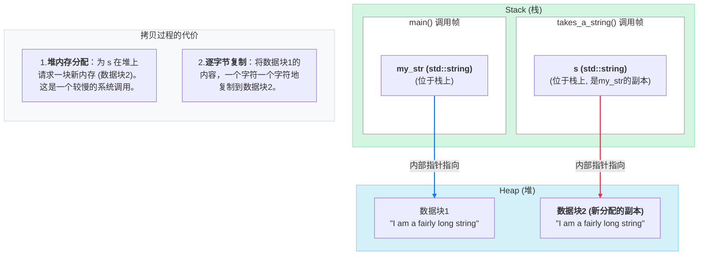
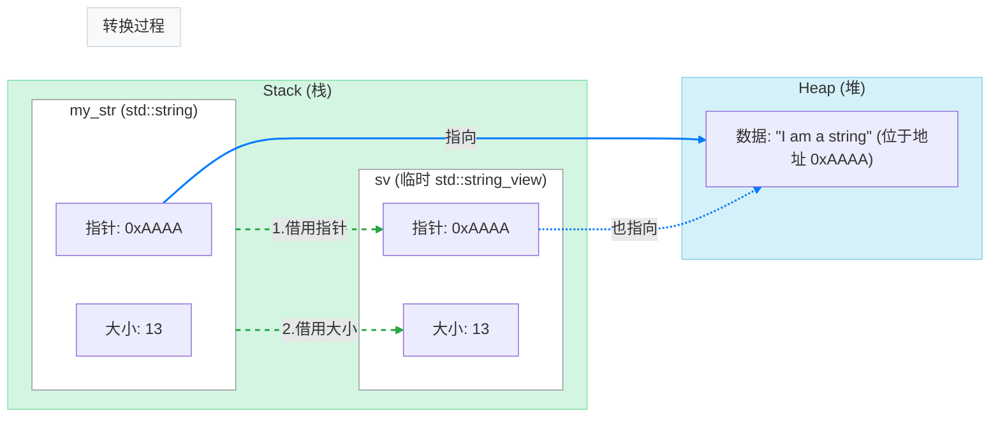
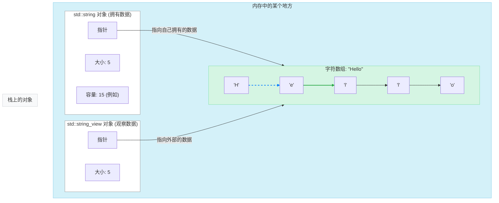

在 C++ 的编程世界里，字符串处理是一个永恒的话题。几乎每个程序都离不开它，但长久以来，如何高效、优雅地传递和操作字符串，一直困扰着无数开发者。这不仅仅是技术选型的问题，更是一段充满了血泪与智慧的演进史。

在我们直接深入 `std::string_view` 之前，让我们先当一次历史侦探，回到过去，看看 `std::string` 究竟给我们带来了哪些“甜蜜的烦恼”，以及 C++ 社区为了解决这些烦恼，都做了哪些伟大的尝试。

### `std::string` 的“原罪”：所有权的代价

`std::string` 是一个伟大的类。它封装了 C 风格的字符数组，为我们处理了动态内存管理，提供了丰富的操作接口。它遵循了 RAII（资源获取即初始化）原则，让我们从手动 `new` 和 `delete` 的噩梦中解放出来。

但要理解它的性能问题，我们必须从更底层的视角审视它的内存布局。一个 `std::string` 对象，通常由两部分组成：

1.  **对象本身**：它通常位于**栈 (Stack)** 上（如果是局部变量）或另一个对象内部。这个对象本身很小，里面存放着一些管理信息，比如指向字符数据的**指针**、字符串的**长度**和当前分配的**容量**。
2.  **字符数据**：真正的字符串内容，存放在**堆 (Heap)** 上的一块动态分配的内存中。对象内部的指针就指向这里。

这种设计很灵活，因为它允许字符串按需增长。但它的核心设计理念——**独占所有权 (Exclusive Ownership)**，也带来了与生俱来的性能代价。一个 `std::string` 对象“拥有”它在堆上的那块数据。当你复制一个 `std::string` 时，为了维护“独占”的原则，必须为副本创建一个全新的、独立的堆内存，并把内容完整地复制过去。

让我们看看当一个 `std::string` 被按值传递给函数时，内存中发生了什么：

```cpp
#include <string>
#include <iostream>

void takes_a_string(std::string s) { // 3. s 是一个全新的对象
    // 4. 它的内部指针指向一块新的堆内存
    std::cout << "Inside function: " << s << std::endl;
} // 5. 函数结束，s 被销毁，它在堆上的内存被释放

int main() {
    // 1. my_str 对象在 main 函数的栈帧上
    //    它指向堆上的一块内存，存着字符串内容
    std::string my_str = "I am a fairly long string";

    // 2. 调用函数，my_str 作为参数被复制给 s
    takes_a_string(my_str);

    return 0;
}
```

这个过程可以用下图来表示：



这就是拷贝的全部代价：**一次堆内存分配 + 一次数据块的完整复制**。当字符串很长，或者这个函数被频繁调用时，这些开销会迅速累积，成为性能的瓶颈。

> **小知识：短字符串优化 (SSO)**
> 许多现代 C++ 标准库的实现都采用了一种叫做“短字符串优化”(Small String Optimization) 的技术。如果字符串非常短（例如，小于16或24个字节），那么它的内容会直接存储在 `std::string` 对象内部预留的一小块空间里，从而避免了在堆上分配内存。
>
> 这非常棒，但它并没有改变游戏规则。一旦字符串的长度超过了这个阈值，`std::string` 就会回到“指针 + 堆内存”的经典模式。我们依然需要面对那些长字符串的拷贝开销。

因此，问题的核心依然存在：我们需要的只是一份“只读”的凭证，却被迫支付了“完整复制一份”的昂贵代价。

### 第一站：`const std::string&` 的优雅与无奈

社区很快找到了一个解决方案：**通过常量引用传递 (pass-by-const-reference)**。

```cpp
void takes_a_string_ref(const std::string& s) {
    std::cout << "Inside function: " << s << std::endl;
}

int main() {
    std::string my_str = "I am a fairly long string...";

    // 几乎零成本！
    // 没有发生拷贝。s 只是 my_str 的一个别名。
    takes_a_string_ref(my_str);
}
```

这看起来太棒了！我们避免了昂贵的拷贝，问题解决了吗？

很遗憾，只解决了一半。`const std::string&` 的方案在一个关键场景下会“图穷匕见”，暴露出它的性能陷阱。当我们试图传递一个 C 风格字符串（比如字符串字面量）给它时，一场“隐形的性能灾难”正在发生。

让我们把 `takes_a_string_ref("I am a literal");` 这一行代码彻底“拆开”，看看编译器在背后都干了些什么：

**第一步：引用的本质与类型的“鸿沟”**

要理解这一切，我们必须先牢记 C++ 中“引用” (`&`) 的本质：**引用不是指针，它是一个已经存在的对象的“别名”**。

当我们定义函数 `void takes_a_string_ref(const std::string& s)` 时，我们向编译器承诺：任何调用这个函数的地方，都会提供一个**真实存在的 `std::string` 对象**，让参数 `s` 去作为它的别名。

但当我们这样调用时：`takes_a_string_ref("I am a literal");`，我们提供的是一个 `const char*` 类型的数据。这里就产生了根本的矛盾：**函数需要一个 `std::string` 对象，但我们只有一个指向字符的指针，内存中根本不存在一个 `std::string` 对象让引用 `s` 去绑定！**

**第二步：编译器的“隐式转换”自救**

面对这个“没有对象可绑定”的窘境，编译器并不会立刻报错。它会启动一套“自救”机制，尝试进行**隐式类型转换**。

编译器的逻辑是：“我需要一个 `std::string`，但你只给了我一个 `const char*`。我能不能用这个 `const char*` 造出一个 `std::string` 呢？”

它检查 `std::string` 的构造函数，发现了一个完美的候选者：`std::string::string(const char*)`。这个构造函数能接收一个 `const char*` 并创建一个 `std::string` 对象。

于是，为了解决“没有对象可绑定”的燃眉之急，编译器决定**当场创造一个 `std::string` 临时对象**。这正是整个性能开销的根源！

**第三步：深入临时对象的代价**

这个临时对象的创建过程，和我们之前解剖 `std::string` 时看到的一样，包含两个昂贵的操作：

1.  **堆内存分配**：调用 `new`，在堆上请求一块足以容纳 `"I am a literal"` 的内存。
2.  **数据拷贝**：通过一个循环，将字符串字面量的内容，一个字符一个字符地拷贝到刚刚分配好的堆内存中。

**第四步：绑定、调用与销毁**

现在，这个新鲜出炉的、包含了完整数据副本的临时 `std::string` 对象终于准备好了。函数参数 `s` 就会被绑定到这个临时对象上。函数执行完毕后，这个临时对象的生命周期也就结束了，它的析构函数会被调用，从而释放掉之前在堆上分配的内存。

下面这段代码，形象地展示了编译器在背后的等效操作：

```cpp
// 你的代码看起来只有一行：
takes_a_string_ref("I am a literal");

// 但编译器在背后等效执行的操作更像是这样：
{
    // 1. 创建临时对象（涉及堆分配和数据拷贝）
    std::string __temp_string("I am a literal");

    // 2. 将引用绑定到临时对象
    takes_a_string_ref(__temp_string);

} // 3. 临时对象在这里被销毁（涉及堆内存释放）
```

你看，你只写了一行简单的函数调用，却在背后触发了：

- 一次堆内存分配 (`new`)
- 一次数据拷贝 (`strcpy-like`)
- 一次堆内存释放 (`delete`)

这正是我们最初想通过传引用来避免的全部开销！

同样的问题也发生在我们想传递一个“子字符串”的时候：

```cpp
std::string source = "hello world";
// substr() 方法会创建一个包含 "hello" 的**新的** std::string 对象
// 然后再将这个临时的新对象传递给函数，开销一样存在！
takes_a_string_ref(source.substr(0, 5));
```

这就是 `const std::string&` 的“无奈”之处：**它强迫所有非 `std::string` 类型的数据，在传递给它之前，都必须先转换成一个 `std::string` 对象**。这种隐式转换带来的临时对象和内存分配，正是我们最初想要避免的。

### 从 `std::string` 到 `std::string_view`：优雅的隐式转换

你可能会好奇，既然 `std::string` 和 `std::string_view` 是两种不同的类型，为什么我们可以如此自然地将一个 `std::string` 对象（`my_str`）传递给需要 `std::string_view` 的函数呢？

这要归功于 `std::string_view` 的设计者为我们提供的一个“便利通道”——一个**转换构造函数 (Converting Constructor)**。

在 `std::string_view` 的内部，有一个原型大致如下的构造函数：

```cpp
// 在 std::string_view 的定义中（简化版）
class string_view {
public:
    // ... 其他成员 ...

    // 这个构造函数不是 explicit 的！
    // 它可以从一个 std::string 隐式地构造一个 string_view
    string_view(const std::string& str) noexcept
        : ptr_(str.data()), size_(str.size())
    {
        // 构造函数的全部工作就是：
        // 1. "借用" str 内部数据的指针
        // 2. "借用" str 的大小
        // 完成！没有堆分配，没有数据拷贝。
    }
};
```

因为这个构造函数**没有**被标记为 `explicit`，所以它允许编译器进行**隐式类型转换**。

#### `explicit` vs. 隐式转换：一个例子让你秒懂

为了彻底理解“隐式”的含义，我们得先聊聊它的反义词——`explicit`。

在 C++ 中，`explicit` 是一个专门用来修饰构造函数的关键字。它的作用就像一个“门禁”，一旦某个构造函数被标记为 `explicit`，就等于告诉编译器：“**禁止私自、自动地用我来进行类型转换！用户必须清清楚楚、明明白白地手动调用我才行！**”

现在，让我们通过一个例子，看看 `string_view` 的构造函数**不是** `explicit` 给我们带来了多大的便利：

```cpp
#include <string>
#include <string_view>

void printStringView(std::string_view sv) { /* ... */ }

int main() {
    std::string my_str = "hello";

    // ---- 场景一：我们现在的幸福生活 (隐式转换) ----
    // 因为 string_view(const std::string&) 构造函数不是 explicit，
    // 编译器被允许在背后自动调用它，来完成从 string 到 string_view 的转换。
    // 我们写的代码简洁明了：
    printStringView(my_str);


    // ---- 场景二：如果我们想“明确”一点 (显式转换) ----
    // 我们当然也可以不依赖编译器，自己手动、显式地调用构造函数。
    // 效果完全一样，只是代码啰嗦了一点：
    printStringView(std::string_view(my_str));


    // ---- 场景三：平行宇宙中的“不幸生活” ----
    // 假设，string_view 的设计者当初把构造函数标记成了 explicit:
    // explicit string_view(const std::string& str);
    //
    // 那么，场景一的代码将会直接编译失败！
    // printStringView(my_str); // 编译错误！编译器被禁止进行隐式转换
    //
    // 在这个“不幸”的平行宇宙里，你将被迫只能使用场景二的写法，
    // 每次都得手动进行显式转换。
}
```

通过这个对比，结论就非常清晰了：

**隐式转换**，就是编译器在背后为我们自动完成的类型转换，让我们的代码可以写得更简洁。`std::string_view` 的设计者**故意**允许了从 `std::string` 到 `string_view` 的隐式转换，目的就是为了让我们能无缝地将既有代码迁移过来，享受最大的便利。

理解了这一点后，我们再来看 `printStringView(my_str)` 这个调用，它的完整流程是：

1.  编译器发现类型不匹配（需要 `string_view`，得到 `std::string`）。
2.  它找到了上面那个**非 `explicit`** 的转换构造函数。
3.  它**隐式地**调用这个构造函数，在**栈上**创建了一个临时的 `std::string_view` 对象。这个过程仅仅是复制了 `my_str` 内部的指针和大小值，快如闪电。
4.  这个临时的 `string_view` 对象被传递给函数。

下面这张图可以让你看得更清楚：



这个设计是 `std::string_view` 如此实用的关键所在。它确保了与现有大量使用 `std::string` 的代码库的无缝兼容，让我们可以逐步地、平滑地将老代码迁移到使用 `string_view` 的现代风格上，而无需进行大规模的破坏性修改。

### “温水煮青蛙”：性能灾难的真实场景

你可能会想：“好吧，一次函数调用多了一点点内存分配和拷贝，真的有那么严重吗？”

在单个、孤立的调用中，确实不容易察觉。但这就像“温水煮青蛙”，真正的危险在于，这种看似无害的开销会在高频率调用的场景中迅速累积，最终吞噬掉你程序的性能，导致难以追踪的卡顿和延迟。

让我们来看两个经典的“灾难现场”：

**场景一：高性能日志系统**

想象你在开发一个需要海量日志的游戏引擎或者高频交易系统。你有一个日志函数：

```cpp
void Logger::log(const std::string& message) {
    // ... 将消息写入文件或控制台 ...
}
```

在程序的核心循环中，你可能会这样记录日志：

```cpp
// 在一个每秒执行数千次的循环中
while (isRunning) {
    // ... 处理核心逻辑 ...

    // 记录各种状态，通常使用字符串字面量
    g_logger.log("Engine status: running");

    int objects_processed = process_objects();

    // 使用 sprintf 或 std::format 格式化字符串，结果通常是 char[]
    char buffer[128];
    snprintf(buffer, sizeof(buffer), "Processed %d objects", objects_processed);
    g_logger.log(buffer); // 又一次临时 std::string 的创建！
}
```

**灾难分析**：
在这个每秒可能执行成千上万次的循环里，每一次 `g_logger.log(...)` 的调用，只要传入的不是一个现成的 `std::string` 对象，就会触发一次“堆分配 + 数据拷贝 + 堆释放”的完整套餐。

- **CPU 飙升**：成千上万次的内存分配和释放操作会持续不断地骚扰操作系统，消耗大量 CPU 时间。
- **内存碎片化**：频繁申请和释放这些小块内存，会让堆内存变得千疮百孔，导致未来的内存分配变得更慢。
- **程序卡顿**：在最关键的游戏渲染或交易处理线程中，这些累积的微小延迟最终会导致肉眼可见的卡顿。

**场景二：文件解析或网络协议处理**

假设你在编写一个解析器，需要逐行读取一个巨大的配置文件，并按分隔符拆分键值对。

```cpp
// 核心处理函数，接收一个“键”
void process_key(const std::string& key) {
    // ...
}

void parse_line(const std::string& line) {
    // string::find 和 string::substr 配合使用
    size_t pos = line.find('=');
    if (pos != std::string::npos) {
        // 灾难点！substr() 创建了一个全新的 std::string 对象来存储 key
        std::string key = line.substr(0, pos);
        process_key(key);
    }
}
```

**灾难分析**：
如果这个配置文件有十万行，你的代码就会默默地创建**十万个**临时的 `std::string` 对象来存储那些 `key`。你只是想“看一看”源字符串中的一小部分，却被迫为这一小部分创建了无数个昂贵的副本。

这正是 `std::string_view` 的前辈——Google 的 `StringPiece` 和 LLVM 的 `StringRef`——诞生的核心原因。它们的开发者在优化编译器和大型系统时，被这种无处不在的子串拷贝问题折磨得忍无可忍，才最终创造出了“字符串视图”这种解决方案。

所以，这绝不是一个理论上的小问题。它是在无数大型、高性能项目中被反复验证过的、实实在在的性能杀手。理解了这种痛，你才能真正体会到 `std::string_view` 出现的历史必然性。

#### 实战剖析：在 Mini-Redis 中如何规避 `substr` 灾难

前文“场景二”中提到的解析噩梦，也正是我们在开发 **<a href="https://mp.weixin.qq.com/s/qujRzKcllccSHxQvJG-vOA" target="_blank" rel="noopener noreferrer">“从零实现 mini-redis”</a>** 实战项目时，遇到的第一个性能瓶颈。

在解析 Redis 的 RESP 网络协议时，我们需要从一个连续的字节流（例如 `*3\r\n$3\r\nSET\r\n$3\r\nkey\r\n$5\r\nvalue\r\n`）中，精准地切分出命令（`SET`）和参数（`key`, `value`）。如果使用 `std::string::substr`，每一次切分都会在堆上生成一个新的 `std::string` 副本，对于一个高并发的 Redis 服务器来说，这种开销是致命的。

我们的解决方案，就是用 `string_view` 来实现零拷贝解析。解析器的核心函数，其职责不是“复制”出内容，而是从原始的缓冲区视图中，“切分”出更小的视图。

```cpp
// in mini-redis project (conceptual code)
// 解析器接收一个包含部分或完整网络数据的缓冲区视图
void CommandParser::parse(std::string_view buffer) {
    while (can_parse_a_complete_command(buffer)) {
        // 从 buffer 中“切”出一个代表命令的视图，例如 "SET"
        // 注意：这里没有创建任何新的字符串对象！
        std::string_view command_view = slice_command(buffer);

        // ... 继续切分出参数的 string_view ...

        // 将这些零成本的视图传递给命令处理器
        process_command(command_view, ...);
    }
}
```

通过这种方式，在整个协议解析的流水线上，数据都以“视图”的形式流动，只有在最终需要将数据长期存储时（例如，存入数据库），才会创建 `std::string` 对象。

正是这种对性能的极致追求，才催生了社区的各种探索。在 C++17 正式采纳 `std::string_view` 之前，各大技术巨头就已经有了自己的先行方案。

### 第二站：各大门派的自创神器

在 C++17 标准到来之前，许多大型项目和库的开发者们不等不靠，自己动手解决了这个问题。他们不约而同地发明了一种设计模式，我们称之为“字符串片段”(String Piece)。

- **Google 的 `StringPiece`**：在 Google 内部被广泛使用，用来优化字符串处理。
- **LLVM 的 `StringRef`**：LLVM 和 Clang 项目用来高效表示和传递代码片段。
- **Qt 的 `QStringRef`**：Qt 框架中用于引用 `QString` 的一部分，避免拷贝。

这些“神器”的原理惊人地一致：**用一个指针和一串长度来表示一个字符串的“视图”**。

一个 `StringPiece` 或 `StringRef` 对象本身不拥有任何数据，它只是“借用”别人的。它像一个观察员，静静地看着某块内存，并记录下起始位置和长度。因为自身非常轻量（只有两个指针大小），所以可以以极低的成本进行复制和传递。

这个设计思想的出现，标志着 C++ 社区已经找到了解决字符串传递效率问题的正确方向。剩下的，只是等待标准委员会将其“收编”并赋予其“官方正统”的地位。

### 终点站：`std::string_view` 的官方正统

千呼万唤始出来！C++17 终于将这个久经考验的设计模式纳入标准库，命名为 `std::string_view`。

`std::string_view` 的核心与那些前辈们完全一样：

1.  一个指向某处已存在的字符序列的**指针**。
2.  一个表示该字符序列的**长度**。

它自己不申请内存来存储字符串内容，而是“借用”别人的。这个“别人”可以是 `std::string`、C 风格字符串字面量 (`const char*`)，甚至是一个字符数组。



现在，我们终于可以写出那个完美的 `print` 函数了：

```cpp
#include <iostream>
#include <string>
#include <string_view> // 引入头文件

// 现代方式：接受一个 std::string_view
// 这里几乎是零成本！
void printStringView(std::string_view sv) {
    std::cout << sv << std::endl;
}

int main() {
    std::string my_str = "I am a string";
    const char* c_str = "I am a C-string";

    // 1. 从 std::string 创建，零成本
    printStringView(my_str);

    // 2. 从 C 风格字符串创建，零成本
    printStringView(c_str);

    // 3. 从字符串字面量创建，零成本
    printStringView("I am a literal");

    // 4. 创建子串视图，同样零成本！
    std::string_view sub_view = my_str;
    printStringView(sub_view.substr(0, 4)); // 输出 "I am"

    return 0;
}
```

使用 `std::string_view`，我们完美地解决了之前的两大痛点：

1.  **避免了 `std::string` 的拷贝**。
2.  **避免了为 `const char*` 等类型创建临时的 `std::string` 对象**。

它成为了 C++ 中用于函数参数传递的、事实上的“只读字符串”最佳实践。

### “悬空视图”：`string_view` 最大的陷阱

`std::string_view` 的高效源于它的“不拥有”，但也正因如此，带来了它最大的使用风险：**视图的生命周期超过了它所指向的数据的生命周期**。

这就像你的朋友还拿着你给的便签，但图书馆管理员已经把那本书下架销毁了。当你的朋友按图索骥时，只会发现一个空空如也的书架。在 C++ 中，这会导致**未定义行为 (Undefined Behavior)**，通常表现为程序崩溃或数据错乱。

看一个经典的错误示范：

```cpp
#include <iostream>
#include <string_view>

std::string_view get_a_view() {
    std::string local_str = "I will be destroyed soon!";
    // 错误！返回了一个指向局部变量的视图
    return local_str;
} // `local_str` 在这里被销毁了，它拥有的内存被释放

int main() {
    std::string_view sv = get_a_view();

    // 灾难发生！
    // sv 现在指向一块已经被释放的内存，它是一个“悬空视图”。
    // 下面的打印操作将导致未定义行为。
    std::cout << sv << std::endl;

    return 0;
}
```

### 安全使用黄金法则

为了避免“悬空视图”，请牢记这条黄金法则：

> **`std::string_view` 非常适合作为函数参数，但用于返回值或作为类成员变量时要格外小心，必须确保它指向的数据活得比它久。**

### 总结

`std::string_view` 的诞生，是 C++ 社区追求极致性能和易用性平衡的必然结果。它的历史演进告诉我们：

1.  **`std::string` 的所有权模型** 是其易用性的来源，也是其性能开销的根源。
2.  **`const std::string&`** 是一个不完美的过渡方案，它解决了部分问题，但引入了隐式转换的性能陷阱。
3.  **各大库的 `StringPiece` 类** 是社区的智慧结晶，为标准方案铺平了道路。
4.  **`std::string_view`** 是最终的“官方正统”，它以非所有权的方式，为只读字符串操作提供了一个零开销的统一接口。

掌握了 `std::string_view`，你不仅是学会了一个新工具，更是理解了 C++ 演进背后对性能的极致追求。从现在开始，在你的代码中，用 `string_view` 来替换那些只读的 `const string&` 参数吧！

### 还在用 C++ 写“学生管理系统”？

是时候给你的简历来点硬核的了！

别再让理论和实践脱节，也别再让你的 C++ 项目停留在“玩具”阶段。

我们为你准备了 **《用现代 C++ 从零实现 mini-Redis》** 实战指南。这不仅仅是一个项目，更是你通往后台开发高手之路的“金钥匙”。

在这趟旅程中，你将：

- 🚀 **亲手缔造性能奇迹：** 将一个“单线程玩具”改造成能从容应对万级并发的高性能引擎。
- ⚙️ **掌握真正工业级技能：** `epoll`、AOF 持久化、RESP 协议... 全程不依赖第三方库，只用最纯粹的 C++ 和系统 API。
- 🌱 **打造你的现代 C++ 试验田：** 不再停留在理论学习，你将亲手在项目中应用 C++23 的 `Modules`、`std::span` 等特性，把新语法变成真正的工程能力。
- 🗣️ **在面试中自信言之有物：** 当你能在白板上画出自己亲手写的架构时，任何关于 Redis 的问题都是送分题。

想进一步了解 Mini-Redis 项目的实现细节？可以点击阅读<a href="https://mp.weixin.qq.com/s/qujRzKcllccSHxQvJG-vOA" target="_blank" rel="noopener noreferrer">这篇详细的文章</a>。

**👇 扫码添加微信（备注“redis”），立即开启你的高手进阶之旅！**


