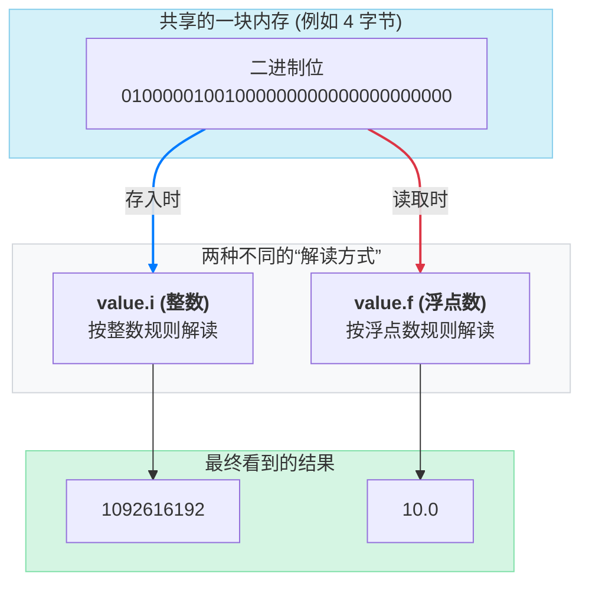
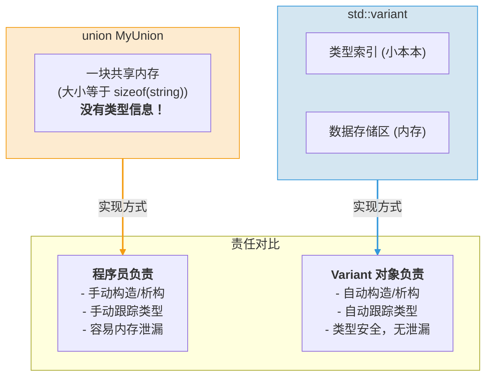

你是否也曾被这样一个问题困扰：如何在一个变量里，安全地存放几种完全不同的类型？🤔

也许你想起了 C 语言中的老朋友 `union`，它承诺能做到这一点，但却像一个没有说明书的“盲盒” 🎁。你往里面放了个整数，但如果不小心按字符串的方式去取，程序可能瞬间崩溃 💥，留下一脸懵的你。这种“信任全靠自觉”的模式，在复杂的项目中简直是噩梦的开始。

别担心，C++17 带来了终极解决方案：**`std::variant`**！🎉

它就像一个自带“身份证”的智能容器，不仅能装下 `int`、`std::string` 或任何你指定的类型，而且每次你打开它，它都会清清楚楚地告诉你：“嘿，我现在装的是一个整数！”

那么，这个神奇的 `std::variant` 究竟是如何施展魔法，既保持了 `union` 的内存效率，又彻底告别了类型混乱的危险呢？它内部的“身份证”到底长什么样？🤔

准备好了吗？让我们一起揭开它的神秘面纱，看看现代 C++ 是如何用一种极其优雅的方式，解决这个困扰开发者数十年的经典难题的！👇

### `union` 的“原罪”：失控的内存魔方

要理解 `std::variant` 为何如此重要，我们必须先回到过去，直面 `union` 的设计缺陷。

`union` 的核心思想是：**在同一块内存空间中，存储不同类型的数据**。它的所有成员共享同一块内存，这块内存的大小由其最大的成员决定。

这听起来非常高效，不是吗？比如，当我们需要一个变量，它有时是整数，有时是浮点数，有时又是一个字符时，用 `union` 似乎再合适不过了。

```cpp
// 一个经典的 C 风格 union
union MyValue {
    int i;
    float f;
    char c;
};
```

但魔鬼就藏在细节里。`union` 最大的问题在于：**它完全不记录自己当前存储的是哪种类型**。它就像一个没有标签的药瓶，里面可能装着维生素，也可能装着毒药，而你只能靠猜。

让我们来看一个经典的“事故”是如何发生的：

```cpp
#include <iostream>

union MyValue {
    int i;
    float f;
};

int main() {
    MyValue value;
    value.i = 1092616192; // 我们存入一个整数

    // 但是，我们却试图把它当作一个浮点数来读取！
    std::cout << "As float: " << value.f << std::endl;

    // 为了对比，我们看看它作为整数时是什么
    std::cout << "As int: " << value.i << std::endl;
}
```

在大多数现代系统上（采用 IEEE 754 浮点标准），这段代码会输出：

```
As float: 10.0
As int: 1092616192
```

是不是很神奇？我们存入的明明是一个巨大的整数 `1092616192`，但当把它按浮点数 `f` “翻译”出来时，却得到了 `10.0`。这不是巧合，而是 `union` 底层工作方式的直接体现。

`union` 只是提供了一块原始的、未加诠释的内存。当我们用 `value.i` 存入数据时，我们是按照整数的二进制格式去填充这块内存。而当我们用 `value.f` 读取时，编译器会把**同一串二进制**按照浮点数的格式来解析。

这背后发生了什么？这正是 `union` 内存布局的核心体现。

#### 深入 `union` 的内存布局：一块内存，两种“解读”

1.  **共享内存**：`union` 的所有成员（在这里是 `i` 和 `f`）都从**同一个内存地址**开始存储。
2.  **大小与对齐**：
    - `union` 的**大小**至少为其最大成员的大小。在我们的例子中，`int` 和 `float` 通常都是 4 字节，所以 `MyValue` 的大小就是 4 字节。
    - `union` 的**对齐要求**则与其最严格（对齐字节数最大）的成员保持一致。

当我们执行 `value.i = 1092616192;` 时，发生了以下事情：

- 整数 `1092616192` 的十六进制表示是 `0x41200000`，其 32 位二进制表示是 `01000001 00100000 00000000 00000000`。
- 这串二进制位被原封不动地写入了 `union` 的 4 字节共享内存中。

而当我们执行 `std::cout << value.f;` 时，编译器会：

- 找到同一块内存地址。
- 将这块内存中的**同一串二进制** `01000001001000000000000000000000` 拿出来。
- 但这一次，它会戴上“浮点数”的眼镜，按照另一套完全不同的规则（即 **IEEE 754 单精度浮点数标准**）来“解读”它。这套规则会把这串二进制拆分成符号、指数和尾数等部分来重新计算。对于 `0x41200000` 这串二进制，通过这套浮点数规则计算出的结果恰好就是 `10.0`。

所以，`10.0` 这个结果，就是对同一块内存数据进行不同“解读”的产物。`union` 只负责提供内存，却不负责解释，这正是它既高效又危险的原因。



这就是 `union` 的“原罪”：它放弃了 C++ 最引以为傲的**类型系统**，把类型是否匹配的核对责任，完全丢给了程序员。这种“信任”是脆弱的，一旦程序员疏忽，就会导致各种难以调试的 bug，甚至严重的安全漏洞。

为了弥补这个缺陷，程序员们发明了一种变通手法——**带标签的联合体 (Tagged Union)**：

```cpp
struct TaggedValue {
    enum class Type { INT, FLOAT };
    Type type; // 这个就是“标签”
    union {
        int i;
        float f;
    } value;
};

void printValue(const TaggedValue& val) {
    if (val.type == TaggedValue::Type::INT) {
        std::cout << "Int: " << val.value.i << std::endl;
    } else if (val.type == TaggedValue::Type::FLOAT) {
        std::cout << "Float: " << val.value.f << std::endl;
    }
}
```

这种手动档的“打标签”方式虽然能工作，但非常笨拙、易错，而且需要编写大量的样板代码。有没有一种可能，让编译器自动帮我们完成这一切呢？

### `std::variant`：自带“身份证”的百变星君

C++17 的 `std::variant` 正是为了解决上述所有问题而设计的。它本质上是一个**自动化的、类型安全的“带标签的联合体”**。

`std::variant` 对象在任何时候，都确切地知道自己存储的是哪一种类型。它就像一个百变星君，每次变身，都会自动在胸前挂上一个写着自己当前形态的“身份证”。

```cpp
#include <iostream>
#include <variant>
#include <string>

int main() {
    // 定义一个可以存储 int, double, string 三种类型之一的 variant
    std::variant<int, double, std::string> v;

    v = 123; // v 现在是一个 int
    std::cout << "当前类型索引: " << v.index() << std::endl; // 输出 0

    v = 3.14; // v 现在是一个 double
    std::cout << "当前类型索引: " << v.index() << std::endl; // 输出 1

    v = "Hello, Variant!"; // v 现在是一个 std::string
    std::cout << "当前类型索引: " << v.index() << std::endl; // 输出 2
}
```

`v.index()` 方法会返回一个从 0 开始的索引，告诉你当前 `variant` 持有的是模板参数列表中的第几种类型。这正是它内部“标签”的体现。

你可能会好奇，`std::variant` 内部到底长什么样？它是如何实现这种“自带身份证”的功能的？

#### 深入 `std::variant` 实现：它和 `union` 的本质区别在哪？

你可能觉得，`std::variant` 不就是在 `union` 外面包了一层，加了个“标签”吗？

从表面看是这样，但这个“包装”的深度，决定了它们之间有天壤之别。`union` 只是一个“内存共享器”，而 `std::variant` 则是一个**“对象生命周期管理器”**。这才是它们在实现上的本质区别。

想象一下，`union` 提供的是一块“毛坯房”，它只给你一块地（内存），你可以在上面盖任何类型的房子（存任何类型的数据），但拆了建、建了拆，都得你自己负责。如果你拆建的姿势不对（比如用 `int` 的方式去解读 `string`），房子就塌了（未定义行为）。

而 `std::variant` 提供的是一个“智能管家”。这个管家不仅持有那块地，还随身携带一个小本本（类型索引）。

`std::variant` 与 `union` 的实现差异主要体现在以下三个层面：

**1. 核心区别：一个“小本本” (类型索引)**

- **`union`**：没有小本本。它对内部存储的数据类型一无所知。
- **`std::variant`**：**强制携带一个小本本** (Type Discriminator)。这个“小本本”是一个内部成员，通常是个小整数，记录着当前这块“毛坯房”里住的到底是 `int` 先生还是 `string` 小姐。`v.index()` 就是在读取这个小本本的内容。

**2. 关键差异：对象的“生死”由谁管 (生命周期管理)**

这才是最关键，也最能体现 `variant` 价值的地方，尤其是在处理像 `std::string` 这样需要动态分配内存的复杂类型时。

- **`union`**：**完全不负责**。如果你在一个 `union` 中存入一个 `std::string`，然后又直接覆盖写入一个 `int`，那么 `std::string` 用来管理堆内存的内部指针就会被无情地覆盖。它原本指向的内存将永远无法被 `delete`，造成**内存泄漏**。`union` 不会为旧对象调用析构函数，也不会为新对象调用构造函数（除了最简单的赋值）。

- **`std::variant`**：**全程负责到底**。当你执行 `v = "new string";` 时，`variant` 会做一套严谨的“交接仪式”：
  1.  **检查旧住户**：通过小本本发现，哦，原来住的是 `int` 先生。
  2.  **办理“退房”**：为 `int` 对象执行析构（对于 `int` 这种简单类型，这步是空操作）。
  3.  **迎接“新住户”**：在“毛坯房”（内部存储区）的同一块地上，使用“定位 new” (placement new) 精准地构造一个新的 `std::string` 对象。这意味着会调用 `std::string` 的构造函数，后者会去堆上申请内存，存放 `"new string"`。
  4.  **更新“小本本”**：在小本本上把住户信息从 `int` 的索引（如 0）改成 `std::string` 的索引（如 1）。

这个“先析构旧值，再构造新值”的自动化流程，保证了 `std::variant` 中对象的生命周期被严格、正确地管理，从根本上杜绝了内存泄漏的风险。

**3. 实现基础：一块“精装修”的内存 (存储区)**

- **`union`**：一块“毛坯”内存，大小由最大的成员决定。
- **`std::variant`**：一块“精装修”内存。它的大小和对齐方式，不仅要满足最大的备选类型，还要满足**最严格**的那个。这确保了任何类型的对象住进来，都能住得“舒适合法”。

我们可以用一个简化的模型来想象 `std::variant<int, std::string>` 的内部结构：

```cpp
// 这是一个极简化的概念模型，非实际源码
template<class... Types>
class simplified_variant {
private:
    // 1. 小本本 (身份证)
    size_t index;

    // 2. 精装修的内存仓库
    // 其大小和对齐方式由所有备选类型中要求最严格的那个决定
    alignas(Types...) char storage[max_sizeof<Types...>()];

    // ... 内部还有复杂的构造、析构、赋值、访问等辅助函数 ...
};
```

现在，你就能理解为什么 `std::get<int>(v)` 敢那么“自信”了。在它交出数据之前，第一步就是检查小本本：`if (v.index() == 0)`。如果对不上号，它会立刻“报警”（抛出 `std::bad_variant_access` 异常），而不是像 `union` 那样，给你一个错误解读的、灾难性的结果。



所以，`std::variant` 相较于 `union` 的本质区别，就是从一个纯粹的**“内存布局工具”**，进化成了一个**“带类型状态机和生命周期管理功能的对象容器”**。它把管理的责任从程序员肩上接了过来，用编译器的严谨，换来了我们代码的安全。

#### 安全的访问：`get` 与 `get_if`

既然 `variant` 知道自己的类型，那么访问它的值也就变得安全了。C++ 提供了两种主要的访问方式：

1.  **`std::get<T>(v)`**：如果你**确信** `variant` 当前存储的是 `T` 类型，那么可以用 `get` 来直接获取其值。但请注意，这是一种“断言式”的访问。如果你猜错了，程序通常会立即终止。因此，它只应在你能 100% 保证类型正确的情况下使用。

    ```cpp
    std::variant<int, std::string> v = "I am a string";

    // 正确访问
    std::cout << std::get<std::string>(v) << std::endl;

    // 错误访问：下面这行代码会导致程序崩溃！
    // std::cout << std::get<int>(v) << std::endl;
    ```

2.  **`std::get_if<T>(&v)`**：这是一种更安全、更推荐的访问方式。它接收一个指向 `variant` 的**指针**。如果类型匹配，它会返回一个指向其内部值的指针；如果类型不匹配，它会返回 `nullptr`。

    ```cpp
    std::variant<int, std::string> v = 42;

    // 检查并获取 int
    if (auto* p_int = std::get_if<int>(&v)) {
        std::cout << "它是一个整数: " << *p_int << std::endl;
    }

    // 检查并获取 string
    if (auto* p_str = std::get_if<std::string>(&v)) {
        std::cout << "它是一个字符串: " << *p_str << std::endl;
    } else {
        std::cout << "它当前不是一个字符串。" << std::endl;
    }
    ```

    你还可以用 `std::holds_alternative<T>(v)` 来检查 `variant` 当前是否持有 `T` 类型，它会返回一个 `bool` 值。

### 终极绝技：`std::visit`

虽然 `get_if` 已经很好用了，但如果你需要为 `variant` 中的每一种可能类型都编写处理逻辑，那么一连串的 `if-else` 会显得非常笨重。

```cpp
// if-else 风格，很啰嗦
if (std::holds_alternative<int>(v)) {
    //...
} else if (std::holds_alternative<double>(v)) {
    //...
} else if (std::holds_alternative<std::string>(v)) {
    //...
}
```

为了解决这个问题，标准库提供了一个终极大招——`std::visit`。

`std::visit` 就像一个专业的“访问者”，你可以给它一个“可调用对象”（比如 Lambda 表达式），它会自动根据 `variant` 当前的类型，去调用这个对象对应的重载版本。

```cpp
#include <iostream>
#include <variant>
#include <string>

int main() {
    std::variant<int, double, std::string> v = "Hello";

    // 定义一个可以处理所有可能类型的“访问者”
    auto visitor = [](const auto& value) {
        // 使用 if constexpr，在编译期选择正确的代码路径
        using T = std::decay_t<decltype(value)>;
        if constexpr (std::is_same_v<T, int>) {
            std::cout << "处理整数: " << value << std::endl;
        } else if constexpr (std::is_same_v<T, double>) {
            std::cout << "处理浮点数: " << value * 2.0 << std::endl;
        } else if constexpr (std::is_same_v<T, std::string>) {
            std::cout << "处理字符串: \"" << value << "\"" << std::endl;
        }
    };

    // 让“访问者”去访问 variant
    std::visit(visitor, v); // 输出: 处理字符串: "Hello"

    v = 100;
    std::visit(visitor, v); // 输出: 处理整数: 100
}
```

`std::visit` 结合 `if constexpr` 是处理 `variant` 最强大、最地道的方式。它不仅代码优雅，而且效率极高，因为所有类型判断和分支选择都在编译期完成，运行时没有任何额外开销。

### 寻根溯源：`std::variant` 的设计哲学与历史演进

`std::variant` 并非横空出世，它的诞生，是 C++ 社区乃至整个编程语言领域几十年探索与演进的结果。要真正理解它为何如此设计，我们需要戴上历史的眼镜，看一看在它出现之前，程序员们都在用哪些“武器”对抗 `union` 的混乱，以及这些“武器”又借鉴了哪些来自其他编程语言的智慧。

这一章，就让我们扮演一次技术侦探，从 `std::variant` 的“近亲”`Boost.Variant` 开始，一路追溯到函数式编程的起源，最终拼凑出 `std::variant` 的完整演化图谱。

#### 1. C++ 社区的探索：前辈们的宝贵遗产

在 `std::variant` 被正式纳入 C++17 标准之前，C++ 开发者们早已开始了漫长的探索。

##### Boost.Variant：最直接的“引路人”

如果说 `std::variant` 有一个“精神前作”，那无疑就是 `Boost.Variant`。它在 C++17 之前的漫长岁月里，几乎是所有需要类型安全联合体的项目的首选。它不仅为 `std::variant` 的最终设计铺平了道路，更在无数实际项目中证明了这一模式的价值。

```cpp
#include <boost/variant.hpp>
#include <iostream>
#include <string>

typedef boost::variant<int, std::string, double> MyVariant;

// Boost 的访问者模式
class MyVisitor : public boost::static_visitor<void> {
public:
    void operator()(int i) const {
        std::cout << "整数: " << i << std::endl;
    }

    void operator()(const std::string& str) const {
        std::cout << "字符串: " << str << std::endl;
    }

    void operator()(double d) const {
        std::cout << "浮点数: " << d << std::endl;
    }
};

int main() {
    MyVariant v = std::string("Hello Boost");

    // 使用访问者模式
    boost::apply_visitor(MyVisitor(), v);

    // 使用 get 获取值
    if (std::string* str = boost::get<std::string>(&v)) {
        std::cout << "成功获取字符串: " << *str << std::endl;
    }

    return 0;
}
```

`boost::variant` 的设计理念与 `std::variant` 非常相似，但在语法上稍显笨重。它需要显式定义访问者类，而 `std::variant` 可以直接使用 lambda 表达式配合 `std::visit`。

**Boost.Variant vs std::variant 对比：**

```cpp
// Boost.Variant 的访问方式
class MyVisitor : public boost::static_visitor<void> {
public:
    void operator()(int i) const { /* 处理逻辑 */ }
    void operator()(const std::string& str) const { /* 处理逻辑 */ }
};
boost::apply_visitor(MyVisitor(), v);

// std::variant 的访问方式 - 更简洁！
std::visit([](const auto& value) {
    using T = std::decay_t<decltype(value)>;
    if constexpr (std::is_same_v<T, int>) {
        // 处理整数
    } else if constexpr (std::is_same_v<T, std::string>) {
        // 处理字符串
    }
}, v);
```

#### absl::variant：Google 的实现

Google 的 Abseil 库也提供了自己的 variant 实现，这在 C++17 普及之前是很多项目的选择：

```cpp
#include "absl/types/variant.h"
#include <iostream>
#include <string>

int main() {
    absl::variant<int, std::string> v;

    v = 42;
    std::cout << absl::get<int>(v) << std::endl;

    v = std::string("Hello Abseil");
    absl::visit([](const auto& value) {
        std::cout << "值: " << value << std::endl;
    }, v);

    return 0;
}
```

`absl::variant` 的 API 与 `std::variant` 几乎完全相同，这并非巧合——两者在设计时相互影响，确保了最终标准的成熟度。

#### Qt 的 QVariant：与元对象系统深度集成

对于任何使用 Qt 框架的 C++ 开发者来说，`QVariant` 都是一个无法绕开的核心组件。它不仅仅是一个类型安全的联合体，更是整个 Qt 元对象系统（Meta-Object System）的基石，深度集成于属性、信号与槽、数据模型等各个角落。

`QVariant` 在设计上更接近于 `std::any`，它是一个完全类型擦除的容器，可以在运行时存储各种不同类型的值。

```cpp
#include <QVariant>
#include <QString>
#include <QDebug>

// 注册自定义类型，使其能被 QVariant 存储
struct MyCustomType {
    int id;
    QString name;
};
Q_DECLARE_METATYPE(MyCustomType);

int main() {
    QVariant v;

    v.setValue(123); // 存储一个 int
    qDebug() << "Type:" << v.typeName() << ", Value:" << v.toInt();

    v.setValue(QString("Hello Qt!")); // 存储一个 QString
    qDebug() << "Type:" << v.typeName() << ", Value:" << v.toString();

    // QVariant 强大的类型转换能力
    v = QString("456");
    bool canConvert = false;
    int intValue = v.toInt(&canConvert);
    if (canConvert) {
        qDebug() << "Successfully converted string to int:" << intValue;
    }

    // 存储自定义类型
    MyCustomType custom = { 101, "CustomData" };
    v.setValue(custom);
    if (v.canConvert<MyCustomType>()) {
        MyCustomType result = v.value<MyCustomType>();
        qDebug() << "Custom Type:" << result.id << result.name;
    }
}
```

**与 `std::variant` 的核心区别：**

- **编译时 vs 运行时**：`std::variant` 是一个编译时确定的类型集合（Sum Type），所有可能的类型都必须在定义时列出。而 `QVariant` 是一个运行时容器（类似 `std::any`），它可以存储任何在编译时已知或在运行时注册的类型。
- **类型安全**：`std::variant` 的类型安全更多地体现在编译期，通过 `std::visit` 等机制，编译器可以检查你是否处理了所有情况。`QVariant` 的类型安全则完全在运行时，你需要通过 `canConvert()` 或 `type()` 等方法来检查和转换类型。
- **灵活性与开销**：`QVariant` 更加灵活，但通常伴随着更高的运行时开销（可能涉及堆分配、类型查找和动态转换）。`std::variant` 则几乎没有运行时开销，性能接近于原生的 `union`。
- **生态集成**：`QVariant` 的最大优势在于它与 Qt 生态的无缝集成。如果你在写 Qt 程序，使用 `QVariant` 是自然而然的选择。`std::variant` 则是通用的、与任何框架无关的标准库组件。

#### 性能与设计权衡

让我们从技术角度对比这些方案：

```cpp
// 内存布局对比
struct VariantLayouts {
    // std::variant<int, std::string> 的典型布局
    struct StdVariant {
        size_t index;           // 类型标签 (8字节)
        alignas(std::string) char storage[sizeof(std::string)]; // 数据存储
    };

    // boost::any 的典型布局
    struct BoostAny {
        void* data;            // 指向实际数据的指针 (8字节)
        std::type_info* type;  // 类型信息指针 (8字节)
        // 实际数据通常在堆上分配
    };

    // std::optional<T> 的典型布局
    struct StdOptional {
        bool has_value;        // 是否有值的标志 (1字节)
        alignas(T) char storage[sizeof(T)]; // 数据存储
    };

    // 传统 C union（无类型信息）
    union CUnion {
        int i;
        double d;
        // 危险：无法知道当前存储的是什么类型
    };
};
```

#### 实际项目选择建议

在现代 C++ 项目中，如何选择合适的方案？

1.  **如果你的项目可以使用 C++17+**：毫无疑问选择 `std::variant`
2.  **如果你被困在 C++14 或更早版本**：
    - 对于简单的联合类型需求：`boost::variant`
    - 对于需要极大灵活性的场景：`boost::any` 或 `std::any`
    - 对于二元选择场景：`boost::optional` 或自实现
3.  **如果你在使用 Google 生态（如 Abseil）**：`absl::variant` 是不错的选择
4.  **如果性能是绝对第一优先级且你有足够的测试覆盖**：谨慎考虑使用 C `union`

这些历史方案的演进过程告诉我们一个重要道理：**好的设计不是一蹴而就的，而是在实践中不断改进的结果**。

### 总结：拥抱类型安全的新时代

`std::variant` 是 C++17 赠予我们的一份厚礼。它不仅仅是一个新工具，更是一种编程思想的转变——从依赖程序员自觉的、脆弱的约定，转向由编译器强制保障的、健壮的类型安全。

让我们回顾一下它的核心优势：

1.  **类型安全**：彻底杜绝了 `union` 因类型混淆而导致的未定义行为。
2.  **表达力强**：清晰地表达了“一个变量可以是这几种类型之一”的意图。
3.  **自动管理**：自动跟踪当前存储的类型，无需手动“打标签”。
4.  **现代化的访问方式**：通过 `get_if` 和 `std::visit` 提供了优雅且高效的值访问机制。

在你的下一个项目中，当你遇到需要在一个变量中存储不同类型数据的场景时，请毫不犹豫地使用 `std::variant` 吧！它会让你的代码更安全、更清晰，也更能体现现代 C++ 的设计哲学。

### 从理论到实战：用 `std::variant` 铸造项目利器

你已经完全掌握了 `std::variant` 的所有用法，从 `get_if` 到 `std::visit` 都了然于胸，甚至理解了它和 `union` 在内存布局上的天壤之别。

但当面试官抛出那个直击灵魂的问题：“很好，那聊聊你在项目中，具体是怎么用 `std::variant` 解决实际问题的？”

你是否会突然语塞，发现自己只能一遍遍复述文章里的 `int` 和 `string` 的小例子，却难以给出一个真正体现其威力的复杂场景？理论和实践之间，仿佛总有一道看不见的鸿沟。

那道鸿沟，其实就是一个能将你所有知识串联起来，锻造成面试“杀手锏”的**“硬核项目”**。

这个项目，我们已经为你准备好了。

**《用现代 C++ 从零实现 mini-Redis》** — 这不只是一份教程，这是一张能带你穿越后台开发技术栈，将 C++ 新特性应用到极致的“实战地图”。

在这趟旅程中，`std::variant` 不再是纸上谈兵的理论，而是解决核心问题的利器。你将亲眼见证，它是如何在一个真实的高性能网络项目中，优雅地处理像 Redis 协议 (RESP) 这样需要表示多种数据类型的复杂场景的。你将不再是简单地知道 `std::variant`，而是真正**用它**解决问题。

通过这个项目，你将完成一次彻底的蜕变：

- **从 `variant` 精通者到协议解析大师：** 你将亲手用 `std::variant` 和 `std::visit` 实现一个高性能的 RESP 解析器，彻底理解 `variant` 在处理这类“和类型”（Sum Types）问题时无与伦比的优势。
- **不止于 C++17，直通 C++23：** 这个项目不仅是 `variant` 的练兵场，更是一个涵盖了从 C++17, C++20 到 C++23 最新特性的实战平台。C++20 的模块 (`modules`)都将是你手中的武器，让你站在现代 C++ 的最前沿。
- **打造面试中的“硬核”名片：** 当其他求职者还在空谈理论时，你可以自信地亮出你的 GitHub，向面试官娓娓道来你是如何用 `std::variant` 解决复杂的协议解析问题，用 C++20 模块组织项目架构，将理论知识转化为真正的工程能力。

准备好，开启这场从理论到实战的飞跃了吗？

想进一步了解 Mini-Redis 项目的实现细节？可以点击阅读<a href="https://mp.weixin.qq.com/s/qujRzKcllccSHxQvJG-vOA" target="_blank" rel="noopener noreferrer">这篇详细的文章</a>。

**👇 扫码添加微信（备注“redis”），立即“登船”！**


