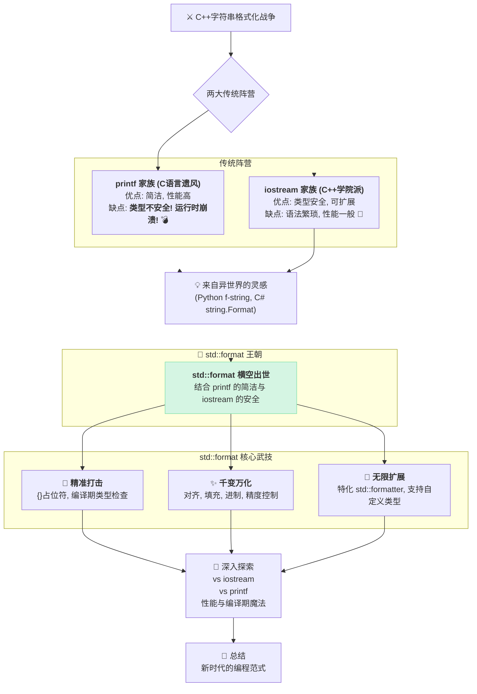

你的 C++ 编程生涯中，一定有那么几个瞬间让你抓狂 🤯：

当你小心翼翼地写下 `printf("Value: %f", my_double);`，结果忘了 `my_double` 其实是 `int`，导致程序在客户演示时华丽崩溃。

或者，你只是想拼接一个简单的日志 `log("User " + name + " with ID " + id + " logged in.");`，却被迫写了一长串的 `std::stringstream`，或者更糟糕的，因为害怕性能开销而退回到了 `sprintf` 的怀抱。

我们似乎陷入了一个两难的困境：一边是 `printf` 家族，高效、简洁，但就像一匹脱缰的野马，随时可能因为一个微小的类型错误而将你的程序带入深渊；另一边是 `iostream` 和 `stringstream`，类型安全、可扩展，但写起来却像在组装一列永无尽头的“小火车”，既笨重又啰嗦。

难道，我们 C++ 程序员就注定要在这“速度与激情”和“安全与笨重”之间做出痛苦的抉择吗？

**不！**

C++20 用 `std::format` 给出了一个响亮的回答。它承诺，要给我们 `printf` 般的简洁，`iostream` 般的安全，以及 Python f-string 般的优雅。这听起来好得不像真的？

别急，在深入它的魔法细节之前，让我们先通过一张“战争沙盘”来鸟瞰全局，看看 `std::format` 是如何从历史的硝烟中走来，并最终一统天下的。



### `format` 的诞生史：一场旷日持久的“格式化战争”

`std::format` 的出现并非偶然，它是 C++ 社区为了终结一场长达数十年的“格式化战争”而精心设计的“终极武器”。在这场战争中，两大传统势力各自占据了一片江山，但都无法让所有开发者满意。

#### 势力一：`printf` 家族 - 简单粗暴的“老兵”

这是从 C 语言时代延续下来的“老兵”，以其简洁的语法和出色的性能而著称。

```cpp
const char* name = "Alex";
int level = 99;
printf("玩家: %s, 等级: %d\n", name, level);
```

看起来很美，对吧？但这位“老兵”有个致命的缺陷：他**健忘且不识字**。你告诉他第二个参数是整数 (`%d`)，他绝不会去检查你给的是不是真的是 `int`。

这种盲目的信任导致了 C++ 世界中最臭名昭著的错误：

```cpp
// 😱 灾难：只是不小心把 %s 和 %d 的位置写反了...
printf("玩家: %d, 等级: %s\n", name, level); // 程序崩溃或输出乱码
```

这种盲目的信任导致了 C++ 世界中最臭名昭著的错误。

**那么，为什么只是写反了两个小小的符号，就会导致乱码甚至程序崩溃这么严重的后果呢？**

这背后，就是“类型安全”问题的典型体现。在我们为 `std::format` 欢呼之前，让我们先把“类型安全”(Type Safety) 这个词弄明白，看看 `printf` 是如何反其道而行之的。

想象一下，你有一个方形的积木（代表一个 `int` 类型的数据）和一个圆形的孔（代表一个只接受 `std::string` 的操作）。**类型安全，就像一个设计精良的玩具，它从物理上就阻止你把方形积木硬塞进圆形的孔里。** 你在尝试的那一刻就会发现“错了，这俩不匹配”。

而一个“类型不安全”的玩具，则会允许你硬塞，结果可能是积木卡住，也可能是把孔撑破——这就是程序的运行时错误或崩溃。

`printf` 就是那个“类型不安全”的玩具。它的工作原理，就像一个**蒙着眼睛的快递员**。

你递给 `printf` 两样东西：一张“指令清单”（格式化字符串），和一堆“包裹”（参数 `name` 和 `level`）。这些包裹在程序运行时，会被一个个按顺序放在一块叫做“栈”的内存区域上。这个蒙着眼睛的快递员完全不知道包裹里装的是什么，它唯一的行动指南就是你给的那张指令清单。

当指令清单是 `"... %d, ... %s"`，而包裹顺序是 `name`, `level` 时：

1.  **处理 `%d`，错把“地址”当“整数”**：快递员看到 `%d`，以为自己要去取一个整数。但它拿到的第一个包裹 `name`，其实是个指针，里面存的是字符串的**内存地址**。快递员不管三七二十一，把这个地址的二进制数据当成一个整数打印出来，结果自然是一个谁也看不懂的巨大数字。

2.  **处理 `%s`，错把“整数”当“地址”**：接下来，快递员看到 `%s`，以为要去取一个字符串地址。但它拿到的第二个包裹 `level`，其实是整数 `99`。此时，灾难发生了！快递员会天真地认为 `99` 这个数字，**就是一个内存地址**！它会立刻动身，试图跑到内存中门牌号为 `99` 的那个房间去取东西。如果那个地方不属于你的程序，操作系统会立刻把它“就地正法”——这就是**程序崩溃**的真相。

它把本该在编译期发现的错误，无情地推迟到了最不应该出事的运行时。

#### 势力二：`iostream` 家族 - 严谨安全的“学院派”

为了解决 `printf` 的安全问题，C++ 引入了 `iostream`。它利用了 C++ 强大的类型系统和操作符重载，做到了绝对的类型安全。

```cpp
std::string name = "Alex";
int level = 99;
std::cout << "玩家: " << name << ", 等级: " << level << std::endl;
```

安全是安全了，你永远不可能把 `level` 按字符串输出。但它的缺点也同样令人难以忍受：**极其繁琐**。

- **可读性差**：一个完整的句子被 `<<` 切割得支离破碎，你很难一眼看出最终的输出格式。
- **性能问题**：每次 `<<` 操作都可能是一次函数调用，对于性能敏感的场景，这种连续的调用开销不容小觑。当需要格式化到字符串时，`std::stringstream` 的笨重更是劝退了无数追求极致性能的开发者。

开发者们就像一群在沙漠中跋涉的旅人，面前只有两个选择：一杯可能是毒药的清水（`printf`），和一块啃不动的石头（`iostream`）。

#### 第三势力：社区先行者的“自救运动”

就在官方标准迟迟未能提供终极解决方案的岁月里，C++ 社区里那些最顶尖的头脑已经等不及了。他们不等不靠，自己动手，掀起了一场轰轰烈烈的“格式化自救运动”。其中，有两位“义军”领袖最为著名，他们的探索，为最终的 `std::format` 王朝铺平了道路。

**先行者一：Boost.Format - `printf` 的“类型安全魔改版”**

Boost 库，作为 C++ 的“准标准库”，自然最早一批站出来解决问题。它推出的 `boost::format`，思路非常巧妙：**用 `printf` 的脸，干 `iostream` 的活**。

它让你继续写 `printf` 风格的格式化字符串 (`%1%`, `%2%` 等)，但它在底层却用了一套类似 `iostream` 的流式机制来处理参数。

```cpp
#include <iostream>
#include <boost/format.hpp> // 需要安装 Boost 库

int main() {
    std::string name = "Alex";
    int level = 99;

    // 看起来像 printf，但它返回一个可以流式输出的对象
    std::cout << boost::format("玩家: %1%, 等级: %2%\n") % name % level;

    // 尝试传递错误的类型？
    // boost::format("玩家: %1%, 等级: %2%\n") % level % name;
    // 编译不会失败，但在运行时会抛出异常！
    // boost::io::bad_format_string: format-string referred to argument 2, but only 1 were passed
}
```

`boost::format` 成功地解决了 `printf` 的类型安全问题（通过抛出异常而非未定义行为），也保持了一定的可读性。但它的缺点也很明显：

1.  **性能开销**：它的格式化字符串是在**运行时**被解析的，而且大量使用了操作符重载和对象构造，性能上相比 `printf` 有较大差距。
2.  **语法略显笨重**：`%` 符号的链式调用，虽然比 `<<` 好一些，但依然感觉有些拖沓。

尽管如此，`boost::format` 依然是一次伟大的尝试，它证明了类型安全的格式化是可行的。

**先行者二：`{fmt}` - 王者降临，未来的标准**

如果说 `boost::format` 是一个改良者，那么 `fmtlib`（又称 `{fmt}`，前身是 `cppformat`）就是一场彻头彻尾的革命。它的作者 Victor Zverovich，也是 `std::format` 提案的核心作者，几乎是以一己之力，为 C++ 带来了现代格式化的曙光。

`{fmt}` 的设计哲学是：**极致的性能 + Pythonic 的优雅**。

```cpp
#include <iostream>
#include <fmt/core.h> // 需要安装 {fmt} 库

int main() {
    std::string name = "Alex";
    int level = 99;

    // 看到这清爽的语法了吗？
    fmt::print("玩家: {}, 等级: {}\n", name, level);

    // 尝试传递错误的参数给需要特定类型的格式符
    // fmt::print("{:d}", name); // 编译期就会失败！
}
```

`{fmt}` 几乎在所有方面都做到了当时的极致：

- **语法优雅**：采用了和 Python f-string 类似的 `{}` 占位符，清晰直观。
- **类型安全**：利用模板元编程，在**编译期**就能捕捉到大量类型错误。
- **极致性能**：对于字符串字面量，它的格式化字符串可以在**编译期**就被解析和优化，生成的代码效率无限接近于手写的 `printf`，在某些场景下甚至更快。
- **可扩展性**：同样提供了一套优雅的自定义类型格式化机制。

`{fmt}` 库一经问世，就以其压倒性的优势迅速征服了 C++ 社区，被大量应用于游戏、金融等对性能要求极高的领域。它雄辩地证明了，鱼与熊掌可以兼得——我们完全可以在不牺牲性能的前提下，拥有安全和优雅。

#### 终极答案的诞生：`{fmt}` 的“官方加冕”

面对 `{fmt}` 的巨大成功，C++ 标准委员会做出了一个明智的决定：不再重新发明轮子，而是直接将 `{fmt}` 的设计哲学和核心实现“收编”为官方标准。

C++20 的 `std::format`，在核心设计、语法和接口上，几乎就是 `{fmt}` 的一个标准库版本。这在 C++ 的历史上也是一段佳话，它代表着社区的创新力量最终推动了语言标准的发展。

所以，当你使用 `std::format` 时，你不仅是在使用一个 C++20 的新特性，你也是在向 `boost`、`{fmt}` 以及无数社区先行者们的探索精神致敬。

### “三军检阅”：`std::format` 的优雅与强大

现在，让我们回到现实的“战场”，看看这位新“统帅” `std::format` 是如何轻松检阅 C++ 世界里各式各样的“数据部队”的。

#### 初次见面：你好，`std::format`！

想象一下，我们要打印一条简单的学生成绩信息。`std::format` 让这件事变得前所未有的简单和直观。

```cpp
#include <iostream>
#include <string>
#include <format>

int main() {
    std::string student_name = "小明";
    int score = 95;

    // 就像填空题一样，把变量塞进去！
    std::string message = std::format("{}同学, 你的期末成绩是 {} 分!", student_name, score);

    std::cout << message << std::endl;
    // 输出: 小明同学, 你的期末成绩是 95 分!
    return 0;
}
```

看到了吗？我们用 `{}` 作为占位符，然后把变量像排队一样放进去，`std::format` 就会自动把它们填到正确的位置。是不是比 `<<` 拼接或者 `%d`, `%s` 占位要清爽多了？😎 这份优雅，简直让人想给它一个大大的赞！

#### 安全第一：编译期的守护神

`printf` 最让人头疼的运行时错误，在 `std::format` 这里，被一位“编译期守护神”彻底终结了。它在你的代码运行之前就会揪出这些潜在的错误！

它的秘密武器是 C++ 的现代核心特性：**变参模板 (Variadic Templates)**。

与老旧的、对类型一无所知的 C 风格变长参数不同，变参模板在编译的每一个阶段，都**完整地保留了每一个参数的精确类型信息**。

当你调用 `std::format("{}", "我是一个字符串", 99)` 时，编译器心里门儿清：第一个参数是 `const char*`，第二个是 `int`。`std::format` 的内部机制，就可以在编译期拿到这些类型信息，并与格式化字符串 `{}` 中的要求进行匹配。这就给了它“未卜先知”的能力。

```cpp
#include <format>

int main() {
    // 试试看把字符串传给一个需要整数的格式符
    // 注意：这里的 {:d} 是可选的，默认的 {} 已经能推断类型。
    // 我们写上 :d 是为了显式告诉 format 我们期望一个整数。
    std::format("{:d}", "我是一个字符串"); // ❌ 编译失败！
    // 编译器会愤怒地告诉你：
    // error: invalid format string for argument of type 'const char*'
}
```

这种在编译期间就发现问题的能力，简直是程序员的福音。它把危险的运行时错误，变成了安全的编译时错误，让 bug 无处遁形！这感觉，就像是有个靠谱的伙伴在背后守护你，安全感满满！🛡️

### `format` 的“遥控”艺术：玩转格式说明符

你以为 `{}` 只能简单占个位？那可就太小看它了！`std::format` 的真正威力，在于它丰富的格式说明符，能让你像魔法师一样随心所欲地控制输出格式。

#### 站好队形！文本对齐与填充

有时候我们希望输出能像阅兵方阵一样整齐。比如打印一张购物小票：

```cpp
#include <iostream>
#include <format>
#include <vector>
#include <string>

struct Item {
    std::string name;
    double price;
};

int main() {
    std::vector<Item> shopping_list = {{"苹果", 5.0}, {"香蕉", 2.5}, {"草莓蛋糕", 25.8}};

    std::cout << std::format("{:<12}{:>10}\n", "商品", "价格");
    std::cout << "----------------------\n";
    for (const auto& item : shopping_list) {
        // :<12 表示左对齐，宽度12
        // :>10.2f 表示右对齐，宽度10，保留两位小数
        std::cout << std::format("{:<12}{:>10.2f}\n", item.name, item.price);
    }
    return 0;
}
```

输出结果：

```
商品                  价格
----------------------
苹果                  5.00
香蕉                  2.50
草莓蛋糕               25.80
```

这里的奥秘就在冒号 `:` 后面：

- `<` 代表左对齐，`>` 代表右对齐，`^` 代表居中。
- `12` 或 `10` 是我们指定的总宽度。
- `.2f` 表示对浮点数保留两位小数。
- 你甚至可以在对齐符号前加上填充字符，比如 `{*^10}`，就能用 `*` 来填充空白。

#### 数字的华尔兹：精度与进制

处理数字时，`std::format` 也能跳出优美的华尔兹。无论是控制小数位数，还是切换进制，都易如反掌。

```cpp
#include <iostream>
#include <format>
#include <numbers> // C++20 提供了数学常数，比如 PI

int main() {
    // 浮点数精度控制
    std::cout << std::format("圆周率 PI ≈ {:.4f}\n", std::numbers::pi);

    // 玩转不同进制
    int number = 42;
    std::cout << std::format("十进制: {}\n", number);
    std::cout << std::format("二进制: {:b}\n", number);
    std::cout << std::format("带前缀的十六进制: {:#x}\n", number); // #号可以自动添加 0b 或 0x 前缀

    return 0;
}
```

### 超能力觉醒：格式化你的专属类型

这才是 `std::format` 最令人兴奋的地方——它拥有和 `iostream` 一样强大的**可扩展性**。你可以教会它如何“打印”你自己定义的任何 `class` 或 `struct`！

假设我们有一个 `Point` 类：

```cpp
struct Point {
    int x, y;
};
```

直接格式化 `Point` 对象，编译器会表示很困惑 `error: no formatter for Point`。别急，我们来教它！只需要为 `Point` 特化 `std::formatter`。

```cpp
#include <iostream>
#include <format>

// 我们自己的 Point 结构体
struct Point {
    int x, y;
};

// “教” std::format 如何处理 Point
// 这就像是为 Point 类型写了一个“格式化插件”
template <>
struct std::formatter<Point> {
    // 1. parse 函数：解析格式字符串，比如 "{:?}" 里的 '?'
    // 暂时简化，直接返回，表示不接受任何特殊格式
    constexpr auto parse(std::format_parse_context& ctx) {
        return ctx.begin();
    }

    // 2. format 函数：真正执行格式化的地方
    // 它告诉 std::format，遇到 Point 对象时，应该如何将其转换成字符串
    auto format(const Point& p, std::format_context& ctx) const {
        // 让它输出成 (x, y) 的形式
        return std::format_to(ctx.out(), "({}, {})", p.x, p.y);
    }
};

int main() {
    Point p = {10, 20};
    std::string s = std::format("坐标点是: {}", p);
    std::cout << s << std::endl; // 输出: 坐标点是: (10, 20)
    return 0;
}
```

看，通过实现 `parse` 和 `format` 这两个函数，我们就成功地让 `std::format` 认识了 `Point`。这种“插件式”的扩展机制，比必须在类内部或全局重载 `operator<<` 要更加灵活和解耦。现在，你可以像格式化 `int` 或 `std::string` 一样，轻松地格式化你自己的任何类型了！这项技能，绝对能让你的代码变得更加优雅和强大。🚀

### 总结：拥抱 `format`，开启 C++ 编程新篇章

`std::format` 的出现，不仅仅是 C++ 标准库里多了一个小工具那么简单。它代表了一种现代 C++ 的编程哲学：追求更安全、更清晰、更具表现力的代码。

#### 你的 `format` 实战检查清单

1.  **告别 `printf`**：在所有新代码中，全面用 `std::format` 替代 `printf`、`sprintf` 等函数。这是你无需任何思考就能获得的巨大安全收益。
2.  **简化字符串拼接**：检查你的代码库，将所有使用 `+`、`append` 或 `stringstream` 进行的复杂字符串拼接，重构为 `std::format`。你的代码会立刻变得更短、更易读。
3.  **拥抱自定义格式化**：对于你自己的核心业务类型（比如 `User`, `Order`, `Vector3D`），为它们提供 `std::formatter` 特化。这能极大地提升日志、调试和序列化的代码质量。

记住，`std::format` 不仅仅是一个函数，它是 C++ 演进的里程碑。下次当你需要拼接字符串时，不妨拥抱 `std::format`，体验一下它带来的编程乐趣吧！💖

### 你以为学会 `format` 就够了？

你现在知道了 `{}` 比 `%s` 更安全，也比 `<<` 更优雅。你甚至学会了为自己的 `Point` 类型编写 `formatter` 插件。恭喜你，你已经掌握了 `std::format` 的“形”！

但，你是否渴望掌握它的“神”？

当面试官问你：“在我们的高频交易系统中，如何设计一个既类型安全又几乎零开销的日志系统？”
当他让你现场展示如何用 `std::format` 优雅地调试一个复杂的二进制协议时...

你脑海里浮现的，会不会还是那个熟悉的“学生管理系统”？

理论和实践之间，隔着一个真正的战场。这个战场，我们已经为你准备好了。

**《用现代 C++ 从零实现 mini-Redis》** — 这不是又一个玩具项目，这是你淬炼 `std::format` 实战能力的最佳熔炉。

在这趟旅程中，你将：

- 🚀 **亲手打造高性能日志**：你将不再只是用 `format` 打印 "Hello World"，而是为高并发服务器实现一个高性能日志系统，在毫秒必争的环境下，体验 `std::format` 编译期格式化字符串带来的极致性能。
- ⚙️ **成为协议调试大师**：你将为 Redis 的 RESP 协议实现自定义 `formatter`，将冰冷的二进制数据流，格式化成人类可读的、结构清晰的命令日志，让你在调试时如有神助。
- 🌱 **贯通现代 C++ 全家桶**：`std::format` 只是开胃菜。你将在这个项目中，将 `std::span`、C++20 Modules、`std::expected` 等现代 C++ 特性融会贯通，将它们从“知识点”锻造成你的“杀手锏”。
- 🗣️ **拥有面试的绝对底气**：当你可以自信地阐述你如何用 `std::format` 优化日志性能，用 `std::span` 实现零拷贝时，你就已经超越了 99% 的竞争者。

准备好，开启这场从“知道”到“精通”的蜕变之旅了吗？

想进一步了解 Mini-Redis 项目的实现细节？可以点击阅读<a href="https://mp.weixin.qq.com/s/qujRzKcllccSHxQvJG-vOA" target="_blank" rel="noopener noreferrer">这篇详细的文章</a>。

**👇 扫码添加微信（备注“redis”），立即“登船”！**


