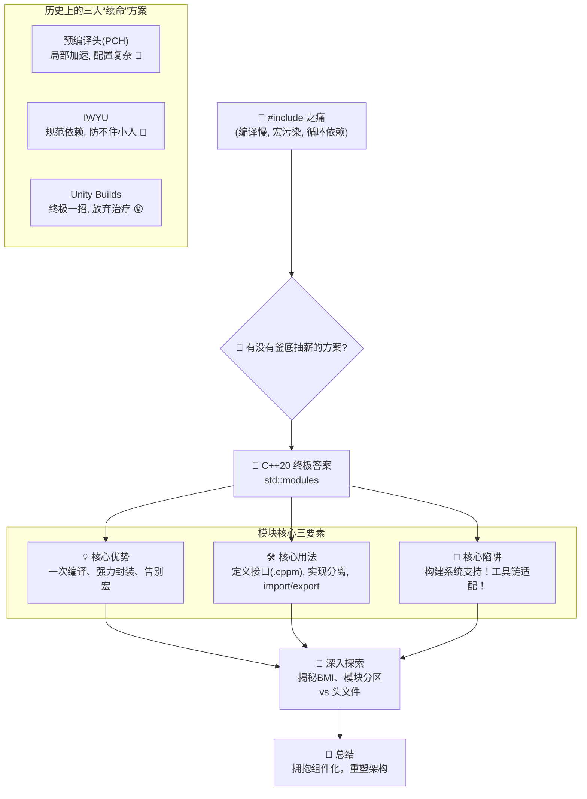
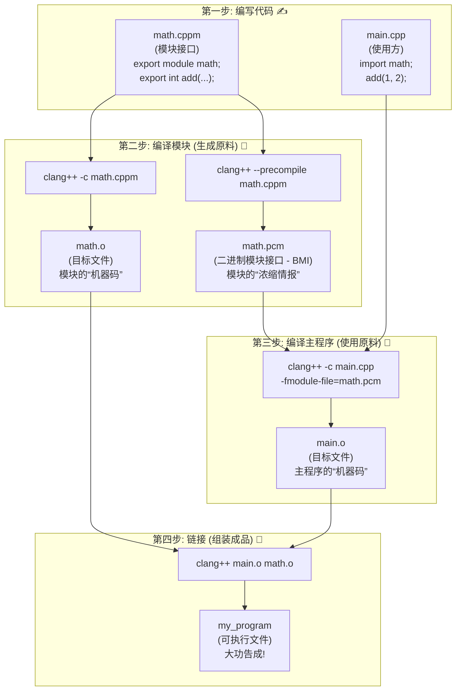

你是否经历过这样的“编译噩梦”：你只是修改了一个底层工具类的头文件（`.h`），然后点击“编译”，接着你就有充足的时间去泡杯咖啡、散个步，甚至和同事聊完半小时的人生，回来发现编译器还在吭哧吭哧地处理那成百上千个因为包含了这个头文件而被牵连的源文件。☕️

为了加快编译，你和同事们尝试了各种“黑魔法”：PCH（预编译头）、Unity/Jumbo builds（巨型编译单元），甚至严格到变态的 IWYU（Include What You Use）代码审查。但这些手段，就像是给一艘千疮百孔的漏水巨轮不断地打补丁，却无法阻止它缓慢下沉。

难道，我们注定要在 `#include` 的无尽循环和宏定义的“跨文件幽灵”中，浪费生命、消磨意志吗？🤯 C++ 的工程化，难道就只有这点“出息”？

如果我告诉你，有一种“次元门”技术，能让你彻底告别头文件，将编译速度提升一个数量级，同时还能让代码的封装性达到前所未有的高度呢？🤔

C++20 的**模块（Modules）**，就是那扇能带我们穿越到未来的“次元门” 🚪。它会彻底颠覆 C++ 快 40 年的旧玩法，把我们从‘复制粘贴’的石器时代，一把拽进真正的组件化新纪元。

准备好了吗？咱们这就出发，去探索那个没有 `#include` 的清爽新世界！😉

在我们启程之前，先通过一张图快速了解 C++ 模块的进化之路和核心知识点，让你对这次的革命有个全景式的认识！



### 模块的诞生史：一场告别“百年老店”的革命

要理解这场革命为何如此重要，我们得先公平地看待那个被革命的“旧制度”——头文件（`.h`）和源文件（`.cpp`）的分离。它并非一个糟糕的设计，恰恰相反，在它诞生的年代，这是一个绝妙的、深思熟虑的方案。

它的背后，是两大基石般的软件工程理念：

#### 基石一：分离接口与实现 - “餐厅菜单与后厨”

这套体系最核心的设计哲学就是**接口与实现的分离**。

- **头文件 (`.h`) 就是餐厅的“菜单”**：它向外界（其他程序员）展示了你能提供什么“菜品”（函数声明、类定义）。菜单上只写菜名、价格和简介，你无需知道这道菜在后厨是怎么做的。
- **源文件 (`.cpp`) 就是“后厨”**：这里藏着所有的秘密配方和烹饪过程（函数的具体实现）。后厨可以随时升级设备、更换厨师，只要最后端上来的菜（函数功能）和菜单上写的一致就行。

**这个设计的动机是什么？**

为了**解耦**和**稳定**。只要“菜单”`.h` 文件不变，无论你的“后厨”`.cpp` 文件怎么修改优化，你的“顾客”（调用你代码的人）都不需要重新编译他们的代码。这对于发布二进制库（`.lib`, `.so`）来说至关重要。你只需要把“菜单”和打包好的“菜品”（库文件）给客户，他们就能愉快地使用了，完全无需关心你的后厨机密。

#### 基石二：简单就是美 - C语言的朴素哲学

C++ 的这套机制，完全继承自它的老大哥 C 语言。在上世纪 70 年代，计算机资源极其宝贵，编译器必须尽可能简单高效。

于是，C 语言的设计者们选择了**预处理器**这个方案。`#include` 只是预处理器众多文本操作中的一个。这种设计的动机就是**简单**：

- 预处理器是一个独立的、相对“愚蠢”的程序。它只做文本替换，不理解 C++ 语法。这大大降低了编译器本身的实现复杂度。
- 所有的“魔法”，如条件编译 (`#ifdef`)、宏，都由这个简单的文本工具完成，核心语言可以保持纯粹。

#### 当“百年老-店”遇上摩天大楼

这套基于“菜单/后厨”分离和“文本复印机”的简单模型，在几十年的时间里运作得非常好。它足够构建出像 Unix 操作系统这样伟大的软件。

但随着 C++ 的发展，我们的项目从“小餐馆”变成了“万层摩天大楼”。模板元编程、海量的第三方库、动辄数百万行的代码库……老旧的“复印机”开始不堪重负，它那朴素的设计在新时代下，逐渐演变成了三大无法根治的原罪：

1.  **重复劳动，编译时间指数级爆炸**：假设 `vector` 头文件有 2000 行代码。如果你的项目里有 500 个 `.cpp` 文件都 `#include <vector>`，那么编译器就必须勤勤恳恳地将这 2000 行代码重复解析、编译 **500 次**！这正是大型 C++ 项目编译时间动辄数小时的罪魁祸首。
2.  **宏污染，防不胜防的“幽灵袭击”**：头文件里的宏定义（`#define`）就像是四处游荡的幽灵。你在 `config.h` 里定义了一个 `#define min(a, b) ...`，结果在某个包含了 `windows.h` 的文件里，它与系统宏 `min` 发生了冲突，导致了一系列莫名其妙的编译错误。这种“幽灵”会穿透所有 `#include` 的边界，造成全局性的污染。
3.  **循环依赖，剪不断理还乱**：`a.h` 想包含 `b.h`，`b.h` 又想用 `a.h` 里的某个类型。为了避免无限递归，你不得不使用 `#pragma once` 或 `#ifndef/#define/#endif` 这样的“护卫宏”，再加上各种前置声明（forward declaration）。整个代码库的依赖关系变得像一团乱麻。

为了对抗这台老旧的复印机，C++ 社区的先驱们从未停止过抗争。

- **预编译头（PCH）**：它相当于把那些最常用的头文件（如 `<vector>`, `<string>`）提前“复印”并编译成一份缓存。其他文件用到时，直接加载这份缓存。这确实能提速，但它配置复杂，且治标不治本。
- **模块化思想的萌芽**：早在 C++ 诞生之前，像 Modula-2 这样的语言就已经有了成熟的模块系统。而在 C++ 社区，这个想法也反复被提出和讨论，但因为 C++ 复杂的语法和与 C 的兼容性历史包袱，迟迟无法落地。各个编译器厂商也推出过自己的私有实现，如 MSVC 的 `__declspec(dllexport)`，但都无法形成统一标准。

直到 C++20，在经历了多年的提案、争论和原型设计后，委员会终于下定决心，发动了这场“独立战争”，正式推出了官方的模块系统。

它的核心思想很简单：**彻底抛弃“文本复印机”模型，转向“语义导入”模型。**

一个模块只会被编译器完整地解析和编译**一次**。编译完成后，会生成一个二进制模块接口文件（Binary Module Interface, BMI）。其他代码单元 `import` 这个模块时，编译器不再需要去解析冗长的头文件，而是直接读取这个高度优化、包含了所有类型信息和函数签名的 BMI 文件。这个过程快如闪电。

了解了这场旷日持久的抗争史，我们就能明白 `std::modules` 肩负的使命有多么重大。它不是一次小修小补，而是一场旨在颠覆 C++ 底层构建逻辑的伟大革命。现在，让我们亲眼见证，这位革命者是如何建立新秩序的。

### “你好，模块”：你的第一个现代化 C++ 程序

理论说再多，不如亲手敲两行。来，咱们这就动手，写下有史以来第一个不再需要头文件的 C++ 程序。放心，过程简单到超乎你想象。我们就从一个提供加法功能的数学模块开始。

在我们一头扎进代码之前，先通过下面这张图，直观地感受一下从编写代码到生成可执行文件的完整流程，看看每个文件都扮演了什么角色：



现在，我们来看看每一步的具体代码。

在装备了现代编译器（比如最新的 MSVC、GCC 或 Clang）的电脑上，咱们只需要跟两种新文件打交道：

1.  **模块接口文件**：我们通常使用 `.cppm` 作为模块接口文件的后缀，这是社区普遍接受的约定。本文将统一使用此后缀。它定义了模块希望对外暴露的公共 API。
2.  **主程序文件**：使用 `import` 来导入并使用模块。

**第一步：创建模块接口文件 `math.cppm`**

```cpp
// math.cppm
export module math; // 声明我们正在定义一个名为 "math" 的模块

// 我们希望外部世界能调用这个函数，所以用 export 关键字导出它
export int add(int a, int b) {
    return a + b;
}
```

**第二步：创建主程序文件 `main.cpp`**

```cpp
// main.cpp
#include <iostream>
import math; // ✨ 导入我们的数学模块！不再需要 #include "math.h"

int main() {
    std::cout << "1 + 2 = " << add(1, 2) << std::endl; // 直接调用
    return 0;
}
```

**第三步：编译**

模块的编译方式与传统方式略有不同，它更像是一个两步走的过程：首先，你需要像编译一个库一样，先编译模块本身，生成二进制模块接口文件（BMI）；然后，在编译主程序时，告诉编译器去哪里找到并使用这个模块。

我们以 Clang++ 为例来演示这个过程：

```bash
# 1. 将模块接口文件预编译为二进制模块接口(BMI)，在Clang下后缀为.pcm
clang++ -std=c++20 --precompile math.cppm -o math.pcm

# 2. 将模块接口自身也编译成一个目标文件(.o)
clang++ -std=c++20 -c math.cppm -o math.o

# 3. 编译主程序时，通过 -fmodule-file 告诉它BMI文件的位置
clang++ -std=c++20 -c main.cpp -fmodule-file=math.pcm -o main.o

# 4. 最后，像往常一样将所有目标文件链接起来
clang++ main.o math.o -o my_program
```

整个过程清晰地体现了模块的“先产出，后使用”的核心思想。虽然步骤看起来多了点，但这正是模块化带来强力解耦和编译加速的根源。

**输出结果：**

```
1 + 2 = 3
```

看到了吗？奇迹就这么发生了！

- `#include "math.h"` 不见了，取而代之的是清爽的 `import math;`。
- 咱们在 `math.cppm` 里定义的 `add` 函数，就像本地函数一样丝滑地在 `main.cpp` 中被调用了。
- （小声说：`#include <iostream>` 还在，那是因为标准库的模块化改造还在路上，但咱们自己的代码已经率先解放了！）

这就是模块的魔力所在：**清晰的边界，聪明的导入**。`import math;` 不再是傻乎乎地复制粘贴，而是像一个会意的眼神，告诉编译器：“嘿，去把 `math` 模块的接口拿来给我用，谢了！”

### 模块的“海关”艺术：`export` 的精细控制

模块最让人上瘾的地方，就是它那堪比“海关”的强大封装能力。你可以当一个严格的边检员，精确控制模块里的哪些东西可以“持证出关”（被外部使用），哪些东西只能“内部流通”，外人甭想窥探分毫。

#### 接口与实现分离

通常，我们希望将函数的声明（接口）和定义（实现）分开。模块让这件事变得无比优雅。

**`math.cppm` (模块接口)**

```cpp
// math.cppm
export module math;

// 只导出函数的声明
export int add(int a, int b);
```

**`math_impl.cpp` (模块实现)**

```cpp
// math_impl.cpp
module math; // 注意：这里没有 export，表示我们正在为 "math" 模块提供实现

// 包含实现所需的头文件，这些头文件不会污染到 import math 的地方
#include <numeric>

// 函数的具体实现
int add(int a, int b) {
    // 假设这里有一个复杂的实现
    return a + b;
}

// 这个函数没有被 export，它就是模块的私有部分
int internal_helper() {
    return 42;
}
```

现在，`import math;` 的代码只能看到 `add` 函数，完全无法知道 `internal_helper` 的存在，也完全不会受到 `math_impl.cpp` 中 `#include <numeric>` 的任何影响。这种强力的封装，是头文件时代无法想象的。

#### 模块分区：给你的大模块做“部门规划”

当一个模块变得非常庞大时，你可能想把它分成几个逻辑部分，但又不希望把它们拆成一堆零散的小模块。这时，**模块分区（Module Partitions）** 就派上用场了。

分区就像一个大公司里的不同部门。对外，它们都属于“我的大公司”这个整体；对内，它们各司其职。

**`my_module.cppm` (主接口)**

```cpp
// my_module.cppm
export module my_module;

// 从 "network" 分区导入并再次导出
export import :network;
// 从 "utils" 分区导入并再次导出
export import :utils;
```

**`my_module-network.cppm` (分区接口)**

```cpp
// my_module-network.cppm
export module my_module:network; // 声明一个名为 "network" 的分区

export void send_data(const char* data);
```

**`my_module-utils.cppm` (分区接口)**

```cpp
// my_module-utils.cppm
export module my_module:utils; // 声明一个名为 "utils" 的分区

export int generate_id();
```

**`main.cpp` (使用者)**

```cpp
// main.cpp
import my_module; // 只需要导入主模块

int main() {
    send_data("hello"); // ✅ 可用
    generate_id();      // ✅ 可用
}
```

使用者只需要关心 `my_module` 这个统一的入口，而模块的作者则可以通过分区来组织内部复杂的结构。这让大型项目的架构设计变得更加清晰、可控。

### 模块的“超能力”：三大原罪的终极解药

好了，我们已经见识了模块的基本玩法。现在，是时候回到最初的战场，看看这位“革命者”是如何兑现承诺，将我们从水深火热中解救出来的。它究竟施展了什么魔法，能将“编译慢、宏污染、循环依赖”这三大原罪一一净化？

#### 超能力一：告别重复劳动 - “编译一次”到底意味着什么？

**原罪回顾**：在 `#include` 的世界里，如果 100 个 `.cpp` 文件都包含了 `<vector>`，那么编译器就必须像个勤劳但又有点傻的机器人，把 `<vector>` 头文件里那数千行代码，**重复地、完整地解析 100 遍**。

**模块的解药**：**一次编译，处处导入 (Compile Once, Import Everywhere)**

> **“这不还是加载了很多次吗？和头文件有什么区别？”**
>
> 这是一个直击灵魂的问题！区别就在于“加载”的东西完全不同。
>
> - **`#include` 是在请一个“速记员”**：每次 `#include <vector>`，都相当于请一个速记员，把 `<vector>` 这本书里的每一个字都原封不动地抄写到你的文件里。编译器每次拿到的都是一本混杂着各种抄本的“大杂烩”，不得不从头开始阅读、理解、消化。100 次 `#include`，就是 100 次完整的抄写和消化。
> - **`import` 是在请一个“情报官”**：模块在第一次被编译时，编译器就已经把 `<vector>` 这本书彻底读懂了，并把所有关键信息（有哪些类、哪些函数、它们长什么样）浓缩成一份薄薄的、二进制格式的“情报纪要”（BMI）。`import` 的时候，你请来的这位“情报官”直接把这份纪要递给编译器。编译器扫一眼纪要，瞬间就明白了一切，完全不需要再去读那本厚厚的原著。100 次 `import`，只是 100 次高效的情报交接。

模块的工作模式，从根本上改变了游戏规则。当编译器处理一个模块接口文件时，它会把所有的思考成果（类型信息、函数签名等）打包成这份高度浓缩的二进制“情报纪要”——BMI 文件（比如 `math.pcm`）。

当其他文件 `import math;` 时，编译器不再需要去读那个冗长的 `.cppm` 源文件了，它只需要读取这份小巧的、秒速加载的 BMI “情报”。

**场景对比：**

假设我们有一个大型日志模块 `logger.cppm`，它内部实现非常复杂，足足有 5000 行代码。

```cpp
// logger.cppm (5000行代码)
export module logger;
export void log_info(const char* msg);
// ... 其他复杂的导出项
```

现在，项目里有两个组件需要用它：

```cpp
// component_a.cpp
import logger;
void do_work_a() { log_info("Component A is working..."); }
```

```cpp
// component_b.cpp
import logger;
void do_work_b() { log_info("Component B is working..."); }
```

**编译流程发生了什么变化？**

1.  **编译模块（消化原著）**：编译器全力以赴，将 5000 行的 `logger.cppm` 源码编译一次，生成 `logger.o` 和 `logger.pcm`（情报纪要）。这个过程可能需要几秒钟。
2.  **编译组件 A（交接情报）**：编译器处理 `component_a.cpp`，看到 `import logger;`，它立刻加载 `logger.pcm`。这个过程可能只需要几毫秒。
3.  **编译组件 B（再次交接情报）**：编译器处理 `component_b.cpp`，看到 `import logger;`，它再次加载 `logger.pcm`。这个过程同样只需要几毫秒。

看到了吗？那 5000 行的复杂代码，**只被完整地思考了一次**！对于所有使用者来说，获取其接口信息的成本几乎为零。这正是模块能让大型项目编译速度产生数量级提升的根本原因。

#### 超能力二：筑起防火墙 - 将宏定义彻底隔离

**原罪回顾**：`#include` 会让宏（`#define`）像病毒一样四处传播。你在 `config.h` 里定义的宏，可能会在不经意间污染其他文件，甚至与系统库冲突。

**模块的解药**：**坚不可摧的宏防火墙 (Macro Firewall)**

模块的 BMI “情报”里，只包含代码的**语义信息**（我是个什么类，我有哪些函数），而**不包含任何宏定义**。宏这种纯粹的“文本替换”游戏，被彻底关在了模块文件的内部，永远无法越过 `export module` 的边界。

**场景对比：**

假设我们又写了一个充满“危险”宏的模块。

```cpp
// dangerous_macros.cppm
export module dangerous_macros;

// 一个很常见的、容易引起冲突的宏
#define min(a, b) (((a) < (b)) ? (a) : (b))

export int get_smaller(int x, int y) {
    // 在模块内部，我们可以自由使用这个宏
    return min(x, y);
}
```

现在，我们在主程序里导入它，并尝试包含一个也定义了 `min` 的 Windows 头文件。

```cpp
// main.cpp
import dangerous_macros; // 导入我们的模块
#include <windows.h>      // 包含一个有“臭名昭著”的 min/max 宏的头文件
#include <iostream>

int main() {
    // 我们能正常使用模块导出的函数
    std::cout << "Smaller of 5 and 10 is: " << get_smaller(5, 10) << std::endl;

    // 在 main.cpp 中，宏 a'min' 来自 <windows.h>，而不是我们的模块
    // 不会发生任何冲突！代码工作得非常完美。
    int m = min(20, 30);
    std::cout << "Min of 20 and 30 is: " << m << std::endl;

    return 0;
}
```

**发生了什么？**

`dangerous_macros.cppm` 里的 `min` 宏，在它被编译成 BMI 的那一刻，就已经完成了它的历史使命（把 `min(x, y)` 替换掉），然后就被彻底抛弃了。生成的 `dangerous_macros.pcm` 里，只记录着“有一个叫 `get_smaller` 的函数”，关于 `min` 宏的任何信息都**荡然无存**。

因此，`main.cpp` 在导入模块时，它的世界是纯净的，完全不受模块内部宏的污染。模块之间就像是两个独立的国家，除非通过 `export` 这个官方“海关”明确出口，否则内部的任何东西都休想“偷渡”出去。

#### 超能力三：理清依赖链 - 让循环依赖成为历史

**原罪回顾**：头文件时代，`a.h` 包含 `b.h`，同时 `b.h` 又想包含 `a.h`，就会导致编译器陷入无限循环的“套娃”游戏。我们必须用 `#pragma once` 和各种前置声明来小心翼翼地拆解这个“死结”。

**模块的解药**：**语义依赖，而非文本包含 (Semantic Dependency, not Textual Inclusion)**

`import` 从根本上就不是文本操作。`import b;` 这条指令的意思不是“把 b 的代码抄过来”，而是“我郑重声明，我需要使用‘b’这个模块的公开接口”。

编译器在处理时，会构建一个模块之间的依赖图。它知道要编译 `a`，必须先确保 `b` 的接口（`b.pcm`）已经可用；要编译 `b`，必须先确保 `a` 的接口（`a.pcm`）已经可用。这不再是一个“你中有我，我中有你”的文本死结，而是一个清晰的“谁依赖谁的接口”的有向图。

**场景对比：**

想象一下 `Parent` 类和 `Child` 类，它们天然地需要互相持有对方的引用。

- **头文件时代的挣扎：**

  ```cpp
  // parent.h
  #pragma once
  class Child; // 必须前置声明，否则不认识 Child
  #include <vector>

  class Parent { std::vector<Child*> children; };
  ```

  ```cpp
  // child.h
  #pragma once
  class Parent; // 必须前置声明，否则不认识 Parent

  class Child { Parent* my_parent; };
  ```

  这个过程需要开发者手动管理，一旦疏忽，就会编译失败。

- **模块时代的从容：**

  ```cpp
  // parent.cppm
  export module parent;
  import child; // 我需要 child 模块
  #include <vector> // 假设 vector 还未模块化

  export class Parent {
      std::vector<child::Child*> children; // 直接用！
  };
  ```

  ```cpp
  // child.cppm
  export module child;
  import parent; // 我也需要 parent 模块

  export class Child {
      parent::Parent* my_parent; // 直接用！
  };
  ```

**发生了什么？**

当编译 `parent.cppm` 时，编译器看到 `import child;`，它只需要找到 `child.pcm` 这份“情报”，就能知道 `child::Child` 是个什么样的类型。同理，编译 `child.cppm` 时也一样。

整个过程没有发生任何文本的递归包含。我们只是在两个模块之间建立了清晰的、双向的**接口依赖**。构建系统会负责调度，确保在编译一个模块之前，它所依赖的其他模块的 BMI 文件都已准备就绪。这种从“文本依赖”到“语义依赖”的升维，彻底让循环依赖这个困扰 C++ 程序员几十年的幽灵，烟消云散。

### 安全须知：穿越“次元门”的注意事项

模块虽好，但作为一项革命性的新技术，它对整个 C++ 生态（尤其是构建系统）都提出了新的要求。

#### 注意事项一：构建系统的支持是关键！

这是使用模块 **最最最重要** 的前提！

传统的 `Makefile`, `Ninja` 等构建工具只理解文件依赖。而模块引入了新的**语义依赖**。`main.cpp` 依赖 `math` 模块，构建系统必须先确保 `math` 模块已经被编译好了。

目前，主流的构建系统正在逐步完善对模块的支持：

- **CMake**：从 3.28 版本开始提供了较为完善的 C++20 模块支持。你需要用较新的 CMake 版本。
- **MSVC / Visual Studio**：提供了最好的开箱即用体验。
- **GCC / Clang**：支持也在快速跟进中，但可能需要你手动编写构建脚本来处理模块依赖。

**金科玉律：在你打算将项目迁移到模块之前，请务必确认你的构建系统和编译器版本已经准备就绪！** 否则，你将陷入比头文件地狱更痛苦的“构建地狱”。

#### 注意事项二：与遗留代码共存 - 全局模块分段

你不可能一夜之间把所有 `#include` 都换成 `import`。那么，如何在模块代码中使用那些尚未模块化的库（比如 `iostream` 或 Boost）呢？

答案是**全局模块分段（Global Module Fragment）**。

```cpp
// my_module.cppm
module; // 进入全局模块分段

#include <vector> // 在这里包含旧式头文件

export module my_module; // 结束全局分段，开始定义模块

export std::vector<int> get_data() {
    return {1, 2, 3};
}
```

`module;` 和 `export module my_module;` 之间的区域，就是留给旧时代 `#include` 的“特区”。在这里包含的头文件，其内容只对当前模块文件可见，不会泄露给 `import my_module` 的使用者。这为我们从旧世界逐步迁移到新世界提供了一条平滑的路径。

### 揭秘模块的内部构造：BMI - 编译器的“天书”

模块之所以能实现“一次编译，处处使用”，其背后的秘密武器就是 **BMI (Binary Module Interface)**。

当你编译一个模块接口文件（如 `math.cppm`）时，编译器做了两件事：

1.  生成一个常规的目标文件 (`.obj`)，包含了导出函数的实现代码。
2.  生成一个全新的 BMI 文件（如 `.ifc`），这是一份编译器才能读懂的“天书”。

这份“天书”里记录了什么？

它压根就不是给人读的文本，而是一份高度浓缩的、序列化了的“情报”——行话叫**抽象语法树（AST）**。这份情报里，包含了模块所有 `export` 成员的完整信息，精确到每一个细节：

- 函数 `add(int, int)` 的确切签名、返回类型。
- `export` 的类 `MyClass` 的完整定义，包括所有成员变量、成员函数（即使是定义在 `private` 里的）。
- 模板的定义。
- 等等...

当另一个文件 `import math;` 时，编译器不再需要打开任何文本文件，而是直接加载这个 BMI 文件，瞬间就能在内存中重建 `math` 模块的接口信息。

**对比一下 `modules` 和 `#include` 的工作流程：**

- **`#include` (复印机模式)**:
  `main.cpp` -> 预处理器打开 `math.h` -> 复制粘贴 -> 编译器从头解析 `math.h` + `main.cpp` 的混合文本。

- **`modules` (BMI 模式)**:
  编译器编译 `math.cppm` -> 生成 `math.ifc` (一次性)。
  编译器编译 `main.cpp` -> 看到 `import math;` -> 直接加载 `math.ifc` -> 获得 `math` 模块的全部接口信息。

BMI 带来的好处是革命性的：

1.  **极速**：加载 BMI 比解析大量文本快几个数量级。
2.  **隔离**：BMI 不包含宏定义。头文件里的宏彻底被关在了模块的实现细节里，无法外泄。
3.  **一致性**：因为接口信息是二进制的，它不受编译器选项（如 `-DDEBUG`）的影响，保证了模块使用者和实现者看到的是完全一致的接口，消除了大量 ODR (One Definition Rule) 问题。

现在你明白了，模块的魔法并非凭空而来，而是通过 BMI 这种先进的“信息技术”，彻底取代了 `#include` 那套落后的“印刷技术”。

### 总结：拥抱模块，开启 C++ 工程化的新篇章

C++20 模块不仅仅是一个新功能，它是一次思想上的革新。它迫使我们更深入地思考软件的架构、依赖关系和封装。它为 C++ 带来了期待已久的、现代化的组件化编程能力。

为了将这套思想应用到你的项目中，这里有一份行动指南：

#### 你的模块化迁移清单

1.  **检查你的工具链**：这是第一步，也是最重要的一步。确保你的编译器（MSVC, GCC, Clang）和构建系统（CMake, Meson, Visual Studio）都支持 C++20 模块。不要在工具链不成熟的情况下贸然迁移。
2.  **从叶子节点开始**：选择你代码库中最底层的、依赖最少的组件作为第一个模块化的目标。例如一个纯粹的数学库、一个工具函数集。
3.  **使用全局模块分段处理遗留依赖**：在新模块中，不可避免地需要使用尚未模块化的第三方库或标准库。大胆地使用 `module;` 区域来 `#include` 它们，这是标准设计的兼容方案。
4.  **将模块作为你 API 设计的边界**：在设计新的代码库时，请将模块作为划分不同功能组件的天然边界。思考什么是公有接口（`export`），什么是私有实现。这个习惯能让你的代码库从一开始就拥有清晰的架构。

C++ 模块的时代已经到来。虽然生态的完善还需要时间，但它所指明的方向——更快的编译、更强的封装、更清晰的架构——无疑是 C++ 未来的必由之路。现在就开始学习和尝试它，你将成为这股重塑 C++ 世界浪潮的先行者。欢迎来到真正的现代化 C++ 工程世界！🚀

### 你离大厂 C++ Offer，只差一个“它”

你可能已经对 C++ 的各种语法特性了如指掌，甚至能手撕红黑树。

但当面试官让你聊聊如何优化一个百万行代码项目的编译速度和架构时，你的大脑却一片空白，只能挤出那个已经说烂了的“PCH”和“前置声明”。你和那些能侃侃而谈大型项目模块化改造经验的“大神”之间，仿佛隔着一道无法逾越的鸿沟。

那道鸿沟，其实就是一个能充分展现你对现代 C++ 工程化理解的 **“硬核项目”**。

这个项目，我们已经为你准备好了。

**《用现代 C++ 从零实现 mini-Redis》** — 这不只是一份教程，这是一张能带你穿越后台开发技术栈的“航海图”。

在这趟旅程中，你将完成一次彻底的蜕变：

- **从语法学习者到工程布道者：** 你将亲手用 C++20 的模块来组织整个项目的代码，告别头文件依赖，享受极速编译的快感，并把这套经验变成你简历上最亮的星。
- **从 API 调用者到性能掌控者：** 你将亲手用 `epoll` 搭建起万级并发的网络服务器，用 `std::span` 和 `std::string_view` 实现零拷贝的协议解析，感受程序性能在你的手中“起飞”的快感。
- **从名词背诵者到技能实践者：** AOF 持久化、RESP 协议、多路复用... 这些曾经只在面试题里出现的名词，都将成为你代码库里闪亮的存在。

最终，当面试官再次问起你的项目时，你可以自信地亮出你的 GitHub，娓娓道来你是如何用 C++20 模块重构整个项目、将编译时间从 10 分钟缩短到 30 秒的。那一刻，你就不再是“求职者”，而是他们正在寻找的“准同事”。

准备好，开启这场蜕变之旅了吗？

想进一步了解 Mini-Redis 项目的实现细节？可以点击阅读<a href="https://mp.weixin.qq.com/s/qujRzKcllccSHxQvJG-vOA" target="_blank" rel="noopener noreferrer">这篇详细的文章</a>。

**👇 扫码添加微信（备注“redis”），立即“登船”！**


