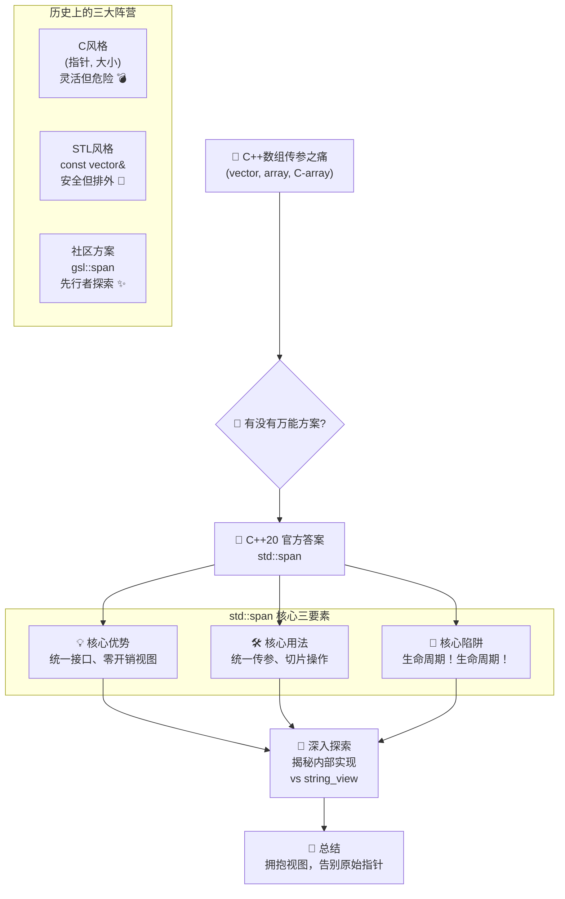

你一定经历过这样的“代码噩梦”：你写了一个超棒的函数，能完美处理 `std::vector<int>`。你的同事看了赞不绝口，然后反手就丢给你一个 C 风格的老式数组 `int[]`，问：“这个能用吗？” 🥶

你傻眼了。

为了兼容他，你只好复制粘贴，忍痛写下另一个充满“指针+大小”这对危险搭档的函数版本。没过多久，又一个同事带着 `std::array` 兴冲冲地跑来...

难道，我们注定要为每一种数组都写一个定制版的函数吗？🤯 这难道就是 C++ 世界的“待客之道”？

**不！**

如果我告诉你，有一种“神器”，能让你只写 **一个** 函数，就能像变魔术一样，安全、优雅地“通吃”所有这些数组类型呢？🤔

C++20 的 `std::span` 就是这把终结混乱的“万能钥匙” 🔑。它究竟施展了什么魔法，能让 `std::vector`, `std::array` 和 `int[]` 这些“性格迥异”的数据方阵，都听从同一个指令？

准备好，我们这就揭开它背后那令人拍案叫绝的秘密！😉

在我们深入细节之前，先通过一张图快速了解 `std::span` 的来龙去脉和核心知识点，让你对这次的旅程有个整体的印象！



### `span` 的诞生史：一场旷日持久的“统一战争”

在深入这场战争的细节之前，我们不妨先聊聊 `span` 这个名字本身。它不是一个凭空创造的计算机术语，而是来自一个非常直观的英文单词。`span` 在英语里，本身就有“跨度”、“范围”的意思，比如我们常说的“桥梁的跨度”（the span of a bridge）。它完美地描述了这个工具的核心功能：**跨越（span over）** 并**覆盖**一段连续的内存，定义一个清晰的范围。记住这个词源，能帮你更好地理解它的本质。💡

`std::span` 这个“万能遥控器”的想法，其实是 C++ 社区酝酿了近十年的成果。它的诞生，是为了终结一场旷日持久的、关于“如何向函数传递一块连续内存”的“统一战争”。

在 `std::span` 出现之前，这片战场上至少有三股主流势力，各自为政，谁也不服谁。

#### 势力一：C语言“原教旨”派 - `(指针, 长度)` 双参数组合

这是最古老、最经典，也是最危险的一派。他们认为，一切连续的内存，本质上就是一个“指向开头的指针”加上一个“记录长度的整数”。

```cpp
// 一个典型的“原教旨”派函数
// 它需要两个信物才能工作：一个地址，一个数字
void process_data_c_style(const int* data, size_t size) {
    if (data == nullptr || size == 0) return;
    std::cout << "[C-Style] 开始处理 " << size << " 个数据..." << std::endl;
}
```

这一派的优点是**极度灵活**。无论你是 `std::vector` 还是 `std::array`，只要你能交出你的 `.data()` 地址和 `.size()`，就能和这个函数打交道。

```cpp
std::vector<int> vec = {1, 2, 3};
process_data_c_style(vec.data(), vec.size()); // ✅

int arr[] = {4, 5, 6};
process_data_c_style(arr, 3); // ✅
```

但它的缺点也同样致命：**极度不安全**。这两个参数是分离的，程序员必须人肉保证它们是匹配的。一旦出错，就是灾难的开始。

```cpp
// 😱 灾难：队伍只有3个人，却告诉指挥官有100个人！
process_data_c_style(vec.data(), 100); // 编译通过，但运行时可能就直接崩溃了！
```

这种风格，是无数内存错误的万恶之源。

#### 势力二：STL“贵族”派 - `const std::vector<T>&`

为了安全，另一派势力崛起了。他们拥抱 C++ 的类型系统，坚持只接受 `std::vector` 这种高贵的容器类型。

```cpp
// 一个只和 vector 打交道的“贵族”函数
void process_data_vector_only(const std::vector<int>& data) {
    std::cout << "[Vector-Only] 开始处理 " << data.size() << " 个数据..." << std::endl;
}
```

这一派的优点是**绝对安全**。指针和长度被完美地封装在 `vector` 内部，你永远不可能传错。但它的缺点也很明显：**极度排外**。

```cpp
std::vector<int> vec = {1, 2, 3};
process_data_vector_only(vec); // ✅

std::array<int, 3> arr = {4, 5, 6};
// process_data_vector_only(arr); // ❌ 编译失败！“对不起，我们不认识 array 家族。”
```

这种风格迫使调用者进行妥协。如果手头恰好是一个 `array`，为了调用这个函数，你可能不得不创建一个临时的 `vector`，这会带来不必要的内存分配和复制，大大降低了性能。

#### 势力三：“民间先行者” - GSL 的 `span`

在官方迟迟不提供统一方案的情况下，一些社区的“先行者”坐不住了。其中，由 C++ 之父 Bjarne Stroustrup 和 Herb Sutter 等人主导的 C++ 核心指南库 (Guideline Support Library, GSL) 就推出了一个解决方案，它的名字就叫 `gsl::span`。

`gsl::span` 就像是 `std::span` 的“测试版”或“民间版”。它是一个纯粹的库实现，用一个简单的类把指针和长度安全地包装在了一起。

```cpp
// GSL 的 span 和标准库的 span 在用法上几乎一模一样
// (以下为示意，实际使用需包含 GSL 头文件)
#include <gsl/gsl> // 假设已安装 GSL

void process_data_gsl_style(gsl::span<const int> data) {
    std::cout << "[GSL-Style] 开始处理 " << data.size() << " 个数据..." << std::endl;
}
```

`gsl::span` 的出现，完美地结合了前两派的优点：

- **像 `(指针, 长度)` 一样灵活**：它可以从 `vector`, `array`, C数组等任何连续内存中创建。
- **像 `const std::vector&` 一样安全**：指针和长度被绑定在一起，杜绝了不匹配的风险。
- **零开销**：它本身不拥有数据，只是一个轻量的视图。

`gsl::span` 的成功，向 C++ 标准委员会雄辩地证明了：**这个东西，社区真的需要，而且它的设计是可行的！**

最终，在 C++20 中，委员会吸收了 `gsl::span` 和其他类似方案（如 `absl::Span`）的设计精髓，经过千锤百炼，终于推出了官方版本的 `std::span`。它继承了先行者们的所有优点，并被赋予了更强大的编译期检查能力，成为了我们今天看到的这个强大、优雅的“万能遥控器”。

了解了这场轰轰烈烈的“统一战争”，我们就能更好地理解 `std::span` 肩负的历史使命。现在，就让我们回到现实的“战场”，亲眼见证这位新加冕的“统帅”，是如何检阅他的“多兵种混合部队”的。这场困扰了 C++ 程序员多年的“阅兵仪式”难题，终于迎来了它的终极答案。

### “阅兵仪式”的终极解决方案

现在，我们手握 `std::span` 这个“万能遥控器”（或者说“万能喊话筒” 📣），终于可以举办一场完美的阅兵仪式了。

我们不再需要为 `std::vector` 或 `std::array` 准备不同的喊话筒，也不再需要那个危险的“指针+大小”组合。我们只需要一个函数，一个为 `span` 打造的函数：

```cpp
#include <iostream>
#include <vector>
#include <array>
#include <span> // ✨ 主角登场，别忘了包含头文件

// 终极阅兵函数，使用 std::span 作为参数
void inspect(std::span<const int> troops) {
    std::cout << "报告将军！"
              << "一支由 " << troops.size() << " 名士兵组成的方阵前来报到！"
              << " 他们分别是：";
    for (int soldier : troops) {
        std::cout << soldier << " ";
    }
    std::cout << std::endl;
}

int main() {
    // 1. std::vector 方阵
    std::vector<int> elite_troops = {1, 2, 3};
    inspect(elite_troops); // ✅ 直接传入 vector，自动转换为 span

    // 2. std::array 方阵
    std::array<int, 4> guard_troops = {4, 5, 6, 7};
    inspect(guard_troops); // ✅ 直接传入 array，自动转换为 span

    // 3. C 风格老兵方阵
    int veteran_troops[] = {8, 9};
    inspect(veteran_troops); // ✅ 直接传入 C 数组，自动转换为 span

    return 0;
}
```

**输出结果：**

```
报告将军！一支由 3 名士兵组成的方阵前来报到！ 他们分别是：1 2 3
报告将军！一支由 4 名士兵组成的方阵前来报到！ 他们分别是：4 5 6 7
报告将军！一支由 2 名士兵组成的方阵前来报到！ 他们分别是：8 9
```

看到了吗？**一个函数，通吃所有！**

`std::span` 就像一个神奇的翻译官，无论对方说的是 "vector 语"、"array 语" 还是 "C 数组土话"，它都能将其统一翻译成 `inspect` 函数能听懂的“标准通用语”。

从此，我们再也不用为函数重载或模板操心了。这就是 `std::span` 带来的优雅和解放！它真正实现了“一次编写，到处使用”的梦想。

### span 的“遥控”艺术：切片与子视图

`span` 的强大之处不仅在于“统一”，还在于“灵活”。它就像一把精密的瑞士军刀，不仅能用，还能玩出花样来。最核心的玩法就是**切片（Slicing）**。

```cpp
// 假设我们有一个更大的方阵
std::vector<int> big_squad = {1, 2, 3, 4, 5, 6, 7, 8};

// 先用遥控器锁定整个方阵
std::span<int> whole_squad_view(big_squad);
```

现在，我们来操作遥控器上的“变焦”按钮 `.subspan()`。

```cpp
// .subspan(startIndex, count)
// 从索引为 2 的士兵开始，选出 3 个
auto middle_group_view = whole_squad_view.subspan(2, 3);
```

现在 `middle_group_view` 这个新的、更小的遥控器视图，就只“看到”了士兵 `{3, 4, 5}`。我们可以把这个小视图传递给检阅函数。

```cpp
// 对这个小编队进行检阅
review_troops_modern(middle_group_view); // 输出: 遥控器锁定！方阵人数 3...
```

这个过程**没有发生任何数据的复制**！我们只是创建了一个新的、包含了不同指针和大小的 `span` 对象。这种零开销的切片能力，使得 `span` 在处理音频、视频、网络数据包等大型数据时，成为了无可替代的性能利器。

遥控器上还有两个快捷按钮：`.first()` 和 `.last()`。

```cpp
// 只看最前面的 2 名士兵
auto vanguards = whole_squad_view.first(2); // 看到了 {1, 2}

// 只看殿后的 2 名士兵
auto rearguards = whole_squad_view.last(2);  // 看到了 {7, 8}
```

是不是非常方便？

### 安全须知：遥控器的两大守则

这么强大的遥控器，使用时当然也要遵守安全守则。

#### 守则一：只看不摸的 `const` 模式

如果你的阅兵仪式只是“检阅”，而不是“训练”（即你只想读取数据，不想修改它），那你应该切换到“只读”模式：`std::span<const int>`。

```cpp
void just_look_dont_touch(std::span<const int> troops) {
    std::cout << "本次只看不摸，士兵们请放松！" << std::endl;
    // troops[0] = 999; // ❌ 试图修改？编译器会立刻阻止你！
}
```

这层 `const` 的保护，能让你的函数接口意图更加明确，也能防止无心之失破坏了原始数据。

#### 守则二：千万别让队伍提前解散！

这是使用 `span` **最最最重要**的一条规则！

记住，遥控器（`span`）只是一个“视图”，它不拥有士兵（数据）。如果阅兵的队伍本身已经解散回家了（原始数据容器被销毁），你手里的遥控器就成了一个指向空气的“幽灵遥控器”。

看看这个灾难性的例子：

```cpp
// 一个幽灵遥控器，它现在什么也没指向
std::span<int> ghost_controller;

{
    // 一支临时组建的仪仗队，只在这个花括号里存在
    std::vector<int> temporary_squad = {7, 7, 7};

    // 你用遥控器锁定了这支临时队伍
    ghost_controller = temporary_squad;

} // 仪式结束！temporary_squad 和它所有的士兵都解散回家了！

// 在这之后，ghost_controller 已经指向了一片废墟。
// 它还以为自己锁定着 {7, 7, 7}，但那里已经空无一物。
review_troops_modern(ghost_controller); // 💥 对着废墟喊话？程序崩溃！
```

**安全使用的金科玉律：必须保证，遥控器（`span`）的寿命，绝对不能比它所指向的真实队伍（原始数据容器）的寿命更长！**

### 编译期安全卫士：`std::span` 的“专属钥匙”模式

我们刚刚讨论了运行时的生命周期安全，这像是给遥控器配备了“过期自动销毁”功能。但 `std::span` 的安全保障远不止于此，它还提供了一种“专属钥匙”模式，能将安全检查从运行时提前到**编译期**，从根源上杜绝尺寸不匹配的错误。

这就是 `std::span` 的静态区间版本：`std::span<T, N>`。

这里的 `N` 不是一个变量，而是一个在**编译时就已确定**的整数。这相当于你告诉编译器：“我这里有一个 `span`，它**必须、永远、只能**指向一个包含不多不少正好 `N` 个元素的内存区域。”

它就像一个为特定型号螺丝定制的扳手，尺寸稍有不符，根本就套不进去！

让我们来看一个处理 RGB 颜色的例子，颜色通常由 3 个浮点数（红、绿、蓝）表示：

```cpp
#include <iostream>
#include <vector>
#include <array>
#include <span>

// 这个函数只接受尺寸为 3 的“专属钥匙”
// 就像一个只为三针插头设计的插座
void process_rgb_color(std::span<const float, 3> color) {
    std::cout << "处理颜色: R=" << color[0]
              << ", G=" << color[1]
              << ", B=" << color[2] << std::endl;
}

int main() {
    // 1. 一个尺寸完全匹配的 std::array
    std::array<float, 3> perfect_red = {1.0f, 0.0f, 0.0f};
    process_rgb_color(perfect_red); // ✅ 完美匹配！编译通过。

    // 2. 一个尺寸不匹配的 std::array
    std::array<float, 4> color_with_alpha = {1.0f, 0.0f, 0.0f, 1.0f};
    // process_rgb_color(color_with_alpha);
    // ❌ 编译失败！编译器直接在门口拦下：
    // “错误：无法将 std::array<float, 4> 转换为 std::span<const float, 3>”

    // 3. 一个 C 风格数组
    float plain_blue[] = {0.0f, 0.0f, 1.0f};
    process_rgb_color(plain_blue); // ✅ 尺寸为3，编译通过。

    // 4. 一个大小在编译期不确定的 std::vector
    std::vector<float> dynamic_green = {0.0f, 1.0f, 0.0f};
    // process_rgb_color(dynamic_green);
    // ❌ 编译失败！
    // vector 的大小是在运行时决定的，编译器无法在编译期保证其大小一定是 3。
}
```

这个例子清晰地展示了静态 `span` 的威力：

1.  **极致的尺寸安全**：任何尺寸不匹配的尝试都会被编译器无情地拒绝。这比运行时的 `if (size != 3)` 检查要安全和高效得多，因为错误在代码诞生时就被消灭了。
2.  **API 意图的终极表达**：函数签名 `process_rgb_color(std::span<const float, 3>)` 本身就是一份完美的文档，它无可辩驳地告诉调用者：“我只要 3 个浮点数，多一个少一个都不行。”
3.  **潜在的性能优化**：因为编译器确切地知道 `span` 的大小，它可以进行更激进的优化，比如循环展开等，而无需任何运行时的分支判断。

**什么时候使用静态 `span`？**

规则很简单：当你处理的数据在逻辑上**必须是固定大小**时，就应该优先使用静态 `span`。比如：

- 处理 3D 坐标 (`std::span<float, 3>`)
- 操作硬件寄存器 (`std::span<uint8_t, 4>`)
- 加密算法中处理固定大小的密钥或块 (`std::span<const std::byte, 16>`)

通过这种方式，`std::span` 不仅在运行时为我们提供了灵活的视图，还在编译期为我们提供了坚不可摧的安全壁垒，真正做到了“灵活”与“安全”的完美统一。

### 实战演练：用 `span` 解剖一个网络数据包 dissected:

理论讲了这么多，让我们来一次真刀真枪的演练，看看在真实世界中，`span` 是如何大显身手的。

想象一下，你正在编写一个网络程序，从 socket 中接收到了一段原始的二进制数据。你需要从中解析出一个自定义协议的数据包。这个协议格式如下：

- **包类型** (1 字节): 0x01 表示登录, 0x02 表示消息
- **载荷长度** (2 字节): 后续载荷的字节数
- **保留字段** (1 字节): 暂时不用
- **载荷** (可变长度): 实际传输的数据
- **校验和** (2 字节): 对载荷的 CRC16 校验

你从网络库收到的，就是一个冷冰冰的 `std::vector<std::byte>` 或 `char*` 缓冲区。在没有 `span` 的蛮荒时代，你可能会看到这样的代码：

```cpp
// 💀 蛮荒时代的指针算术，每一步都如履薄冰
void process_packet_old_school(const char* buffer, size_t size) {
    if (size < 4) { /* 长度检查 */ }

    char packet_type = buffer[0];
    uint16_t payload_len = *reinterpret_cast<const uint16_t*>(buffer + 1);

    if (size < 4 + payload_len + 2) { /* 更复杂的长度检查 */ }

    const char* payload = buffer + 4;
    uint16_t checksum = *reinterpret_cast<const uint16_t*>(buffer + 4 + payload_len);

    // ... 后续处理，到处都是指针和偏移量，代码难以阅读和维护
}
```

这种代码就是 bug 的温床！`reinterpret_cast`、手动的指针偏移、复杂的边界检查……每一个环节都可能出错，导致程序崩溃或安全漏洞。

现在，让我们请出 `std::span` 这位优雅的“解剖大师”：

```cpp
#include <iostream>
#include <vector>
#include <cstddef> // For std::byte
#include <span>

// 假设的协议结构体，用于更清晰地映射
struct PacketHeader {
    std::byte type;
    uint16_t payload_length;
    std::byte reserved;
};

// 使用 span 的现代化解析函数
bool parse_packet(std::span<const std::byte> packet) {
    // 1. 检查数据包总长度是否至少包含头部和校验和
    constexpr size_t min_packet_size = sizeof(PacketHeader) + sizeof(uint16_t);
    if (packet.size() < min_packet_size) {
        std::cerr << "错误：数据包过短！" << std::endl;
        return false;
    }

    // 2.【零拷贝】创建头部的视图
    // 使用静态 span，如果包长不够，编译时可能就会警告
    auto header_view = packet.first<sizeof(PacketHeader)>();

    // 3. 安全地从视图中读取头部信息
    // C++20 的 std::bit_cast 在这里更理想，但为了兼容性我们用 reinterpret_cast
    const auto& header = *reinterpret_cast<const PacketHeader*>(header_view.data());

    // 4. 再次校验长度，确保载荷和校验和都在包内
    if (packet.size() < sizeof(PacketHeader) + header.payload_length + sizeof(uint16_t)) {
        std::cerr << "错误：声称的载荷长度超出实际数据包大小！" << std::endl;
        return false;
    }

    // 5.【零拷贝】创建载荷和校验和的视图
    auto payload_view = packet.subspan(sizeof(PacketHeader), header.payload_length);
    auto checksum_view = packet.last<sizeof(uint16_t)>();
    const uint16_t checksum = *reinterpret_cast<const uint16_t*>(checksum_view.data());

    std::cout << "包解析成功!" << std::endl;
    std::cout << "  - 包类型: 0x" << std::hex << static_cast<int>(header.type) << std::endl;
    std::cout << "  - 载荷长度: " << std::dec << header.payload_length << " 字节" << std::endl;
    std::cout << "  - 载荷视图大小: " << payload_view.size() << " 字节" << std::endl;
    std::cout << "  - 校验和: 0x" << std::hex << checksum << std::endl;

    // TODO: 可以在这里计算 payload_view 的校验和并与 checksum 比较

    return true;
}

int main() {
    // 模拟一个网络收到的数据包
    std::vector<std::byte> raw_packet = {
        std::byte{0x02},                // 类型：消息
        std::byte{0x05}, std::byte{0x00}, // 载荷长度: 5
        std::byte{0x00},                // 保留
        std::byte{'h'}, std::byte{'e'}, // 载荷: "hello"
        std::byte{'l'}, std::byte{'l'},
        std::byte{'o'},
        std::byte{0xAB}, std::byte{0xCD}  // 校验和
    };

    parse_packet(raw_packet);

    return 0;
}
```

**`span` 在这个场景下的不可替代性：**

1.  **代码即文档 (Self-Documenting Code)**：`header_view`, `payload_view` 这些变量名清晰地表达了其意图，远胜于 `buffer + 4` 这种需要读者心算的“魔法数字”。
2.  **绝对的类型安全 (Type Safety)**：我们操作的是 `std::span<const std::byte>`，避免了传统 `char*` 可能带来的各种编码和别名问题。`std::byte` 类型专门用于表示原始内存，它不能被隐式转换为任何整数或字符，从根源上防止了误用。
3.  **零拷贝高性能 (Zero-Copy Performance)**：整个解析过程，我们没有复制一个字节的数据。`first`, `last`, `subspan` 等操作仅仅是创建了新的、指向原始数据不同位置的 `span` 对象，这些操作的开销和创建一个整数一样低。对于性能敏感的网络或嵌入式应用，这是至关重要的。
4.  **边界检查的保障 (Boundary-Checked by Default)**：虽然我们自己也加了长度检查，但 `span` 的很多操作（如通过 `std::get` 访问静态 `span`）都自带边界检查，提供了额外的安全层。更重要的是，它将“长度”这个信息与数据本身绑定，使得检查逻辑更简单、更不易出错。

这个例子雄辩地证明了，`std::span` 不仅仅是处理 `int` 数组的“玩具”，它是在真实世界中进行高性能、高安全性底层内存操作的现代化基石。

### 理论与实战的完美结合：在 Mini-Redis 中驾驭 `span`

理论的剖析已经足够深入，但没有什么比亲手在真实项目中驾驭这些工具更令人兴奋了。

**还在用 C++ 写“学生管理系统”？**

是时候给你的简历来点硬核的了！

在我们的实战项目 **《用现代 C++ 从零实现 mini-Redis》** 中，`std::span` 不再是纸上谈兵的理论，而是贯穿整个高性能网络 IO 和协议解析层的一等功臣。你将亲手用 `span` 完成：

- 🚀 **零拷贝的 IO 操作：** 直接将从 socket 读出的原始字节缓冲区封装成 `span`，在整个处理流水线中传递，避免任何不必要的数据复制。
- ⚙️ **安全的协议解包：** 使用 `span` 的切片能力，优雅地从原始数据流中“切”出协议头、命令、参数等视图，代码清晰且边界安全。
- 🌱 **打造你的现代 C++ 试验田：** `std::span` 只是冰山一角。你将亲手在项目中应用 C++20 的 `Modules`、`std::expected` 等最新特性，把新语法变成真正的工程能力。
- 🗣️ **在面试中自信言之有物：** 当你能在白板上画出自己用 `span` 实现的零拷贝缓冲区架构时，任何关于高性能网络编程的问题都是送分题。

想进一步了解 Mini-Redis 项目的实现细节？可以点击阅读<a href="https://mp.weixin.qq.com/s/qujRzKcllccSHxQvJG-vOA" target="_blank" rel="noopener noreferrer">这篇详细的文章</a>。

**👇 扫码添加微信（备注“redis”），立即开启你的高手进阶之旅！**


### 揭秘 `span` 的内部构造：一个指针 + 一个长度的优雅封装

聊了这么多 `span` 的神奇之处，你可能会好奇：它内部到底是怎么实现的？是不是用了什么复杂的黑魔法？

恰恰相反！`std::span` 的核心原理简单到令人发指，它仅仅是把 C 语言时代那个最原始的 `(指针, 长度)` 组合，用一个类给安全地包装了起来。

它就像一个只有两行字的“便签” 📝：

1.  数据从哪里开始？（一个指针 `data_`）
2.  数据有多长？（一个整数 `size_`）

仅此而已！它不管理内存，不持有数据，它就是一个彻头彻尾的“观察者”。为了让你看得更清楚，我们甚至可以自己动手，实现一个极简版本的 `span`，就叫 `OurSpan` 吧：

```cpp
#include <iostream>
#include <vector>
#include <array>

// 一个极简的、用于教学目的的 span 实现
template <typename T>
class OurSpan {
private:
    T* data_;      // 指向数据开头的指针
    size_t size_;  // 数据的长度

public:
    // 构造函数：从指针和长度创建
    constexpr OurSpan(T* data, size_t size) : data_(data), size_(size) {}

    // 构造函数：从 C 风格数组创建 (利用模板推导数组大小)
    template <size_t N>
    constexpr OurSpan(T (&arr)[N]) : data_(arr), size_(N) {}

    // 构造函数：从 std::vector 创建 (SFINAE 可用于更复杂的约束)
    template <typename U>
    constexpr OurSpan(std::vector<U>& vec) : data_(vec.data()), size_(vec.size()) {}

    // 构造函数：从 std::array 创建
    template <typename U, size_t N>
    constexpr OurSpan(std::array<U, N>& arr) : data_(arr.data()), size_(arr.size()) {}

    // 获取大小
    constexpr size_t size() const { return size_; }

    // 获取底层指针
    constexpr T* data() const { return data_; }

    // 提供 begin/end 迭代器，以便用于 for-each 循环
    constexpr T* begin() const { return data_; }
    constexpr T* end() const { return data_ + size_; }
};

// 我们的测试函数，现在使用 OurSpan
void inspect_with_our_span(OurSpan<const int> troops) {
    std::cout << "[OurSpan] 检阅开始，人数: " << troops.size() << std::endl;
}

int main() {
    std::vector<int> vec = {1, 2, 3};
    std::array<int, 2> arr = {4, 5};
    int c_arr[] = {6};

    inspect_with_our_span(vec);   // ✅ 成功！
    inspect_with_our_span(arr);   // ✅ 成功！
    inspect_with_our_span(c_arr); // ✅ 成功！

    return 0;
}
```

看到 `OurSpan` 的实现后，`std::span` 的所有秘密都已不复存在：

1.  **它就是一个值类型**：内部只有两个成员（一个指针，一个 size_t），创建和传递它的开销极低，和传递两个整数或指针几乎没区别。这就是“零成本抽象”。
2.  **构造函数是关键**：它之所以能“通吃”各种容器，秘诀全在构造函数里。它为不同的容器类型提供了不同的构造方式，但最终都殊途同归——提取出它们的起始指针和长度，存到自己的成员变量里。
3.  **安全性的来源**：它把指针和长度“绑定”在了一起，杜绝了两者不匹配的可能，从而解决了 C 风格参数最大的安全隐患。

现在你明白了，`std::span` 并非天外来物，而是 C++ 工程师们基于最朴素的原理，打造出的一个既安全又高效的绝妙工具。

### `span` vs. `string_view`：表兄弟还是亲兄弟？ 🤔

当你看到 `std::span`，你可能会立刻联想到 C++17 引入的另一位“视图”家族成员：`std::string_view`。它们确实像一对关系亲密的表兄弟：都遵循着“只看不拥有”（non-owning）的核心原则，都是轻量级的“观察者”，并且都有着同样的生命周期陷阱。

但它们终究不是同一个人，各自有着明确的分工和不同的“性格”。

**`std::span<T>` (万能遥控器)**

- **目标**: 通用，可以遥控**任何类型** `T` 的连续序列。
- **基因**: `std::span<const char>` 在功能上与 `std::string_view` 高度相似。
- **能力**: `std::span<T>` 允许修改底层数据（除非是`span<const T>`）。
- **工具箱**: 提供通用的切片操作，如 `.subspan()`, `.first()`, `.last()`。

**`std::string_view` (字符串专属放大镜)**

- **目标**: 专一，只能观察 `const char` 序列。
- **基因**: 字符串处理的专家。
- **能力**: **永远只读**。它从不让你修改它看到的东西。
- **工具箱**: 提供丰富的字符串专用工具，如 `.substr()`, `.find()`, `.starts_with()`。

简单来说，你可以认为 `std::string_view` 是一个**特化且只读**的 `std::span<const char>`。它的诞生，就是为了解决 `const std::string&` 在传递时可能带来的性能问题，同时提供一套丰富的字符串操作接口。

**什么时候用谁？** 规则很简单：

- 当你需要一个**只读**的、**像字符串一样**操作的字符序列视图时，永远选择 `std::string_view`。比如函数参数是 `const std::string&`，用 `std::string_view` 替换几乎总是正确的。
- 对于所有其他情况——包括需要修改数据的、非字符类型的、或者仅仅需要一个通用内存块视图的场景——`std::span` 都是你的不二之选。

如果你想更深入地了解 `std::string_view` 的演进历史和它如何解决了 `const std::string&` 的性能陷阱，我们强烈推荐你阅读另一篇专题文章：<a href="https://mp.weixin.qq.com/s/69tBWZbdItsFPB7NksxCWg?token=966162905&lang=zh_CN" target="_blank" rel="noopener noreferrer">《字符串的救赎：从 const string& 到 string_view 的演进史》</a>。

### 总结：拥抱视图，将思想转化为行动

`std::span` 的出现，不仅仅是 C++ 标准库里多了一个小工具那么简单。它代表了一种现代 C++ 的编程思想的胜利：所有权与视图分离、告别原始指针、提升API设计。它鼓励我们写出更通用、更高效、也更安全的函数接口。

为了将这些思想转化为实实在在的代码改进，这里有一份你可以立即应用的行动指南：

#### 你的 `span` 实战检查清单

1.  **审查你的函数参数：**
    - **检查 `const std::vector<T>&`:** 看看你的代码库里，有多少函数接受 `const std::vector&` 却仅仅是为了遍历它？马上把它们重构成 `std::span<const T>` 吧！这一个小小的改动，就能让你的函数瞬间变得通用，能接纳 `std::array` 和 C 数组，而调用者无需任何成本。
    - **消灭 `(T*, size_t)` 组合:** 在所有新代码中，应当将 `(指针, 长度)` 这种 C 风格的参数视为“代码异味”。用 `std::span` 全面替代它，这是你只需花费几秒钟就能完成的最有效的安全升级。

2.  **将 `span` 作为 API 设计的默认选项：**
    - 当你设计一个需要操作连续内存的函数时，请把 `std::span` 作为你的“默认武器”。只有当你明确需要修改容器大小（如 `push_back`）或需要特定容器的功能时，才去考虑传递具体的容器引用。这个习惯能让你的 API 设计从一开始就具备高度的灵活性和通用性。

3.  **建立“生命周期”心智模型：**
    - `span` 最大的责任在于调用者。请牢记这条金科玉律：**`span` 的生命周期绝不能长于它所引用的数据源**。
    - 在代码审查（Code Review）时，对 `span` 作为函数返回值或类成员变量的情况要像警犬一样敏感。立即诘问：“这个 `span` 指向的数据由谁拥有？谁来保证它的有效性？” 建立这个“谁拥有，谁做主”的心智模型，可以规避 99% 的 `span` 相关 bug。

所以，下次当你再要写一个处理数组数据的函数时，请暂停一下，用这份清单问问自己。我相信，90% 的情况下，`std::span` 会是那个更优雅、更现代的答案。欢迎来到 C++20 的新世界！🚀

### 你离大厂 C++ Offer，只差一个“它”

你可能已经刷完了《剑指 Offer》，对 STL 的各种容器了如指掌，甚至能默写出好几种设计模式。

但当面试官让你聊聊最有挑战性的 C++ 项目时，你的大脑却一片空白，只能挤出那个已经说了一万遍的“学生管理系统”。你和那些手握 Nginx、Redis 源码贡献的“大神”之间，仿佛隔着一道无法逾越的鸿沟。

那道鸿沟，其实就是一个能充分展现你工程能力、体现你对性能和现代 C++ 特性深度理解的 **“硬核项目”**。

这个项目，我们已经为你准备好了。

**《用现代 C++ 从零实现 mini-Redis》** — 这不只是一份教程，这是一张能带你穿越后台开发技术栈的“航海图”。

在这趟旅程中，你将完成一次彻底的蜕变：

- **从 API 调用者到性能掌控者：** 你将亲手用 `epoll` 搭建起万级并发的网络服务器，用 `std::span` 和 `std::string_view` 实现零拷贝的协议解析，感受程序性能在你的手中“起飞”的快感。
- **从名词背诵者到技能实践者：** AOF 持久化、RESP 协议、多路复用... 这些曾经只在面试题里出现的名词，都将成为你代码库里闪亮的存在。
- **从语法学习者到工程布道者：** C++20/23 的 `Modules`, `coroutine`, `expected`... 你将不再只是“听说过”，而是在真实项目中用它们解决真实问题，把“新语法”锻造成“杀手锏”。

最终，当面试官再次问起你的项目时，你可以自信地亮出你的 GitHub，娓娓道来你的架构设计、你踩过的坑、以及你对性能优化的思考。那一刻，你就不再是“求职者”，而是他们正在寻找的“准同事”。

准备好，开启这场蜕变之旅了吗？

想进一步了解 Mini-Redis 项目的实现细节？可以点击阅读<a href="https://mp.weixin.qq.com/s/qujRzKcllccSHxQvJG-vOA" target="_blank" rel="noopener noreferrer">这篇详细的文章</a>。

**👇 扫码添加微信（备注“redis”），立即“登船”！**


