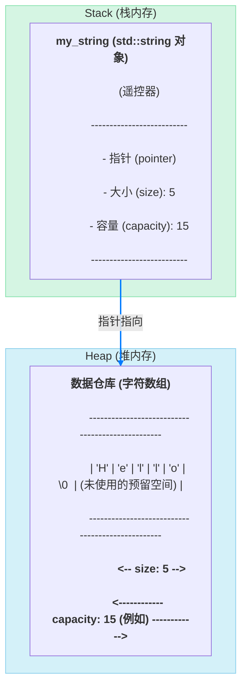
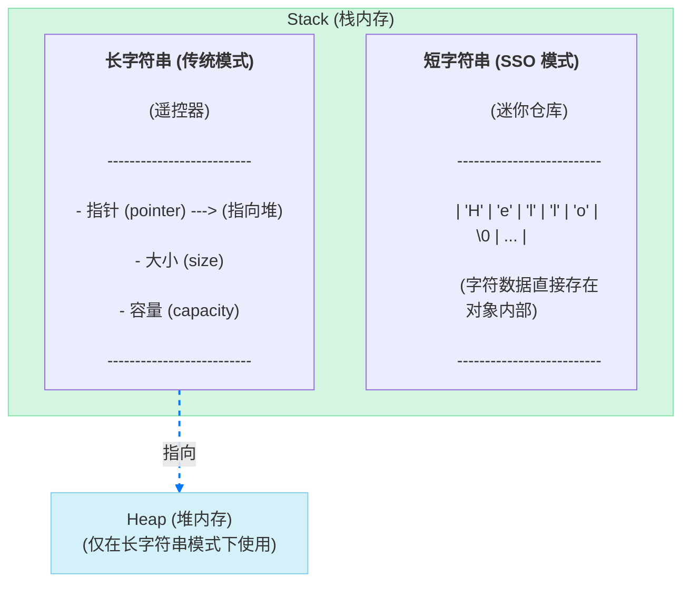

`std::string`，这个在我们 C++ 旅程中几乎天天见面的老朋友，你真的了解它吗？

我们都爱它的方便：自动管理内存，不用再提心吊胆地用 `char*` 和 `strcpy`；丰富的接口，查找、拼接、替换无所不能。但在这份便利之下，隐藏着一个精密而复杂的内存管理世界。

这篇文章，就是你的手术刀。我们将一起解剖 `std::string`，把它从里到外看个通透，彻底搞清楚它的内存布局、性能奥秘，以及那些令人拍案叫绝的实现技巧。

## 宏观视角：一个可以自动扩建的仓库

想象一下，你有一个神奇的仓库，用来存放货物（字符）。这个仓库由两部分组成：

1.  **一个遥控器（`std::string` 对象本身）**：你随身携带，它很小巧。上面有几个关键按钮和显示屏，告诉你“当前货物数量”（size）和“仓库最大容量”（capacity）。
2.  **一个远方的实体仓库（堆内存）**：这个仓库很大，真正存放货物的地方。你的遥控器通过一条看不见的线（指针）连接着它。

当你需要存放更多货物，超出了仓库的当前容量时，神奇的事情发生了：仓库系统会自动找到一个更大的地方，建一个更大的新仓库，把旧仓库的所有货物搬过去，然后拆掉旧仓库。你的遥-控器也会自动更新，连接到这个新仓库。

这个“自动扩建”的过程，就是 `std::string` 动态增长的核心思想，它被称为**再分配 (Reallocation)**。

## 微观解剖：`std::string` 的内部三要素

现在，让我们拿起手术刀，切开这个“遥控器”，看看它的内部构造。在绝大多数实现中，一个 `std::string` 对象（在不考虑短字符串优化时）主要包含三个核心成员：

1.  `pointer`：一个指针，指向堆上一块动态分配的内存，那里存储着真正的字符数据。
2.  `size`：一个整数，记录当前字符串中有效字符的数量。`size()` 或 `length()` 方法返回的就是它。
3.  `capacity`：一个整数，记录在不进行“再分配”的情况下，当前堆上内存最多能容纳多少个字符。`capacity()` 方法返回的就是它。

`capacity` 永远大于或等于 `size`。`capacity - size` 的空间就是预留的“缓冲区”，为的是让你在添加少量新字符时，不必立即进行昂贵的“仓库扩建”。

下面这张图清晰地展示了它们的关系：



### 侦测“成长”过程

`size` 和 `capacity` 的变化过程是理解 `std::string` 性能的关键。让我们写一段代码来亲眼见证一下：

```cpp
#include <iostream>
#include <string>

int main() {
    std::string s;
    std::cout << "初始状态: " << std::endl;
    std::cout << "size: " << s.size() << ", capacity: " << s.capacity() << std::endl;
    std::cout << "----------------------------------" << std::endl;

    size_t last_capacity = s.capacity();
    for (int i = 0; i < 50; ++i) {
        s.push_back('a');
        if (s.capacity() != last_capacity) {
            std::cout << "当 size 增长到 " << s.size()
                      << " 时，capacity 变成了: " << s.capacity() << std::endl;
            last_capacity = s.capacity();
        }
    }
    return 0;
}
```

当你运行这段代码，你会看到一个非常典型的输出（具体数值取决于编译器和标准库实现）：当 `size` 增长并触碰到 `capacity` 的边界时，`capacity` 会突然“跳跃式”地增长到一个更大的值。这个增长通常是按某个倍率（如 1.5 倍或 2 倍）进行的，以摊平多次内存分配的成本。每一次 `capacity` 的“跳跃”，都伴随着一次昂贵的“再分配”操作。

## 黑科技：短字符串优化 (SSO)

现在，让我们聊聊 `std::string` 实现中最常见、也最重要的一个性能优化：**Small String Optimization (SSO)**，有时也叫 Short String Optimization。

**核心思想**：如果一个字符串非常短（比如少于 16 个字符），那么频繁地为它在堆上分配和释放内存就太浪费了。干脆别用堆了！直接把这些字符存放在 `std::string` 对象内部！

在支持 SSO 的实现中，`std::string` 对象内部的存储结构是“共用”的。它可能像这样：

- 当字符串很长时，这块内存被解释为“指针、大小、容量”这三要素。
- 当字符串很短时，这块内存就被直接用来存储字符数据本身！



**SSO 的巨大优势**：对于无处不在的短字符串，所有操作（创建、复制、销毁）都只在栈上进行，完全避免了与堆的交互。这使得处理短字符串的性能得到了指数级的提升。这也是为什么在很多基准测试中，处理短字符串时，`std::string` 的速度快得惊人。

## 结论

解剖完 `std::string`，我们可以得出结论：

1.  **它是一个复杂的类**：它不仅仅是一个字符容器，更是一个精密的内存管理器。
2.  **所有权是有代价的**：它的动态增长能力和生命周期管理，都依赖于堆内存分配和数据拷贝，这是其核心性能开销的来源。
3.  **Capacity 是性能的关键**：理解 `capacity` 的增长策略，有助于我们写出更高效的代码（例如，如果能预知长度，使用 `reserve()` 提前分配容量可以避免多次再分配）。
4.  **SSO 是现代优化的基石**：这个“黑科技”极大地提升了常见场景（处理短字符串）下的性能，体现了 C++ 标准库实现者们的智慧。

深入理解 `std::string` 的内部工作原理，是成为一名优秀 C++ 开发者的必经之路。它让我们在享受其便利的同时，也能清醒地认识到其性能边界，从而在关键时刻做出更明智的技术决策——比如，在只读场景下，选择我们上一篇文章讨论的 `std::string_view`。
